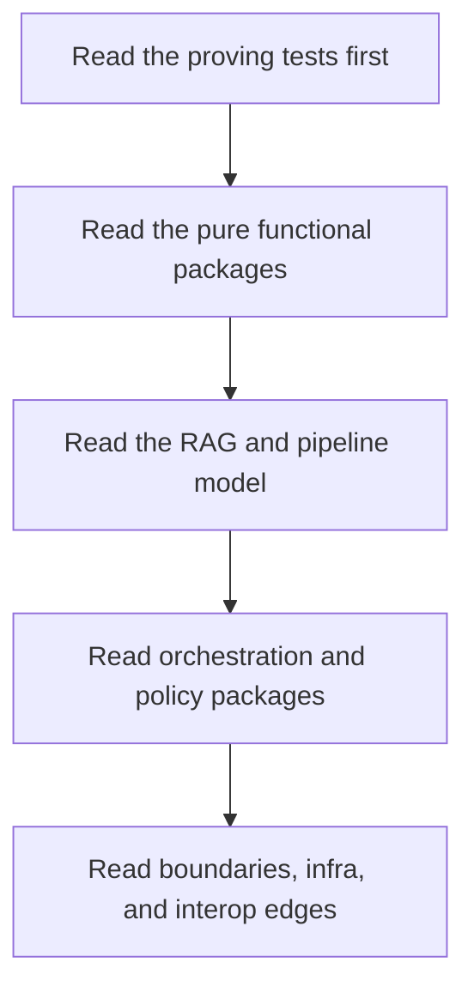

# FuncPipe Package Guide

<!-- page-maps:start -->
## Guide Maps

<!-- page-maps:end -->

Use this guide when you want a stable code-reading route through the capstone. The point
is not to read files alphabetically. The point is to understand which package owns which
kind of reasoning pressure.

## Recommended reading order

1. `tests/unit/fp/`, `tests/unit/result/`, and `tests/unit/streaming/`
2. `src/funcpipe_rag/fp/`, `result/`, `tree/`, and `streaming/`
3. `src/funcpipe_rag/core/`, `rag/`, and `rag/domain/`
4. `src/funcpipe_rag/pipelines/` and `policies/`
5. `src/funcpipe_rag/domain/`, `boundaries/`, and `infra/`
6. `src/funcpipe_rag/interop/`

That order keeps proof before abstraction and keeps the pure core visible before you hit
effects and integrations.

## Package groups

| Group | Paths | Owns | First matching tests |
| --- | --- | --- | --- |
| Functional core | `src/funcpipe_rag/fp/`, `result/`, `tree/`, `streaming/` | reusable algebra, containers, folds, and lazy stream behavior | `tests/unit/fp/`, `tests/unit/result/`, `tests/unit/tree/`, `tests/unit/streaming/` |
| RAG model | `src/funcpipe_rag/core/`, `rag/`, `rag/domain/` | chunk shapes, stage composition, RAG assembly, and domain values | `tests/unit/rag/`, `tests/unit/rag/domain/` |
| Orchestration and policy | `src/funcpipe_rag/pipelines/`, `policies/` | configured pipelines, policies, and runtime choices that stay explicit | `tests/unit/pipelines/`, `tests/unit/policies/` |
| Effect boundaries | `src/funcpipe_rag/domain/`, `domain/effects/`, `boundaries/`, `infra/` | capabilities, adapters, effect descriptions, shells, and concrete runtime edges | `tests/unit/domain/`, `tests/unit/boundaries/`, `tests/unit/infra/adapters/` |
| Interop | `src/funcpipe_rag/interop/` | bridges to stdlib and external library styles | `tests/unit/interop/` |

## Review questions by group

- Functional core:
  Which helpers stay pure, lawful, and lazily composable?
- RAG model:
  Which values and stage boundaries define the application-specific semantics?
- Orchestration and policy:
  Which choices are configurable policy rather than hidden control flow?
- Effect boundaries:
  Which package describes effects and which one actually executes them?
- Interop:
  Which compatibility helper can disappear without corrupting the core model?

## What this guide prevents

- starting in adapters and mistaking them for the center of the design
- reading the pipeline shell before you know what the pure stages promise
- treating every package as equally effectful or equally important
- changing an interop layer without knowing which proofs should stay unchanged
