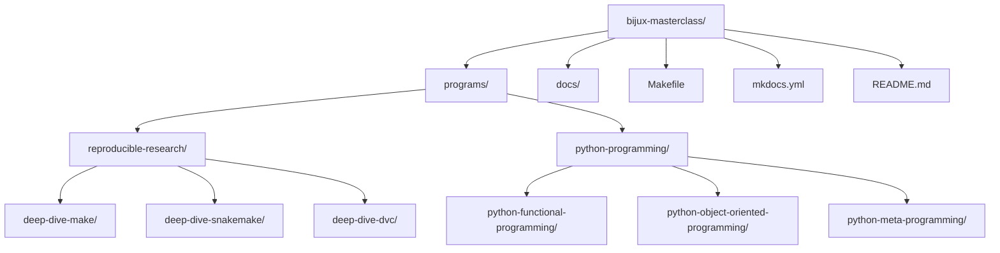

# Bijux Masterclass

This repository is the permanent home for the Bijux Masterclass program collection.
Each program keeps its own full git history while living inside one repository,
so new programs can be added without duplicating repo-level setup.

## Repository Layout



## Program Families

- `reproducible-research`
  - `deep-dive-make`
  - `deep-dive-snakemake`
  - `deep-dive-dvc`
- `python-programming`
  - `python-object-oriented-programming`
  - `python-functional-programming`
  - `python-meta-programming`

## Working With Programs

List the available families:

```bash
make families
```

List the available programs:

```bash
make programs
```

Run a common target against a selected program:

```bash
make PROGRAM=reproducible-research/deep-dive-make docs-build
make PROGRAM=python-programming/python-functional-programming test
```

Show a program's own Make targets:

```bash
make PROGRAM=reproducible-research/deep-dive-snakemake program-help
```

Build the series site:

```bash
make docs-build
```

Serve the series site locally:

```bash
make docs-serve
```

Use the explicit per-program docs route when you only want one program:

```bash
make PROGRAM=python-programming/python-functional-programming docs-serve
```

If port `8000` is already busy, the docs server automatically moves to the next open
local port. Set `DOCS_PORT=<port>` when you want a different starting port.

## Verification Routes

Audit the documentation rules that apply across course-book and capstone content:

```bash
make docs-audit
```

Build the full catalog with the same strict MkDocs validation used for the repository site:

```bash
make docs-build
```

Run a program's published verification route through its own Makefile:

```bash
make PROGRAM=python-programming/python-object-oriented-programming test
make PROGRAM=reproducible-research/deep-dive-snakemake test
```

Inspect the selected program's available routes before running them:

```bash
make PROGRAM=python-programming/python-functional-programming program-help
```
