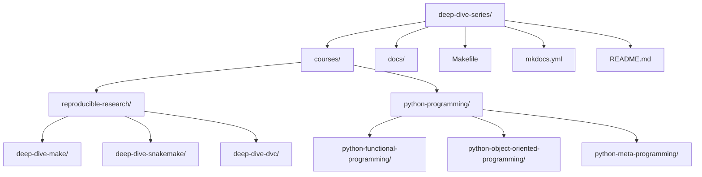

# Deep Dive Series

This repository is the permanent home for the Deep Dive course collection.
Each course keeps its own full git history while living inside one repository,
so new courses can be added without duplicating repo-level setup.

## Repository Layout



## Course Families

- `reproducible-research`
  - `deep-dive-make`
  - `deep-dive-snakemake`
  - `deep-dive-dvc`
- `python-programming`
  - `python-object-oriented-programming`
  - `python-functional-programming`
  - `python-meta-programming`

## Working With Courses

List the available families:

```bash
make families
```

List the available courses:

```bash
make courses
```

Run a common target against a selected course:

```bash
make COURSE=reproducible-research/deep-dive-make docs-build
make COURSE=python-programming/python-functional-programming test
```

Show a course's own Make targets:

```bash
make COURSE=reproducible-research/deep-dive-snakemake course-help
```

Build the series site:

```bash
make series-docs-build
```

Serve the series site locally:

```bash
make series-docs-serve
```
