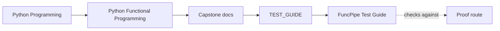
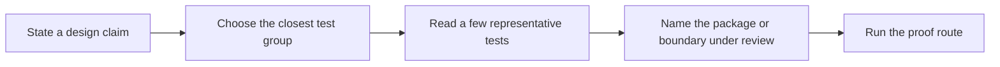

# FuncPipe Test Guide

<!-- page-maps:start -->
## Guide Maps

<!-- page-maps:end -->

Use this guide when you want the test suite to function as a review map instead of a
large undifferentiated tree.

## Test groups

| Group | Paths | What it proves |
| --- | --- | --- |
| Algebra and laws | `tests/unit/fp/laws/`, `tests/unit/result/`, `tests/unit/tree/` | the reusable functional containers and laws behave as the course claims |
| Functional toolkit | `tests/unit/fp/`, `tests/unit/streaming/` | pure helpers, stream combinators, and local reasoning rules stay stable |
| Domain and async behavior | `tests/unit/domain/` | retries, transactions, async scheduling, and effect descriptions remain explicit |
| Pipeline and policy surfaces | `tests/unit/pipelines/`, `tests/unit/policies/` | configured pipelines and runtime policies stay reviewable instead of hidden |
| Application model | `tests/unit/rag/`, `tests/unit/rag/domain/` | RAG-specific assembly, stages, and domain values preserve their contracts |
| Edges and interop | `tests/unit/boundaries/`, `tests/unit/infra/adapters/`, `tests/unit/interop/` | adapters, serialization, storage, and compatibility helpers stay at the edge |

## Suggested reading order

1. `tests/unit/fp/laws/`
2. `tests/unit/fp/`, `tests/unit/result/`, and `tests/unit/streaming/`
3. `tests/unit/rag/` and `tests/unit/rag/domain/`
4. `tests/unit/pipelines/` and `tests/unit/policies/`
5. `tests/unit/domain/`
6. `tests/unit/boundaries/`, `tests/unit/infra/adapters/`, and `tests/unit/interop/`

That order keeps semantic floor before orchestration and keeps the outer edges last.

## Review questions

- Which tests here prove laws or invariants rather than only a happy path?
- Which package should stay unchanged if this test still passes?
- Which proof route should you run after reading this group: `make test`, `make tour`, or `make proof`?
- Which future change would require a new test group instead of another test in the current folder?
