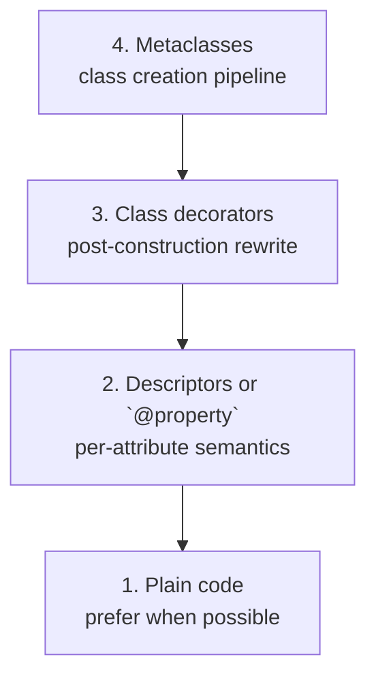
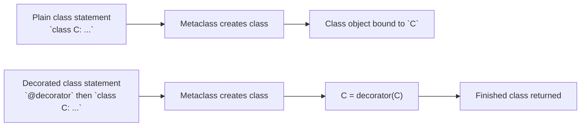
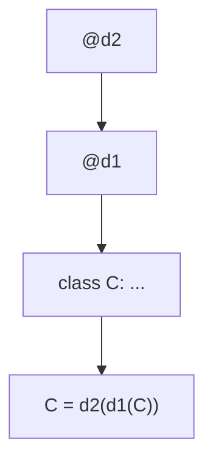
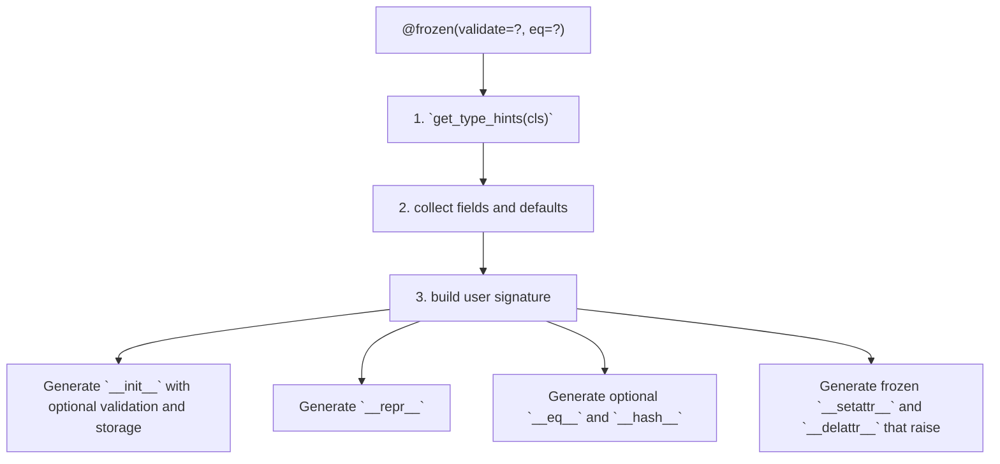

<a id="top"></a>
# Module 6: Class Decorators, `@property`, and the Typing Bridge

<a id="toc"></a>
## Table of Contents

1. [Introduction](#introduction)
2. [Visual: Tooling Power Ladder](#visual)
3. [Core 26: Class Decorators — Transformation Post-Construction](#core26)
4. [Core 27: `@dataclass` Dissected — What It Generates (and What It Doesn’t)](#core27)
5. [Core 28: `@property` / `.setter` / `.deleter` — The Friendly Face of Descriptors](#core28)
6. [Core 29: Runtime Type Hints as a Declarative Aid for Attribute Validation](#core29)
7. [Capstone: `@frozen` — Surface Immutability + Optional Validation](#capstone)
8. [Glossary (Module 6)](#glossary)

<span style="font-size: 1em;">[Back to top](#top)</span>

---

<a id="introduction"></a>
## Introduction

This module moves from function decorators (Modules 4–5) to **class-level metaprogramming**:

* **Class decorators**: transform a *fully created* class (`C = decorator(C)`).
* **`@property`**: the friendly entry point to the **descriptor protocol**.
* **Runtime type hints**: use `typing.get_type_hints` as a declarative schema for **shallow** runtime validation.

Design stance:

> Prefer descriptors, class decorators, or explicit helper methods for attribute management.
> Treat custom `__setattr__` as a last resort, only for tightly controlled hierarchies.

Conventions in this book:

* ` ```python` fences are runnable.
* Any line expected to raise is wrapped in `try/except` and prints `Expected: ...`.
* Pseudo-code is in ` ```text` fences.

<span style="font-size: 1em;">[Back to top](#top)</span>

---

<a id="visual"></a>
## Visual: Tooling Power Ladder



Caption: Choose the lowest-power tool that solves the problem.

<span style="font-size: 1em;">[Back to top](#top)</span>

---

<a id="core26"></a>
## Core 26: Class Decorators — Transformation Post-Construction

### Definition

A **class decorator** is any callable that takes a class object and returns a replacement:

```python
def identity_decorator(cls):
    """Placeholder decorator that returns the class unchanged (for demonstration)."""
    return cls

@identity_decorator
class C:
    ...
```

is exactly:

```python
def identity_decorator(cls):
    """Placeholder decorator that returns the class unchanged (for demonstration)."""
    return cls

class C:
    ...
C = identity_decorator(C)
```

It runs **after** the metaclass has created the class: bases, MRO, and class namespace are already fixed.

### Visual: Class Definition Pipeline (simplified)



Caption: Class decorators run after the metaclass; they see a fully formed class.
```

### Example 1: Method injection

```python
def add_method(cls):
    def extra(self):
        return f"Extra from {cls.__name__}"
    cls.extra = extra  # function becomes a descriptor on the class
    return cls

@add_method
class Basic:
    def __init__(self, value):
        self.value = value

b = Basic(42)
print(b.extra())  # Extra from Basic
```

### Example 2: Registration

```python
registry = []

def register(cls):
    registry.append(cls)
    return cls

@register
class Registered:
    pass

print([c.__name__ for c in registry])  # ['Registered']
```

### Example 3: Replacing the binding (legal, usually a bad idea)

```python
def replace_with_callable(cls):
    def proxy(*args, **kwargs):
        return f"Replaced {cls.__name__}; args={args}, kwargs={kwargs}"
    return proxy

@replace_with_callable
class Replaced:
    pass

print(Replaced(1, 2))  # Replaced Replaced; args=(1, 2), kwargs={}
```

Rule of thumb: returning a non-class breaks `isinstance` expectations and tooling. Avoid unless you *want* the name to stop being a class.

### Visual: Decorator stacking order



Caption: Decorators are applied bottom-up: inner first, outer last.
```

### Exercise

Implement `@log_attributes` that wraps `__setattr__`:

* logs only public assignments (skip names starting with `_`)
* affects only that decorated class (no global patching)

<span style="font-size: 1em;">[Back to top](#top)</span>

---

<a id="core27"></a>
## Core 27: `@dataclass` Dissected — What It Generates (and What It Doesn’t)

### What `@dataclass` does

`dataclasses.dataclass` inspects annotations and generates (depending on options):

* `__init__`
* `__repr__`
* `__eq__` (and optionally ordering)
* `__hash__` under certain rules
* calls `__post_init__` if present

Crucially: **it does not enforce types at runtime**.

### Visual: What `@dataclass` synthesizes

```mermaid
graph TD
  annotations["Annotations and defaults"]
  fields["Field discovery"]
  init["`__init__`"]
  repr["`__repr__`"]
  eq["`__eq__` and optional ordering"]
  hash["`__hash__` depending on `frozen`, `eq`, and `unsafe_hash`"]
  post["Optional `__post_init__` hook"]
  annotations --> fields
  fields --> init
  fields --> repr
  fields --> eq
  fields --> hash
  fields --> post
```

Caption: `@dataclass` generates boilerplate from declarative hints.
```

### Example: Defaults and `default_factory`

```python
from dataclasses import dataclass, field

@dataclass(kw_only=True)
class Employee:
    name: str
    id: int = field(default=0, repr=False)
    dept: str = field(default_factory=lambda: "Unknown")

e = Employee(name="Alice", dept="HR")
print(e)  # Employee(name='Alice', dept='HR')
```

### Example: Frozen + slots

```python
from dataclasses import dataclass

@dataclass(frozen=True, slots=True)
class Point:
    x: float
    y: float

p = Point(1.0, 2.0)
print(p)  # Point(x=1.0, y=2.0)

try:
    p.x = 3.0
except Exception as e:
    print("Expected:", type(e).__name__, e)
```

### Minimal emulation (for understanding only)

```python
import inspect
from typing import get_type_hints

def manual_dataclass(cls):
    hints = get_type_hints(cls)
    fields = [n for n in hints if not n.startswith("_")]
    defaults = {n: cls.__dict__[n] for n in fields if n in cls.__dict__}

    # required-before-optional rule
    seen_optional = False
    for n in fields:
        if n in defaults:
            seen_optional = True
        elif seen_optional:
            raise TypeError(f"Required field '{n}' cannot follow optional fields")

    params = []
    for n in fields:
        default = defaults[n] if n in defaults else inspect.Parameter.empty
        params.append(
            inspect.Parameter(
                n,
                inspect.Parameter.POSITIONAL_OR_KEYWORD,
                annotation=hints[n],
                default=default,
            )
        )
    user_sig = inspect.Signature(params)

    def __init__(self, *args, **kwargs):
        bound = user_sig.bind(*args, **kwargs)
        bound.apply_defaults()
        for name, value in bound.arguments.items():
            setattr(self, name, value)

    __init__.__signature__ = inspect.Signature(
        [inspect.Parameter("self", inspect.Parameter.POSITIONAL_OR_KEYWORD)] + params
    )
    cls.__init__ = __init__

    def __repr__(self):
        body = ", ".join(f"{n}={getattr(self, n)!r}" for n in fields)
        return f"{cls.__name__}({body})"
    cls.__repr__ = __repr__

    return cls

@manual_dataclass
class ManualPoint:
    x: int
    y: int = 0

mp = ManualPoint(5)
print(mp)  # ManualPoint(x=5, y=0)
print(inspect.signature(ManualPoint.__init__))  # (self, x: int, y: int = 0)
```

### Exercise

Write `@small_dataclass` that:

* generates only `__init__` + `__repr__`
* no inheritance support
* rejects >10 fields

<span style="font-size: 1em;">[Back to top](#top)</span>

---

<a id="core28"></a>
## Core 28: `@property` / `.setter` / `.deleter` — The Friendly Face of Descriptors

### Correct semantics (precise)

A `property` is a **descriptor stored on the class**.

* `instance.attr` triggers `__get__`
* `instance.attr = v` triggers `__set__`
* `del instance.attr` triggers `__delete__`

#### Critical correction: `property` is a **data descriptor**

Even without a user-defined setter, `property` defines `__set__` (it raises), so it **wins over** `instance.__dict__` during lookup and **cannot be shadowed**.

### Visual: Attribute lookup precedence (obj.x)

```text
Attribute Lookup Precedence (obj.x)

1. Data descriptor on type(obj)? (defines __set__ or __delete__)
   → descriptor.__get__(obj, type(obj))                WINNER

2. "x" in obj.__dict__?
   → return instance value

3. Non-data descriptor on type(obj)? (only __get__)
   → descriptor.__get__(obj, type(obj))

4. Plain class attribute?
   → return that value

5. __getattr__ fallback or AttributeError

Caption: @property is a data descriptor even without a setter → cannot be shadowed by obj.x = value.
```

### Example 1: Standard property with validation

```python
class Circle:
    def __init__(self, radius):
        self._radius = radius

    @property
    def radius(self):
        return self._radius

    @radius.setter
    def radius(self, value):
        if value < 0:
            raise ValueError("Radius must be non-negative")
        self._radius = value

c = Circle(5)
print(c.radius)  # 5
c.radius = 10
print(c.radius)  # 10

try:
    c.radius = -1
except ValueError as e:
    print("Expected:", e)
```

### Example 2: Subclass extending a base property (correct pattern)

```python
class Base:
    @property
    def value(self):
        return 42

class Sub(Base):
    @Base.value.getter
    def value(self):
        return getattr(self, "_value", super().value)

    @Base.value.setter
    def value(self, v):
        self._value = v

s = Sub()
print(s.value)  # 42
s.value = 100
print(s.value)  # 100
```

### Example 3: Read-only property is NOT shadowable

```python
class ReadOnly:
    @property
    def x(self):
        return 123

r = ReadOnly()
print(r.x)  # 123

try:
    r.x = "shadow?"
except AttributeError as e:
    print("Expected:", e)

r.__dict__["x"] = "forced"
print(r.__dict__["x"])  # forced
print(r.x)              # 123 (property wins)
```

### Example 4: A true non-data descriptor (shadowable)

```python
class NonData:
    def __init__(self, func):
        self.func = func
        self.__doc__ = getattr(func, "__doc__", None)

    def __get__(self, obj, objtype=None):
        if obj is None:
            return self
        return self.func(obj)

class Shadowable:
    @NonData
    def computed(self):
        return "computed"

sh = Shadowable()
print(sh.computed)  # computed
sh.computed = "shadow"
print(sh.computed)  # shadow
print(sh.__dict__["computed"])  # shadow
```

### Visual: `@property` is descriptor sugar

```text
@property is Descriptor Sugar

@property
def x(self): ...

is conceptually:

x = property(fget=x)

Then:

@x.setter
def x(self, v): ...
      ↓
x = x.setter(new_fset)

Each decorator returns a new property object.
Chaining builds the full descriptor.

Caption: Property chaining reuses and extends the original property instance.
```

### Exercise

Implement a minimal cached-property-like descriptor:

* computes once
* stores into `obj.__dict__[name]`
* subsequent access returns cached value
* include a `reset(obj)` method on the descriptor

<span style="font-size: 1em;">[Back to top](#top)</span>

---

<a id="core29"></a>
## Core 29: Runtime Type Hints as a Declarative Aid for Attribute Validation

### Key point

`get_type_hints(MyClass)` returns resolved annotations. They do nothing unless you enforce them.

We implement:

* minimal `_is_instance` (Any, Union/Optional, plain runtime classes)
* a `TypedDescriptor` that validates on assignment
* per-class hint caching

### Visual: Typing bridge data flow

```mermaid
graph TD
  classDef["Class definition"]
  annotations["Annotations"]
  hints["`get_type_hints(Class)`"]
  cache["Hints cached on class"]
  validate["Descriptor `__set__` validates incoming value"]
  store["Store into private slot or key"]
  classDef --> annotations --> hints --> cache --> validate --> store
```

Caption: Hints are resolved once; descriptors enforce shallow runtime checks.
```

### Minimal `_is_instance` (deliberately limited)

```python
from typing import Any, Union, get_args, get_origin

def _is_instance(value, hint) -> bool:
    if hint is Any:
        return True

    origin = get_origin(hint)

    if origin is Union:
        return any(_is_instance(value, h) for h in get_args(hint))

    if origin is not None:
        raise NotImplementedError(f"Generic validation not supported: {hint!r}")

    try:
        return isinstance(value, hint)
    except TypeError as e:
        raise NotImplementedError(f"Unsupported hint: {hint!r}") from e
```

### Typed descriptor with per-class cached hints

```python
import sys
from typing import get_type_hints

class TypedDescriptor:
    def __set_name__(self, owner, name):
        self.public_name = name
        self.storage_name = f"_{name}"

        if not hasattr(owner, "_field_hints_cache"):
            owner._field_hints_cache = get_type_hints(
                owner,
                globalns=vars(sys.modules[owner.__module__]),
                localns=dict(owner.__dict__),
            )

    def __get__(self, obj, objtype=None):
        if obj is None:
            return self
        return getattr(obj, self.storage_name)

    def __set__(self, obj, value):
        hints = obj.__class__._field_hints_cache
        expected = hints.get(self.public_name)

        if expected is not None and not _is_instance(value, expected):
            raise TypeError(f"{self.public_name}={value!r} expected {expected!r}")

        setattr(obj, self.storage_name, value)

class TypedClass:
    x: int = TypedDescriptor()
    y: str = TypedDescriptor()

tc = TypedClass()
tc.x = 42
tc.y = "ok"
print(tc.x, tc.y)  # 42 ok

try:
    tc.x = "oops"
except TypeError as e:
    print("Expected:", e)
```

### Exercise

Extend `TypedDescriptor` to support `Annotated[T, validator1, ...]`:

* validate base `T`
* then apply validators sequentially

<span style="font-size: 1em;">[Back to top](#top)</span>

---

<a id="capstone"></a>
## Capstone: `@frozen` — Surface Immutability + Optional Validation

A minimal frozen-class decorator that:

* reads fields from annotations
* generates `__init__`, `__repr__`
* optionally `__eq__` and `__hash__`
* enforces surface immutability via `__setattr__`/`__delattr__`
* optionally validates constructor args

### Visual: `@frozen` synthesizes



Caption: Minimal frozen dataclass-like behavior via a class decorator.
```

### Implementation

```python
import inspect
from typing import Callable, get_type_hints

def frozen(*, eq: bool = True, validate: bool = False) -> Callable[[type], type]:
    def decorator(cls: type) -> type:
        hints = get_type_hints(cls)
        fields = [n for n in hints if not n.startswith("_")]
        defaults = {n: cls.__dict__[n] for n in fields if n in cls.__dict__}

        seen_optional = False
        for n in fields:
            if n in defaults:
                seen_optional = True
            elif seen_optional:
                raise TypeError(f"Required field '{n}' cannot follow optional fields")

        user_params = []
        for n in fields:
            default = defaults[n] if n in defaults else inspect.Parameter.empty
            user_params.append(
                inspect.Parameter(
                    n,
                    inspect.Parameter.POSITIONAL_OR_KEYWORD,
                    annotation=hints[n],
                    default=default,
                )
            )

        user_sig = inspect.Signature(user_params)

        def __init__(self, *args, **kwargs):
            bound = user_sig.bind(*args, **kwargs)
            bound.apply_defaults()
            for name, value in bound.arguments.items():
                if validate:
                    expected = hints.get(name)
                    if expected is not None and not _is_instance(value, expected):
                        raise TypeError(f"{name}={value!r} expected {expected!r}")
                object.__setattr__(self, name, value)

        __init__.__signature__ = inspect.Signature(
            [inspect.Parameter("self", inspect.Parameter.POSITIONAL_OR_KEYWORD)] + list(user_params)
        )
        cls.__init__ = __init__
        cls.__signature__ = user_sig

        def __repr__(self):
            body = ", ".join(f"{n}={getattr(self, n)!r}" for n in fields)
            return f"{cls.__name__}({body})"
        cls.__repr__ = __repr__

        if eq:
            def __eq__(self, other):
                if type(self) is not type(other):
                    return NotImplemented
                return all(getattr(self, n) == getattr(other, n) for n in fields)

            def __hash__(self):
                return hash(tuple(getattr(self, n) for n in fields))

            cls.__eq__ = __eq__
            cls.__hash__ = __hash__

        def __setattr__(self, name, value):
            raise TypeError(f"{cls.__name__} is frozen; cannot set {name!r}")

        def __delattr__(self, name):
            raise TypeError(f"{cls.__name__} is frozen; cannot delete {name!r}")

        cls.__setattr__ = __setattr__
        cls.__delattr__ = __delattr__

        return cls
    return decorator


@frozen(validate=True)
class FrozenPoint:
    x: float
    y: float = 0.0

p = FrozenPoint(1.5)
print(p)  # FrozenPoint(x=1.5, y=0.0)

print(inspect.signature(FrozenPoint))          # (x: float, y: float = 0.0)
print(inspect.signature(FrozenPoint.__init__)) # (self, x: float, y: float = 0.0)

try:
    p.x = 2.0
except TypeError as e:
    print("Expected:", e)

try:
    FrozenPoint("x")
except TypeError as e:
    print("Expected:", e)
```

<span style="font-size: 1em;">[Back to top](#top)</span>

---

<a id="glossary"></a>
## Glossary (Module 6)

| Term                                      | Definition                                                                                                                                                                   |
| ----------------------------------------- | ---------------------------------------------------------------------------------------------------------------------------------------------------------------------------- |
| **Class decorator**                       | Callable that takes a fully-created class and returns a replacement; `@d class C: ...` desugars to `C = d(C)`.                                                               |
| **Post-construction transformation**      | Modification stage after metaclass/class creation; bases, MRO, and initial namespace already exist.                                                                          |
| **Binding replacement**                   | Class decorator returns a non-class (e.g., proxy function) under the original name; legal but breaks `isinstance` expectations and tooling assumptions.                      |
| **Method injection**                      | Adding functions/attributes onto the class inside a class decorator; injected functions become descriptors (bind as methods when accessed from instances).                   |
| **Registration decorator**                | Class decorator that records class objects into a registry for discovery, typically deterministic and resettable for tests.                                                  |
| **Decorator stacking order**              | Multiple class decorators apply bottom-up: `@d2 @d1 class C` becomes `C = d2(d1(C))`.                                                                                        |
| **`dataclasses.dataclass`**               | Standard-library class decorator that generates boilerplate (`__init__`, `__repr__`, `__eq__`, ordering, hashing rules, `__post_init__` hook) from annotations and defaults. |
| **Dataclass field discovery**             | Process of reading class annotations + defaults (including `field(default_factory=...)`) to define generated init parameters and repr/eq behavior.                           |
| **`default_factory`**                     | Dataclass field option producing a fresh default value per instance (avoids shared mutable defaults).                                                                        |
| **Frozen dataclass**                      | Dataclass mode (`frozen=True`) that blocks attribute rebinding after initialization (surface immutability).                                                                  |
| **Slots dataclass**                       | Dataclass mode (`slots=True`) that generates a slotted class (no per-instance `__dict__` unless requested), reducing memory and limiting dynamic attrs.                      |
| **`__post_init__`**                       | Dataclass hook called after the generated `__init__` assigns fields; used for derived fields or validation.                                                                  |
| **Descriptor**                            | Object defining `__get__` and optionally `__set__` / `__delete__`, participating in attribute access semantics when stored on a class.                                       |
| **Descriptor protocol**                   | The rules by which attribute access on instances/types calls descriptor methods (`__get__`, `__set__`, `__delete__`) instead of returning raw objects.                       |
| **`property`**                            | Built-in descriptor wrapping fget/fset/fdel; created by `property(fget, fset, fdel, doc)` and typically via `@property` / `.setter` / `.deleter`.                            |
| **Data descriptor**                       | Descriptor that defines `__set__` or `__delete__` (or both); wins over `obj.__dict__` during lookup.                                                                         |
| **Non-data descriptor**                   | Descriptor that defines only `__get__`; can be shadowed by an instance attribute of the same name.                                                                           |
| **Read-only property semantics**          | Even without a user setter, `property` is still a data descriptor (its `__set__` raises), so it cannot be shadowed by `obj.__dict__`.                                        |
| **Subclass property extension**           | Pattern of reusing a base property via `@Base.prop.getter` / `.setter` to extend behavior while keeping descriptor identity coherent.                                        |
| **`__set_name__`**                        | Descriptor hook called at class creation time with `(owner, name)`; used to capture the public name and compute storage keys.                                                |
| **Typed descriptor**                      | Descriptor that validates values in `__set__` using type hints (or validators) and stores validated data under a private name/slot.                                          |
| **Typing bridge**                         | Use of `typing.get_type_hints(cls)` as a declarative schema for shallow runtime checks (opt-in enforcement, not automatic).                                                  |
| **`typing.get_type_hints`**               | Resolves annotations (including forward refs) into runtime objects using provided globals/locals; may evaluate strings.                                                      |
| **Per-class hint cache**                  | Storing resolved hints on the class (e.g., `_field_hints_cache`) so enforcement doesn’t recompute hints per assignment/call.                                                 |
| **Shallow runtime validation**            | Limited runtime checking typically supporting plain classes, `Union`/`Optional`, and `Any`; refuses generics like `list[int]` unless implemented explicitly.                 |
| **`Annotated` (typing)**                  | Hint wrapper carrying metadata (`Annotated[T, ...]`); enforcement requires explicitly parsing metadata and applying validators.                                              |
| **Surface immutability**                  | Blocking attribute rebinding/deletion via `__setattr__`/`__delattr__`; does not freeze nested mutable objects.                                                               |
| **Frozen class decorator (`@frozen`)**    | Class decorator that synthesizes `__init__`/`__repr__` (and optionally `__eq__`/`__hash__`) and prevents further attribute mutation at the surface.                          |
| **`object.__setattr__`**                  | Bypasses custom `__setattr__` in controlled contexts (e.g., inside `__init__` of a frozen class) to perform assignments reliably.                                            |
| **Prefer descriptors over `__setattr__`** | Policy stance: use properties/descriptors/class decorators for localized semantics; override `__setattr__` only as a last resort due to global, hard-to-debug side effects.  |

Proceed to **Module 7: The Descriptor Protocol — The True Engine (Part 1)**.

<span style="font-size: 1em;">[Back to top](#top)</span>
