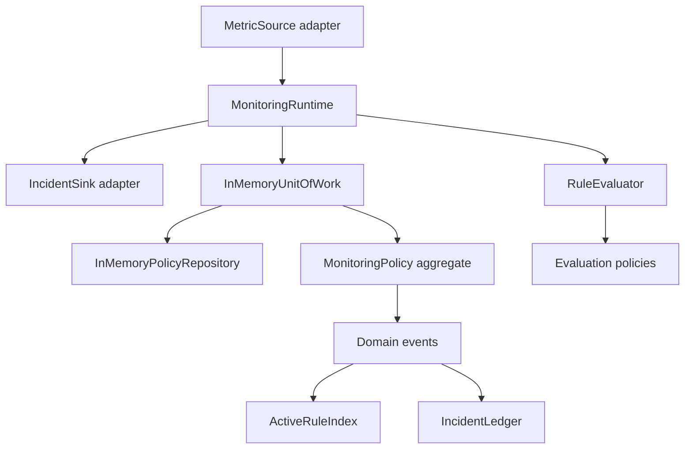

# Python Object-Oriented Programming Capstone

This capstone is a compact monitoring-system reference implementation. It exists to
make the course concrete: value objects, entities, rule lifecycles, aggregate roots,
evaluation policies, read models, runtime adapters, and unit-of-work boundaries are
all exercised in runnable code instead of only in chapter prose.

## What it models

- threshold-based monitoring rules with explicit lifecycle states
- a `MonitoringPolicy` aggregate root that owns rule transitions and evaluation
- multiple evaluation policies: threshold, consecutive breach, and rate of change
- domain events for registration, activation, retirement, and alert triggering
- read models for active-rule indexing and incident history
- a `MonitoringRuntime` facade with source and sink adapters
- an in-memory unit of work with rollback semantics

## Run it

From this directory:

```bash
make confirm
```

Or from the repository root:

```bash
make COURSE=python-programming/python-object-oriented-programming test
```

## Design intent

The implementation deliberately stays small. The goal is not framework breadth. The
goal is to demonstrate a Python object model that remains readable under change:

- value types stay immutable and validated
- aggregates own invariants instead of scattering them
- strategy objects keep rule evaluation extensible without condition ladders
- events describe what happened without mutating projections directly
- a runtime facade keeps orchestration outside the aggregate
- repositories and unit-of-work boundaries make persistence intent explicit

## Architecture



## Layout

- `src/service_monitoring/model.py` contains the aggregate, rules, and alert model.
- `src/service_monitoring/policies.py` contains rule-evaluation strategy objects.
- `src/service_monitoring/read_models.py` contains downstream incident projections.
- `src/service_monitoring/runtime.py` contains the runtime facade and adapters.
- `tests/` contains executable behavioral checks across the full stack.
