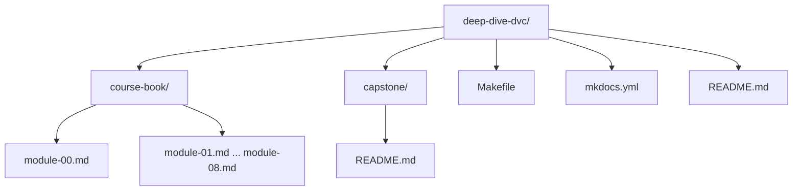

# Deep Dive DVC

Deep Dive DVC is the reproducible-research course about **state**: what it is, how it acquires identity, how it moves through pipelines, and how teams keep it recoverable over time.

This course sits alongside:

- **Deep Dive Make** for truthful local build graphs
- **Deep Dive Snakemake** for scalable workflow execution
- **Deep Dive DVC** for data identity, experiment lineage, and recoverability

## What you will learn

- Why Git alone cannot make data-heavy systems reproducible
- Why content-addressed identity is the only stable definition of “the same data”
- How `dvc.yaml`, `dvc.lock`, remotes, params, metrics, and experiments work together
- Why CI, retention policy, and recovery drills matter as much as commands

## Working locally

From the repository root:

```bash
make COURSE=reproducible-research/deep-dive-dvc docs-serve
make COURSE=reproducible-research/deep-dive-dvc test
```

## Repository layout



## Course modules

- `00` Orientation
- `01` Why Reproducibility Fails
- `02` Data Identity and Content Addressing
- `03` Execution Environments as Inputs
- `04` Pipelines as Truthful DAGs
- `05` Metrics, Parameters, and Meaning
- `06` Experiments Without Chaos
- `07` Collaboration, CI, and Social Contracts
- `08` Production, Scale, and Incident Survival
