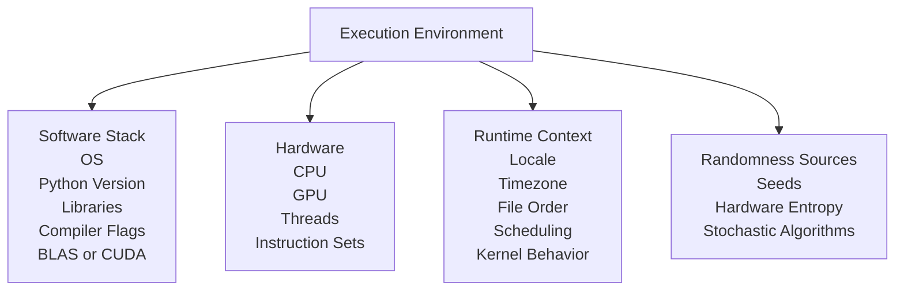

# Module 03 — Execution Environments as Inputs

*The invisible variable that breaks reproducibility even when everything else is correct*

---

## Purpose of this Module

Having established immutable data identity and recoverable historical versions in prior modules, along with verifiable byte usage, discrepancies in results may still arise. This module elucidates the underlying reasons and, crucially, clarifies that such issues do not stem from deficiencies in DVC itself.

The central assertion, though potentially disconcerting, is inescapable: **Code combined with data does not fully encapsulate an experiment; the execution environment constitutes an additional input.** Until this element is explicitly addressed, reproducibility remains tentative and potentially deceptive.

**Prerequisites**: Completion of Modules 01 and 02 is required. Proficiency in basic ML scripting and familiarity with containerization concepts (e.g., Docker) will enhance comprehension; review these if necessary.

---

## 3.1 The Erroneous Presumption: Identical Code and Data Yield Identical Results

This belief is entrenched, particularly within software engineering paradigms, yet it proves invalid in machine learning (ML) contexts. Identical scripts, datasets, and parameters can produce divergent outcomes, not due to overt errors, but through unrecognized input alterations residing within the environment.

---

## 3.2 Precise Definition of the Environment

The environment encompasses all factors influencing execution that remain undeclared as dependencies, including:

### Software Stack
- Operating system.
- Python interpreter version.
- Library dependencies.
- Compiler directives.
- Implementations such as BLAS, LAPACK, or CUDA.

### Hardware
- CPU architecture.
- GPU configuration.
- Thread count.
- Instruction set extensions.

### Runtime Context
- Locale settings.
- Timezone configurations.
- File enumeration sequences.
- Parallelism orchestration.
- Non-deterministic computational kernels.

### Randomness Sources
- Pseudorandom number seeds.
- Hardware-derived entropy.
- Inherently stochastic algorithms.

These components can alter results without modifications to code or data.

**Illustration**:



---

## 3.3 The Spectrum of Determinism

A common oversight is viewing programs as strictly deterministic or otherwise. Determinism, however, operates along a continuum.

### Theoretically Deterministic
- Pure functional computations.
- Sequential arithmetic operations.
- Single-threaded processes.

### Conditionally Deterministic
- Floating-point calculations.
- Parallel summation reductions.
- GPU kernels susceptible to race conditions.

### Inherently Non-Deterministic
- Asynchronous task handling.
- Hardware scheduling variances.
- Optimized mathematical procedures.

ML tasks predominantly occupy the conditionally deterministic domain, where minor variances compound, leading to subtle divergences and unexplained metric shifts. This reflects fundamental physical constraints, not procedural lapses.

---

## 3.4 DVC's Deliberate Exclusion of Environment Management

DVC intentionally refrains from overseeing environments, establishing a clear demarcation rather than an omission. It assures data usage, pipeline execution, and stage timing, but not uniform floating-point outcomes, library behaviors, or hardware executions. Anticipating such from DVC mirrors expecting Git to dictate compiler semantics. The appropriate strategy involves integration with complementary tools.

---

## 3.5 Strategies for Explicit Environment Management

Achieving reproducibility necessitates deliberate decisions on environmental fixation, balancing trade-offs without a singular solution.

### Strategy 1: Lockfiles (Lightweight and Partial)
Examples include `requirements.txt`, `poetry.lock`, and `conda-lock.yml`.

**Advantages**: Simplicity in adoption, rapid iteration, suitability for CPU-intensive tasks.

**Disadvantages**: Dependence on operating systems and hardware, incomplete determinism.

Applicable when prioritizing development speed and tolerating minor numerical variations.

### Strategy 2: Containers (Robust and Intermediate)
Examples encompass Docker images and OCI-compliant containers.

**Advantages**: Operating system consistency, cross-machine portability, compatibility with continuous integration (CI).

**Disadvantages**: Increased artifact size, complexities in GPU integration, residual hardware dependencies.

Suitable for ensuring cross-machine stability and CI reliability.

### Strategy 3: CI as the Authoritative Environment (Comprehensive Approach)
This framework posits: **Reproducibility is confirmed if achieved in CI.** Local executions are deemed exploratory and provisional, while CI serves as the definitive executor, correctness adjudicator, and reproducibility benchmark. This model harmonizes priorities and mitigates uncertainties.

**Example Integration Snippet** (Illustrative Docker configuration for DVC):
```
FROM python:3.10-slim

RUN pip install dvc[all]
COPY . /app
WORKDIR /app
RUN dvc repro
```

---

## 3.6 DVC's Integrative Role

DVC functions as a connector among environment tools (e.g., Docker, Conda), data identity mechanisms, and pipeline orchestration. It guarantees consistent input delivery, step execution, and deviation detection, but not numerical equivalence across environments. This boundary is fundamental.

---

## 3.7 Failure Modes and Their Analyses

| Symptom                        | Interpretation                     |
| ------------------------------ | ---------------------------------- |
| Inter-machine metric variances | Environmental divergence           |
| CI-local discrepancies         | Non-authoritative local setup      |
| Minor numerical alterations    | Floating-point variability         |
| Substantial metric shifts      | Probable concealed dependency      |

Address these by identifying altered inputs, rather than superficial fixes like arbitrary seed pinning.

---

## 3.8 Diagnostic Exercise

Conduct this systematically:
1. Execute a pipeline locally, documenting metrics and environment specifications (e.g., via `pip freeze`).
2. Replicate in a CI environment.
3. Compare outputs, logs, and behaviors.
4. Assess: Which variances are tolerable? Which require resolution? Which are intrinsic?

This practical evaluation surpasses theoretical descriptions.

**Guidance**: Utilize a sample repository if unavailable; record insights for future reference.

---

## 3.9 Essential Conceptual Model

> **Data, code, parameters, and the environment each represent inputs.**

Influential factors must be captured, constrained, or acknowledged as variable; no alternatives exist.

---

## Module 03 — Invariants Checklist

Affirm and substantiate:
- [ ] Environments impact outcomes despite identical data.
- [ ] Determinism is conditional, not unequivocal.
- [ ] DVC excludes environment management intentionally.
- [ ] CI may function as a canonical executor.
- [ ] Environmental drifts are identifiable, not enigmatic.

Proceed if these resonate intuitively.

---

## Transition to Module 04

With immutable data identity and explicit environments secured, pipeline unpredictability endures due to misrepresented dependencies. Module 04 presents truthful directed acyclic graphs (DAGs)—pipelines that execute selectively and precisely, transforming reproducibility from aspirational to systematic.
