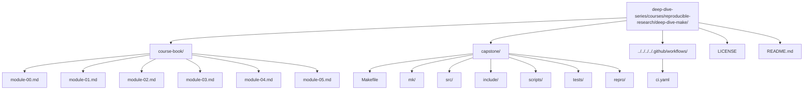

<a id="top"></a>

# Deep Dive Make

A course-book and executable capstone that teaches **GNU Make as a build-graph engine**—not a scripting language. The goal is simple: help you write Makefiles that are **truthful, race-free under `-j`, deterministic, and self-tested**, so builds scale without surprises.

[](https://github.com/bijux/deep-dive-series/actions/workflows/course-validation.yml?query=branch%3Amaster)
[](https://www.gnu.org/software/make/)
[](https://github.com/bijux/deep-dive-series/blob/master/LICENSE)
[](https://bijux.io/deep-dive-series/reproducible-research/deep-dive-make/)
[](https://github.com/bijux/deep-dive-series/tree/master/courses/reproducible-research/deep-dive-make/capstone)
> Validation runs from the monorepo root against the shared `course-validation.yml` workflow.
---

## What this is

Most Makefiles “work” until they don’t: hidden inputs, phony ordering, stamp hacks, and parallel builds that silently change behavior.

**Deep Dive Make** is a structured path out of that mess. It teaches Make through a strict contract:

- **Truthful DAG**: every dependency edge is explicit (depfiles, manifests, or principled stamps).
- **Atomic publication**: no partial artifacts, no half-written outputs.
- **Parallel safety**: `-j` speeds up builds without changing semantics.
- **Determinism**: serial and parallel builds converge to identical results.
- **Self-testing**: the build validates itself (convergence, equivalence, and failure modes).

This is a practical step toward *real* understanding of Make: what it guarantees, what it does not, and how to design Makefiles that remain correct as projects grow.

[Back to top](#top)

---

## What you get

### 1) The course-book (5 modules)

A compact, opinionated handbook with patterns, anti-patterns, and exercises:

- **01 — Foundations**: targets, prerequisites, rebuild semantics, depfiles, atomicity.
- **02 — Scaling**: parallelism, ordering primitives, discovery patterns, structure for large repos.
- **03 — Production Practice**: determinism, CI discipline, invariants, style constraints that prevent drift.
- **04 — Semantics Under Pressure**: edge cases and battle-tested rules you rely on when things break.
- **05 — Hardening**: portability, jobserver correctness, hermetic-ish practices, performance, failure isolation.

Read on the website: https://bijux.io/deep-dive-series/reproducible-research/deep-dive-make/

### 2) The executable capstone

`capstone/` is a working build that embodies the rules above and provides a concrete reference for “what correct looks like” under pressure (including parallel builds).

### 3) A repro pack of failure modes

Small, isolated examples of common pitfalls (races, stamp lies, mkdir hazards, generated header modeling) meant to be *reproduced*, not merely described.

[Back to top](#top)

---

## Quick start
From the monorepo root:

### Linux (GNU Make)

```sh
make COURSE=reproducible-research/deep-dive-make test
```

### macOS (GNU Make via Homebrew)

```sh
brew install make
make COURSE=reproducible-research/deep-dive-make test
```

If `selftest` passes, you’ve validated the capstone’s contract on your machine.

[Back to top](#top)

---

## Repository layout



[Back to top](#top)

---

## Who this is for

* Engineers inheriting brittle Makefiles and needing a safe migration path.
* People who “know Make” but still get surprised by rebuild behavior or `-j` races.
* Teams that want a build system they can trust in CI and at scale.

This is not “Make syntax tutorials.” It is **build semantics and correctness engineering** with Make as the tool.

[Back to top](#top)

---

## Contributing

Contributions that improve correctness, clarity, or reproducibility are welcome (typos, exercises, minimal repros, capstone hardening).

1. Fork & clone `deep-dive-series`
2. Make a focused change (docs or capstone)
3. From the monorepo root, verify:
   ```sh
   make COURSE=reproducible-research/deep-dive-make test
   ```
4. Open a PR against `master` or `main`

[Back to top](#top)

---

## License

MIT — see the repository root [LICENSE](https://github.com/bijux/deep-dive-series/blob/master/LICENSE). © 2025 Bijan Mousavi <bijan@bijux.io>.

[Back to top](#top)
