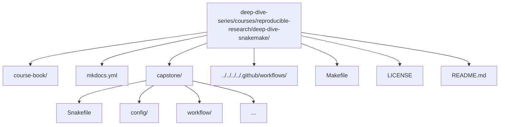

# Deep Dive Snakemake

A course-book and executable capstone that teaches **Snakemake as a workflow engine**—not merely a collection of rules and scripts. The objective is to enable the creation of workflows that feature **explicit contracts, safe dynamic behavior, atomic outputs, reproducible execution, and built-in validation**.

[](https://github.com/bijux/deep-dive-series/actions/workflows/course-validation.yml?query=branch%3Amaster)
[](https://snakemake.readthedocs.io/en/stable/)
[](https://github.com/bijux/deep-dive-series/blob/master/LICENSE)
[](https://bijux.github.io/deep-dive-series/reproducible-research/deep-dive-snakemake/)
[](https://github.com/bijux/deep-dive-series/tree/master/courses/reproducible-research/deep-dive-snakemake/capstone)

> CI executes full confirmation runs including workflow execution and artifact validation.

---

## What this is

Many Snakemake workflows function adequately in simple cases but encounter issues under scale: implicit dependencies, checkpoint misuse, non-atomic outputs, configuration drift, or reproducibility failures across environments.

**Deep Dive Snakemake** provides a structured approach to robust design. It emphasizes a strict contract:

- **Explicit inputs/outputs**: every dependency and product is declared and enforced.
- **Atomic publication**: outputs are written safely with no partial artifacts.
- **Dynamic safety**: checkpoints and re-evaluation used correctly without races or surprises.
- **Configuration discipline**: validated schemas and modular composition.
- **Reproducibility**: profiles, manifests, and integrity checks for verifiable runs.
- **Self-validation**: wrapper-driven checks confirm correctness end-to-end.

This repository offers practical guidance toward genuine mastery of Snakemake semantics: understanding its guarantees, limitations, and patterns that ensure workflows remain reliable as complexity increases.

[Back to top](#top)

---

## What you get

### 1) The course-book

A compact, focused handbook with practical patterns, anti-patterns, and guidance:

- explicit inputs/outputs and safe writing
- checkpoints and dependency re-evaluation
- configuration + schema validation
- modular workflow composition
- publishing, manifests, and integrity checks
- execution profiles and reproducible runs

Read on the website: https://bijux.github.io/deep-dive-series/reproducible-research/deep-dive-snakemake/

### 2) The executable capstone

`capstone/` is a complete end-to-end pipeline on toy FASTQ data that embodies the principles above, demonstrating:

- checkpoint-driven sample discovery
- per-sample processing stages
- summary and report generation
- versioned `publish/v1/` outputs
- checksummed manifest and artifact sanity checks
- a Make-driven verification flow

[Back to top](#top)

---

## Quick start

Prerequisites:
- Python 3.11+
- `make`

From the repository root:

### Preview the course book locally

```bash
make COURSE=reproducible-research/deep-dive-snakemake docs-serve
```

Open the local URL displayed by MkDocs.

### Run the capstone reference workflow

```bash
make COURSE=reproducible-research/deep-dive-snakemake test
```

This executes formatting/linting/tests, a dry-run, full workflow execution, and artifact validation.

Successful completion confirms the workflow's contract on your system.

[Back to top](#top)

---

## Repository layout



[Back to top](#top)

---

## Who this is for

- Engineers maintaining or inheriting complex bioinformatics workflows seeking reliability.
- Users familiar with basic Snakemake but encountering issues with checkpoints, reproducibility, or scaling.
- Teams requiring workflows that are trustworthy in CI/CD and production environments.

This is not an introductory syntax tutorial. It focuses on **workflow semantics and correctness engineering** using Snakemake.

[Back to top](#top)

---

## Contributing

Contributions that enhance correctness, clarity, or reproducibility are welcome (improvements to documentation, exercises, or capstone hardening).

1. Fork and clone `deep-dive-series`.
2. Implement a focused change (documentation or capstone).
3. From the monorepo root, verify:
   ```bash
   make COURSE=reproducible-research/deep-dive-snakemake test
   ```
4. Open a pull request against `master` or `main`.

[Back to top](#top)

---

## License

MIT — see the repository root [LICENSE](https://github.com/bijux/deep-dive-series/blob/master/LICENSE). © 2025 Bijan Mousavi.

[Back to top](#top)
