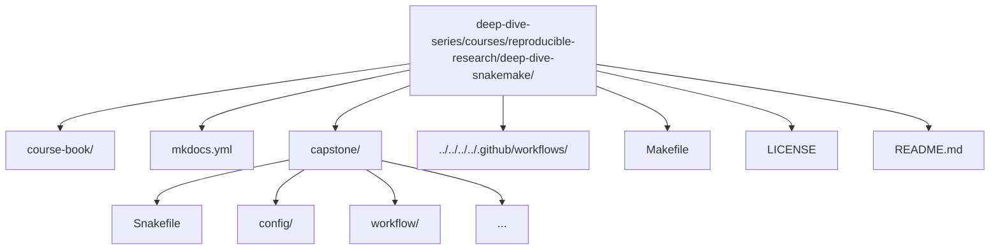

# Deep Dive Snakemake

A course-book and executable capstone that teaches **Snakemake as a workflow engine**—not merely a collection of rules and scripts. The objective is to enable the creation of workflows that feature **explicit contracts, safe dynamic behavior, atomic outputs, reproducible execution, and built-in validation**.

[](https://github.com/bijux/deep-dive-series/actions/workflows/course-validation.yml?query=branch%3Amaster)
[](https://snakemake.readthedocs.io/en/stable/)
[](https://github.com/bijux/deep-dive-series/blob/master/LICENSE)
[](https://bijux.io/deep-dive-series/reproducible-research/deep-dive-snakemake/)
[](https://github.com/bijux/deep-dive-series/tree/master/courses/reproducible-research/deep-dive-snakemake/capstone)

> CI executes full confirmation runs including workflow execution and artifact validation.

---

## Who this course is for

- Engineers who already know basic Snakemake syntax and now need stronger workflow design judgment
- Researchers and platform teams maintaining pipelines that must survive CI, shared filesystems, and long-lived change
- Reviewers who want concrete criteria for deciding whether a workflow is robust or merely convenient

## Who this course is not for

- Absolute beginners looking for a first introduction to Snakemake syntax
- Readers who only want isolated snippets without understanding workflow contracts
- Teams trying to debug executor behavior before they understand their workflow semantics

## What this is

Many Snakemake workflows function adequately in simple cases but encounter issues under scale: implicit dependencies, checkpoint misuse, non-atomic outputs, configuration drift, or reproducibility failures across environments.

**Deep Dive Snakemake** provides a structured approach to robust design. It emphasizes a strict contract:

- **Explicit inputs/outputs**: every dependency and product is declared and enforced.
- **Atomic publication**: outputs are written safely with no partial artifacts.
- **Dynamic safety**: checkpoints and re-evaluation used correctly without races or surprises.
- **Configuration discipline**: validated schemas and modular composition.
- **Reproducibility**: profiles, manifests, and integrity checks for verifiable runs.
- **Self-validation**: wrapper-driven checks confirm correctness end-to-end.

This repository offers practical guidance toward genuine mastery of Snakemake semantics: understanding its guarantees, limitations, and patterns that ensure workflows remain reliable as complexity increases.

[Back to top](#top)

---

## What you should be able to do after this course

- explain why a workflow re-runs using evidence instead of intuition
- distinguish a truthful dynamic DAG from a workflow that only appears to work
- separate workflow logic, profile policy, and published artifact contracts cleanly
- extend a pipeline without weakening its publish boundary or provenance story
- review a Snakemake repository for hidden coupling, poison artifacts, and reproducibility gaps

[Back to top](#top)

---

## What you get

### 1) The course-book

A compact, focused handbook with practical patterns, anti-patterns, and guidance:

- explicit inputs/outputs and safe writing
- checkpoints and dependency re-evaluation
- configuration + schema validation
- modular workflow composition
- publishing, manifests, and integrity checks
- execution profiles and reproducible runs

Read on the website: https://bijux.io/deep-dive-series/reproducible-research/deep-dive-snakemake/

### 2) The executable capstone

`capstone/` is a complete end-to-end pipeline on toy FASTQ data that embodies the principles above, demonstrating:

- checkpoint-driven sample discovery
- per-sample processing stages
- summary and report generation
- versioned `publish/v1/` outputs
- checksummed manifest and artifact sanity checks
- a Make-driven verification flow

[Back to top](#top)

---

## Recommended background

- Comfortable shell usage and basic Python workflow tooling
- Basic Snakemake familiarity: rules, wildcards, `snakemake -n`, and dry-run interpretation
- Willingness to treat workflow design as an engineering contract rather than as glue code

[Back to top](#top)

---

## Quick start

Prerequisites:
- Python 3.11+
- `make`

From the repository root:

### Preview the course book locally

```bash
make COURSE=reproducible-research/deep-dive-snakemake docs-serve
```

Open the local URL displayed by MkDocs.

### Run the capstone reference workflow

```bash
make COURSE=reproducible-research/deep-dive-snakemake test
```

This executes formatting/linting/tests, a dry-run, full workflow execution, and artifact validation.

Successful completion confirms the workflow's contract on your system.

[Back to top](#top)

---

## How to study this course well

1. Start with the orientation material before reading the deeper technical modules.
2. Work through Modules 01 to 04 in order because later workflow patterns depend on earlier file-contract discipline.
3. Treat each module as a design checkpoint: read the overview, then the detailed module body, then inspect the capstone for the same idea.
4. Re-run the capstone proof targets regularly so the workflow stays executable in your head, not only in prose.
5. Use dry-runs, summaries, and proof artifacts as learning tools, not only as debugging tools.

[Back to top](#top)

---

## How to know you are succeeding

- You can explain every published artifact and why it belongs at the publish boundary.
- You can describe what a checkpoint is allowed to discover and what it must never hide.
- You can distinguish executor policy from workflow semantics.
- You can review a workflow and identify hidden coupling, poison artifacts, or provenance gaps quickly.

[Back to top](#top)

---

## Module map

- `00` Orientation and study map
- `01` File contracts, rebuild truth, and safe rule design
- `02` Dynamic DAGs, integrity, environments, and performance patterns
- `03` Production operation, profiles, staging, retries, and governance
- `04` Scaling boundaries, modularity, CI gates, and executor-proof semantics

[Back to top](#top)

---

## Repository layout



[Back to top](#top)

---

## Capstone promise

The capstone is the course’s executable proof. It is not decorative. It exists so that
the big claims in the course can always be located in runnable workflow behavior:

- explicit discovery instead of hidden sample state
- versioned publishing instead of informal results directories
- profiles as policy instead of tribal command lines
- verification gates instead of “it ran once” confidence

[Back to top](#top)

---

## Contributing

Contributions that enhance correctness, clarity, or reproducibility are welcome (improvements to documentation, exercises, or capstone hardening).

1. Fork and clone `deep-dive-series`.
2. Implement a focused change (documentation or capstone).
3. From the monorepo root, verify:
   ```bash
   make COURSE=reproducible-research/deep-dive-snakemake test
   ```
4. Open a pull request against `master` or `main`.

[Back to top](#top)

---

## License

MIT — see the repository root [LICENSE](https://github.com/bijux/deep-dive-series/blob/master/LICENSE). © 2025 Bijan Mousavi <bijan@bijux.io>.

[Back to top](#top)
