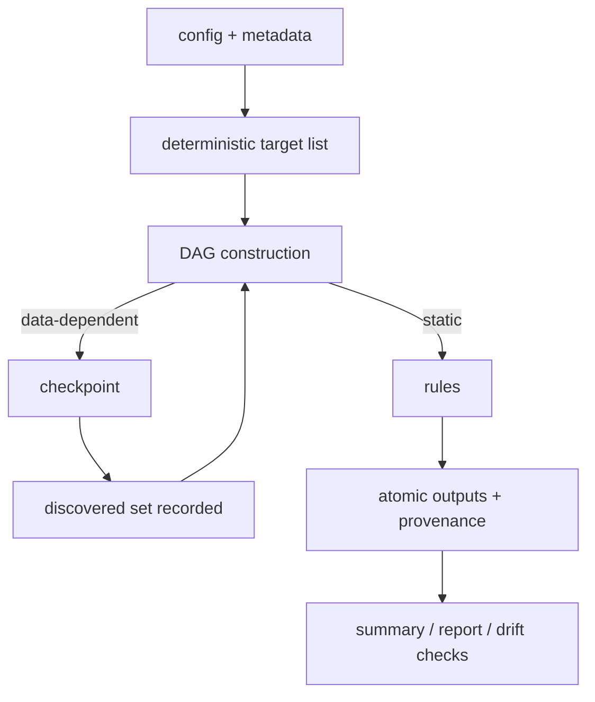
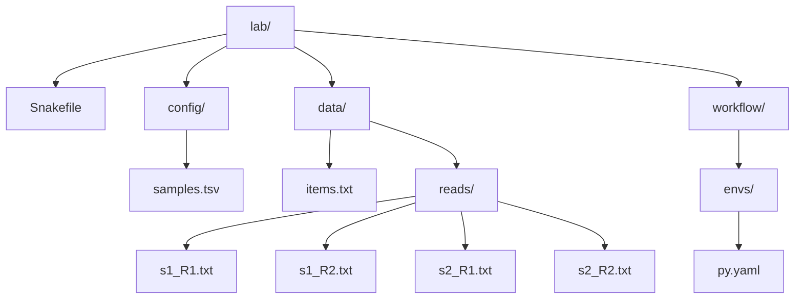

# Module 02: Advanced Mechanics — Dynamic DAGs, Integrity, and Performance Patterns

> **Version & scope contract**
>
> * Target: **Snakemake 9.14.x** semantics (mid-December 2025 docs). Verify your runtime:
>
>   ```bash
>   snakemake --version
>   snakemake -h | sed -n '930,1025p'   # software deployment + conda + apptainer flags
>   ```
> * Scope: **advanced DAG construction, dynamic DAGs (checkpoints), integrity/provenance, env/container discipline, and performance patterns** *without* assuming a cluster. Cluster-first execution and executor plugins are Module 03.
> * Hard constraint: **deterministic targets, deterministic discovery, atomic outputs, reproducible software stacks**. If you violate any of these, Snakemake will still run — you will just stop trusting your results.

---

## Why this module matters

Dynamic behavior is where many workflows become impressive demos and unreliable systems.
Checkpoints, metadata-driven expansion, and environment management can all be correct, but
they can also hide moving targets, unstable discovery, and irreproducible plans.

This module is about turning “the DAG depends on data” from a hand-wave into a disciplined contract.

## Reading path

1. Start with the predictive model and wildcard discipline.
2. Read checkpoints only after the target-list story feels clear.
3. Read integrity and environment sections before performance patterns.
4. Treat the appendices as proof aids, not as optional filler.

## Capstone connection

The capstone’s discovery checkpoint, provenance artifacts, and versioned publish flow all
depend on this module’s rules. If you want to know why discovery is recorded explicitly and
why the workflow is opinionated about reproducibility evidence, this module provides that justification.

---

## Table of Contents

* [0. Orientation](#0-orientation)
* [Core 1 — Wildcard Mastery](#core-1--wildcard-mastery-metadata-driven-expansion-without-explosions)
* [Core 2 — Checkpoints](#core-2--checkpoints-dynamic-dags-done-safely-and-when-theyre-a-smell)
* [Core 3 — Integrity + Provenance](#core-3--data-integrity-and-provenance-as-first-class-outputs)
* [Core 4 — Environments + Containers](#core-4--environments-and-containers-reproducibility-without-slowness)
* [Core 5 — Performance Patterns](#core-5--performance-patterns-dag-shape-scheduler-load-and-io)
* [Appendix A — Minimal Lab Setup](#appendix-a--minimal-lab-setup)
* [Appendix B — Debugging Playbook](#appendix-b--debugging-playbook-what-you-see--what-it-means--first-fix)
* [Appendix C — Exercises](#appendix-c--exercises)
* [Appendix D — Reference Workflow](#appendix-d--reference-workflow-complete-runnable-baseline)

---

## 0. Orientation

### 0.1 The predictive model for “advanced Snakemake pain”

If Module 01 taught you “**the DAG is a function of files**”, Module 02 teaches you what breaks when the DAG is *not predictable*.

A practical cost model:

| Pain term                  | What you feel                              | Root cause                                           | First fix                                                    |
| -------------------------- | ------------------------------------------ | ---------------------------------------------------- | ------------------------------------------------------------ |
| **DAG explosion**          | thousands of unintended jobs               | `expand()` cartesian product, uncontrolled wildcards | constrain + validate + build explicit target lists           |
| **Dynamic nondeterminism** | reruns that “shouldn’t happen”             | checkpoint outputs differ across runs                | make discovery deterministic + record discovered set         |
| **Poison artifacts**       | “Nothing to be done” but results are wrong | stale outputs that still satisfy patterns            | strict contracts + provenance + `--summary`/`--list-changes` |
| **Env churn**              | workflow is “slow before it starts”        | too many unique environments, repeated solves        | reuse envs + pin + pre-create                                |
| **Scheduler overhead**     | cluster/FS melts on small jobs             | too-fine task granularity                            | batch/group/scatter-gather intentionally                     |

### 0.2 A single mental picture for Module 02



**Invariant:** *If a run’s “discovered set” is not recorded as an explicit artifact, you do not have a reproducible dynamic DAG.*

---

# Core 1 — Wildcard Mastery: Metadata-Driven Expansion Without Explosions

## Learning objectives

You will be able to:

* predict when `expand()` produces a cartesian product (and prevent it),
* build a **validated, explicit target list** from a sample sheet,
* use wildcard constraints to prevent ambiguous matching,
* prove that your DAG size equals your metadata size (no hidden multiplication).

## 1.1 Definition

**Metadata-driven expansion** means: you compute *the exact list of targets* from structured metadata (sample sheet), validate it, and only then hand it to Snakemake (typically via `rule all` / `rule targets`).

This is the opposite of “let wildcards float freely and hope”.

## 1.2 Semantics: why `expand()` bites

By default, `expand()` uses a cartesian product of wildcard value lists. The docs explicitly note you can replace that combinator (e.g., `zip`) when you intend paired alignment. ([snakemake.readthedocs.io][1])

### Minimal repro: accidental cartesian product

**Snakefile**

```python
SAMPLES = ["s1", "s2"]
READS   = ["R1", "R2"]

rule all:
    input:
        expand("work/{sample}.{read}.fq", sample=SAMPLES, read=READS)
```

**Expected**
You get 4 targets:

```
work/s1.R1.fq
work/s1.R2.fq
work/s2.R1.fq
work/s2.R2.fq
```

That was correct here — but the same mechanism silently creates nonsense when lists are meant to be paired (e.g., sample ↔ library, tumor ↔ normal).

### Fix pattern: pair with `zip`

```python
SAMPLES = ["s1", "s2"]
LIBS    = ["libA", "libB"]  # paired with SAMPLES

rule all:
    input:
        expand("work/{sample}.{lib}.ok", zip, sample=SAMPLES, lib=LIBS)
```

**Expected**
Only:

```
work/s1.libA.ok
work/s2.libB.ok
```

## 1.3 The professional pattern: “targets are data”

You want a *single function* that:

1. reads metadata, 2) validates it, 3) returns explicit targets.

### Minimal, runnable sample sheet pattern

**config/samples.tsv**

```tsv
sample	read1	read2
s1	data/reads/s1_R1.txt	data/reads/s1_R2.txt
s2	data/reads/s2_R1.txt	data/reads/s2_R2.txt
```

**Snakefile snippet**

```python
import csv
from pathlib import Path

SAMPLES_TSV = Path("config/samples.tsv")

def load_samples(tsv: Path):
    if not tsv.exists():
        raise ValueError(f"Missing sample sheet: {tsv}")
    rows = []
    with tsv.open() as fh:
        rdr = csv.DictReader(fh, delimiter="\t")
        required = {"sample", "read1", "read2"}
        if set(rdr.fieldnames or []) != required:
            raise ValueError(f"Expected columns {required}, got {rdr.fieldnames}")
        for r in rdr:
            rows.append(r)

    samples = [r["sample"] for r in rows]
    if len(samples) != len(set(samples)):
        raise ValueError("Duplicate sample IDs in samples.tsv")

    # Optional: enforce safe wildcard domain (prevents regex surprises later)
    for s in samples:
        if not s.replace("_", "").isalnum():
            raise ValueError(f"Unsafe sample id (use [A-Za-z0-9_]+): {s}")

    return rows

ROWS = load_samples(SAMPLES_TSV)
SAMPLE_IDS = [r["sample"] for r in ROWS]

def targets():
    return [f"results/qc/{s}.ok" for s in SAMPLE_IDS]

rule all:
    input:
        targets()
```

## 1.4 Failure signatures

* **Symptom:** “Why do I have N×M jobs?”

  * **Evidence:** `snakemake -n` prints job counts far above sample count.
* **Symptom:** wildcard matches files you didn’t intend

  * **Evidence:** `AmbiguousRuleException` or a rule fires for wrong filenames.

## 1.5 Proof hook

Run:

```bash
snakemake -n
```

**Expected invariant:** job counts scale linearly with sample rows (not multiplicatively).

---

# Core 2 — Checkpoints: Dynamic DAGs Done Safely (and When They’re a Smell)

## Learning objectives

You will be able to:

* explain the two-phase model: “build DAG → run checkpoint → re-evaluate DAG”,
* implement a checkpoint that discovers an unknown set **deterministically**,
* demonstrate a “moving target” anti-pattern and repair it,
* prove that the discovered set is stable across repeated runs.

## 2.1 Definition

A **checkpoint** is a rule that allows Snakemake to **re-evaluate part of the DAG after some data exists**. This is for cases where the downstream targets cannot be known at parse time. ([snakemake.readthedocs.io][2])

## 2.2 Semantics: the two-phase execution model

* **Phase 1:** Snakemake builds a partial DAG that includes the checkpoint output.
* **Phase 2:** Once the checkpoint finishes, input functions that access `checkpoints.<name>.get(...)` are re-evaluated, and the downstream DAG becomes concrete. ([snakemake.readthedocs.io][2])

**Critical contract:** the checkpoint output should be declared with `directory(...)` when it represents “a set of files whose names are only known after execution.” ([snakemake.readthedocs.io][2])

## 2.3 Minimal repro: deterministic discovery (correct pattern)

We will “discover” chunk IDs from a file, then process each chunk.

**data/items.txt**

```text
A
B
C
```

**Snakefile**

```python
from pathlib import Path
import json

checkpoint discover_chunks:
    input:
        "data/items.txt"
    output:
        directory("work/discovered")
    run:
        outdir = Path(output[0])
        outdir.mkdir(parents=True, exist_ok=True)

        # Deterministic discovery: sorted unique IDs from the file
        ids = sorted({line.strip() for line in Path(input[0]).read_text().splitlines() if line.strip()})
        (outdir / "chunks.json").write_text(json.dumps({"chunks": ids}, indent=2) + "\n")

rule process_chunk:
    input:
        "work/discovered/chunks.json"
    output:
        "work/chunks/{chunk}.done"
    wildcard_constraints:
        chunk=r"[A-Za-z0-9_]+"
    run:
        import json
        from pathlib import Path
        ids = json.loads(Path(input[0]).read_text())["chunks"]
        if wildcards.chunk not in ids:
            raise ValueError(f"Unknown chunk {wildcards.chunk}; discovered={ids}")
        Path(output[0]).parent.mkdir(parents=True, exist_ok=True)
        Path(output[0]).write_text(f"{wildcards.chunk}\n")

def chunk_targets(wildcards):
    # This is the canonical checkpoint access pattern.
    ck = checkpoints.discover_chunks.get()
    chunks_json = Path(ck.output[0]) / "chunks.json"
    import json
    ids = json.loads(chunks_json.read_text())["chunks"]
    return expand("work/chunks/{chunk}.done", chunk=ids)

rule gather:
    input:
        chunk_targets
    output:
        "results/chunks.manifest"
    run:
        from pathlib import Path
        Path(output[0]).parent.mkdir(parents=True, exist_ok=True)
        Path(output[0]).write_text("".join(Path(f).read_text() for f in input))
```

**Run**

```bash
snakemake -j 1 results/chunks.manifest
```

**Expected filesystem**

```
work/discovered/chunks.json
work/chunks/A.done
work/chunks/B.done
work/chunks/C.done
results/chunks.manifest
```

**Expected results/chunks.manifest**

```text
A
B
C
```

## 2.4 Minimal repro: “moving target” checkpoint (anti-pattern)

**Broken checkpoint:** emits random chunk IDs each run.

```python
import random
import string
from pathlib import Path
import json

checkpoint discover_chunks:
    output:
        directory("work/discovered")
    run:
        outdir = Path(output[0])
        outdir.mkdir(parents=True, exist_ok=True)

        # NONDETERMINISTIC: changes across runs even with identical inputs.
        ids = ["".join(random.choice(string.ascii_uppercase) for _ in range(4)) for _ in range(3)]
        (outdir / "chunks.json").write_text(json.dumps({"chunks": ids}, indent=2) + "\n")
```

### Failure signatures

* **Symptom:** repeated runs create different downstream targets.
* **Evidence:** `git diff work/discovered/chunks.json` changes each run; outputs accumulate; provenance becomes meaningless.

### Fix pattern

* **Discovery must be a deterministic function of checkpoint inputs**.
* The discovered set must be recorded (e.g., `chunks.json`) and treated as a contract.

## 2.5 Proof hook

Run twice:

```bash
snakemake -j 1 results/chunks.manifest
snakemake -j 1 results/chunks.manifest
```

**Expected invariant:** second run is “Nothing to be done” and `work/discovered/chunks.json` is unchanged.

---

# Core 3 — Data Integrity and Provenance as First-Class Outputs

## Learning objectives

You will be able to:

* treat provenance artifacts as **outputs** (not “nice-to-have logs”),
* use `--summary` / `--detailed-summary` to detect stale/poison artifacts,
* use `--list-changes` and rule `version:` to force evidence-based reruns,
* generate an HTML report as a reproducible audit artifact.

## 3.1 Definition

Integrity means: **outputs correspond to specific inputs + code + parameters + software**.

Snakemake supports this via metadata tracking and CLI introspection (`--summary`, `--detailed-summary`, change listing). ([snakemake.readthedocs.io][3])

## 3.2 The evidence tools (with expected output structure)

### `--summary` (what exists, what will run, why)

Docs state the summary columns include: `filename, modification time, rule version, status, plan`. ([snakemake.readthedocs.io][3])

Run:

```bash
snakemake --summary
```

**Expected header structure (columns):**

```
filename  modification time  rule version  status  plan
```

### `--detailed-summary` (adds input + shell command)

Docs state it adds: `input file(s), shell command` columns. ([snakemake.readthedocs.io][3])

Run:

```bash
snakemake --detailed-summary
```

**Expected header structure (columns):**

```
filename  modification time  rule version  input file(s)  shell command  status  plan
```

### `--list-changes` (drift detection)

The modern interface is `--list-changes {input,code,params}` (migration docs call out the redesign). ([snakemake.readthedocs.io][4])

Run:

```bash
snakemake --list-changes code
snakemake --list-changes params
snakemake --list-changes input
```

**Expected output:** a list of output files that are considered stale under that drift type.

## 3.3 Minimal repro: rule versioning + code drift

```python
rule build:
    input: "data/items.txt"
    output: "results/build.txt"
    version: "1"
    shell: "cat {input} > {output}"
```

1. Run once.
2. Change `version: "1"` → `version: "2"`.
3. Run `snakemake --summary`.

**Expected evidence:** the `status` / `plan` reflect that `results/build.txt` is outdated due to version/implementation change. ([snakemake.readthedocs.io][3])

## 3.4 Report as an audit artifact

`--report` generates a self-contained HTML report (or a zip archive for larger reports). ([snakemake.readthedocs.io][5])

Run:

```bash
snakemake -j 1 --report results/report.zip
```

**Expected:**

* `results/report.zip` exists
* it contains `report.html` as the entrypoint (docs behavior). ([snakemake.readthedocs.io][5])

## 3.5 Proof hook

Your workflow is “auditable” only if you can answer, with artifacts:

* *What ran?* (logs, benchmark, report)
* *With what code/version?* (`version:`, metadata, repo state)
* *With what inputs/params?* (snapshotted config + sample sheet)

---

# Core 4 — Environments and Containers: Reproducibility Without Slowness

## Learning objectives

You will be able to:

* run per-rule conda envs correctly (and understand which flags are required),
* eliminate env churn via reuse + pin files + pre-creation,
* reason about containers vs conda as a reproducibility/performance tradeoff,
* prove that your software stack is stable across machines.

## 4.1 The flag reality (don’t guess)

From the CLI docs:

* `--software-deployment-method` has alias `--sdm` (choices include `conda`, `apptainer`). ([snakemake.readthedocs.io][6])
* `--use-conda` must be set or `conda:` directives are ignored. ([snakemake.readthedocs.io][6])
* `--conda-create-envs-only` creates envs and exits (requires `--use-conda`). ([snakemake.readthedocs.io][6])
* `--use-apptainer` must be set or `container:` directives are ignored. ([snakemake.readthedocs.io][6])

**Operational implication:** you don’t “turn on conda” with one flag. You choose a deployment method *and* enable the directive.

## 4.2 Minimal repro: one env reused across many rules

**workflow/envs/py.yaml**

```yaml
channels:
  - conda-forge
dependencies:
  - python=3.11
```

**Snakefile**

```python
rule step1:
    input: "data/items.txt"
    output: "work/step1.txt"
    conda: "workflow/envs/py.yaml"
    shell: "python -c \"open('{output}', 'w').write(open('{input}').read())\""

rule step2:
    input: "work/step1.txt"
    output: "results/final.txt"
    conda: "workflow/envs/py.yaml"
    shell: "python -c \"open('{output}', 'w').write(open('{input}').read().lower())\""
```

**Pre-create envs**

```bash
snakemake --sdm conda --use-conda --conda-create-envs-only
```

Then run normally:

```bash
snakemake --sdm conda --use-conda -j 1 results/final.txt
```

**Expected evidence:** the second invocation does not re-solve environments (it reuses cached envs under the conda prefix). (Exact timing varies by machine.)

## 4.3 Pin files: freezing conda to exact builds

Snakemake supports `<platform>.pin.txt` alongside env YAML to freeze environments to explicit specs. ([snakemake.readthedocs.io][7])

Example:

```
workflow/envs/py.yaml
workflow/envs/py.linux-64.pin.txt
```

**Interpretation:** this is “container-like reproducibility” without building an image.

## 4.4 Containers (Apptainer/Singularity) realities

* `--use-apptainer` (aka `--use-singularity`) enables container directives. ([snakemake.readthedocs.io][6])
* If apptainer/singularity binary is missing, Snakemake fails fast (common HPC module issue). ([GitHub][8])

**Rule of thumb:** use containers when you need maximal reproducibility across heterogeneous nodes; use conda when you need fast iteration and minimal overhead — but pin aggressively either way.

## 4.5 Proof hook

You have “reproducible software deployment” if:

* a cold run can be made deterministic (pin files or pinned container tags),
* a warm run does not re-create environments,
* `--report` contains provenance that matches the deployed software method. ([snakemake.readthedocs.io][5])

---

# Core 5 — Performance Patterns: DAG Shape, Scheduler Load, and I/O

## Learning objectives

You will be able to:

* recognize “too many tiny jobs” as a scheduler problem (not a compute problem),
* apply scatter/gather and batching intentionally,
* understand job grouping and where it actually matters,
* reduce filesystem pressure by changing DAG shape (not by “more threads”).

## 5.1 The dominant performance killer: overhead

In real pipelines, you often pay more for:

* process launch + conda activation,
* filesystem metadata ops,
* scheduler submission latency,

than for the compute itself.

## 5.2 Minimal repro: tiny-job pathology

```python
SAMPLES = [f"s{i}" for i in range(200)]

rule tiny:
    output: "work/tiny/{s}.txt"
    wildcard_constraints: s=r"s[0-9]+"
    shell: "echo {wildcards.s} > {output}"

rule all:
    input: expand("work/tiny/{s}.txt", s=SAMPLES)
```

**Expected symptom:** `snakemake -n` prints 200 jobs for `tiny` plus `all`.

### Fix pattern A: batch inside a rule (manual batching)

Write one rule that processes a batch list (e.g., 20 samples per job). This reduces job count by ~20×, at the cost of less parallelism granularity.

### Fix pattern B: job grouping (cluster/cloud payoff)

Snakemake supports grouping jobs so they are submitted together as “group jobs” in cluster/cloud execution. Docs: grouping partitions the job graph into groups; **ignored locally**. ([snakemake.readthedocs.io][9])

**Important truth:** you cannot “see the benefit” of grouping in local mode because it is intentionally ignored. The proof requires a non-local executor (Module 03).

## 5.3 Scatter/gather done right

Scatter:

* split a large input into deterministic shards (often via checkpoint if shard count is data-dependent),
* process shards independently,
* gather into final outputs.

This is the *safe* use-case for checkpoints: you trade a single large job for a stable, reproducible shard set.

## 5.4 Proof hook

Your performance changes are real only if you can show:

* fewer jobs in the planned DAG (`snakemake -n` job counts),
* fewer filesystem outputs (or fewer tiny intermediates),
* under cluster mode: fewer submissions (group jobs), with unchanged final results.

---

# Appendix A — Minimal Lab Setup

Create this structure (exact):



Populate:

* `data/items.txt` as in Core 2
* `config/samples.tsv` as in Core 1
* `workflow/envs/py.yaml` as in Core 4

---

# Appendix B — Debugging Playbook: What You See → What It Means → First Fix

| What you see                             | Run this                                              | Expected evidence               | Likely cause                                       | First fix                                                             |
| ---------------------------------------- | ----------------------------------------------------- | ------------------------------- | -------------------------------------------------- | --------------------------------------------------------------------- |
| DAG is huge                              | `snakemake -n`                                        | job counts ≫ sample rows        | cartesian `expand()`, free wildcards               | explicit target list + `zip` + validation                             |
| “Nothing to do” but you distrust outputs | `snakemake --summary`                                 | `status/plan` show “up-to-date” | poison artifact still matches contract             | tighten contracts + `version:` + `--list-changes`                     |
| Output should rerun after code change    | `snakemake --list-changes code`                       | file listed (or not)            | rule body not tracked / metadata dropped           | stop using `--drop-metadata`; rerun with `-R $(...)`                  |
| Checkpoint downstream missing            | run with `-n --reason`                                | checkpoint dependency shown     | wrong `.get()` usage or nondeterministic discovery | use canonical `checkpoints.x.get(...).output` + record discovered set |
| Conda slow every time                    | `snakemake --sdm conda --use-conda --list-conda-envs` | many envs                       | env fragmentation                                  | reuse env files; pin; precreate                                       |

CLI evidence tools (`--summary`, `--detailed-summary`, `--list-changes`, `--report`) are documented in Snakemake’s CLI docs. ([snakemake.readthedocs.io][3])

---

# Appendix C — Exercises

Each exercise requires:

1. the command(s) you ran,
2. the evidence artifact(s) produced (file contents or CLI output),
3. a 5–10 line explanation: **symptom → violated contract → fix**.

### Exercise 1 — Prove you avoided a cartesian explosion

* Modify `samples.tsv` to include 10 samples.
* Build targets from metadata.
* **Proof:** `snakemake -n` shows job count linear in sample count.

### Exercise 2 — Break a checkpoint on purpose, then repair it

* Implement the “moving target” checkpoint.
* Show that discovered set changes across runs.
* Repair to deterministic discovery.
* **Proof:** `chunks.json` identical across two runs.

### Exercise 3 — Demonstrate drift detection

* Add `version: "1"` to a rule producing a result.
* Run once.
* Change to `version: "2"`.
* **Proof:** `snakemake --summary` indicates the result is scheduled due to version/implementation drift (columns as documented). ([snakemake.readthedocs.io][3])

### Exercise 4 — Eliminate env churn

* Add `conda:` to two rules with the same env file.
* Run `--conda-create-envs-only`, then run the workflow.
* **Proof:** second run does not recreate envs; `--list-conda-envs` shows a single env (or a small stable set).

### Exercise 5 — Performance reasoning (no cluster required)

* Create a “200 tiny jobs” repro (Core 5).
* Replace with manual batching (20 per job).
* **Proof:** `snakemake -n` job counts drop by ~10×.

---

# Appendix D — Reference Workflow (Complete, Runnable Baseline)

If you want **one copy-paste file** that exercises Module 02 patterns (metadata targets + checkpoint discovery + provenance hooks), use this **single Snakefile**:

```python
# Snakefile — Module 02 baseline

import csv
import json
from pathlib import Path

# -----------------------
# Metadata → targets (Core 1)
# -----------------------
SAMPLES_TSV = Path("config/samples.tsv")

def load_samples(tsv: Path):
    rows = []
    with tsv.open() as fh:
        rdr = csv.DictReader(fh, delimiter="\t")
        required = {"sample", "read1", "read2"}
        if set(rdr.fieldnames or []) != required:
            raise ValueError(f"Expected columns {required}, got {rdr.fieldnames}")
        for r in rdr:
            rows.append(r)

    ids = [r["sample"] for r in rows]
    if len(ids) != len(set(ids)):
        raise ValueError("Duplicate sample IDs in samples.tsv")
    for s in ids:
        if not s.replace("_", "").isalnum():
            raise ValueError(f"Unsafe sample id (use [A-Za-z0-9_]+): {s}")
    return rows

ROWS = load_samples(SAMPLES_TSV)
SAMPLE_IDS = [r["sample"] for r in ROWS]

rule all:
    input:
        "results/chunks.manifest",
        expand("results/qc/{sample}.ok", sample=SAMPLE_IDS)

rule qc:
    input:
        r1=lambda wc: next(r["read1"] for r in ROWS if r["sample"] == wc.sample),
        r2=lambda wc: next(r["read2"] for r in ROWS if r["sample"] == wc.sample),
    output:
        "results/qc/{sample}.ok"
    wildcard_constraints:
        sample=r"[A-Za-z0-9_]+"
    version: "1"
    run:
        Path(output[0]).parent.mkdir(parents=True, exist_ok=True)
        # Minimal “QC”: prove both reads exist and write a stable marker.
        for f in input:
            if not Path(f).exists():
                raise ValueError(f"Missing input: {f}")
        Path(output[0]).write_text(f"{wildcards.sample}\tOK\n")

# -----------------------
# Deterministic checkpoint discovery (Core 2)
# -----------------------
checkpoint discover_chunks:
    input:
        "data/items.txt"
    output:
        directory("work/discovered")
    run:
        outdir = Path(output[0])
        outdir.mkdir(parents=True, exist_ok=True)
        ids = sorted({line.strip() for line in Path(input[0]).read_text().splitlines() if line.strip()})
        (outdir / "chunks.json").write_text(json.dumps({"chunks": ids}, indent=2) + "\n")

def chunk_targets(_):
    ck = checkpoints.discover_chunks.get()
    chunks_json = Path(ck.output[0]) / "chunks.json"
    ids = json.loads(chunks_json.read_text())["chunks"]
    return expand("work/chunks/{chunk}.done", chunk=ids)

rule process_chunk:
    input:
        "work/discovered/chunks.json"
    output:
        "work/chunks/{chunk}.done"
    wildcard_constraints:
        chunk=r"[A-Za-z0-9_]+"
    version: "1"
    run:
        ids = json.loads(Path(input[0]).read_text())["chunks"]
        if wildcards.chunk not in ids:
            raise ValueError(f"Unknown chunk {wildcards.chunk}; discovered={ids}")
        Path(output[0]).parent.mkdir(parents=True, exist_ok=True)
        Path(output[0]).write_text(f"{wildcards.chunk}\n")

rule gather:
    input:
        chunk_targets
    output:
        "results/chunks.manifest"
    version: "1"
    run:
        Path(output[0]).parent.mkdir(parents=True, exist_ok=True)
        Path(output[0]).write_text("".join(Path(f).read_text() for f in input))
```

---

## Verified CLI / semantics references (for this module)

* Checkpoints `.get()` behavior and `directory(...)` guidance ([snakemake.readthedocs.io][2])
* `expand(..., zip, ...)` to avoid cartesian product ([snakemake.readthedocs.io][1])
* `--summary` / `--detailed-summary` column definitions ([snakemake.readthedocs.io][3])
* `--list-changes` redesigned interface ([snakemake.readthedocs.io][4])
* CLI flags: `--sdm`, `--use-conda`, `--conda-create-envs-only`, `--use-apptainer` ([snakemake.readthedocs.io][6])
* Reports (`--report`) ([snakemake.readthedocs.io][5])
* Job grouping semantics (cluster/cloud only; ignored locally) ([snakemake.readthedocs.io][9])

[1]: https://snakemake.readthedocs.io/en/stable/project_info/faq.html "Frequently Asked Questions | Snakemake 9.14.4 documentation"
[2]: https://snakemake.readthedocs.io/en/stable/snakefiles/rules.html?highlight=checkpoint "Snakefiles and Rules | Snakemake 9.14.1 documentation"
[3]: https://snakemake.readthedocs.io/en/stable/executing/cli.html "Command line interface | Snakemake 9.14.4 documentation"
[4]: https://snakemake.readthedocs.io/en/stable/getting_started/migration.html "Migration between Snakemake versions - Read the Docs"
[5]: https://snakemake.readthedocs.io/en/stable/snakefiles/reporting.html "Reports | Snakemake 9.14.3 documentation - Read the Docs"
[6]: https://snakemake.readthedocs.io/en/stable/executing/cli.html "Command line interface | Snakemake 9.14.5 documentation"
[7]: https://snakemake.readthedocs.io/en/stable/snakefiles/deployment.html "Distribution and Reproducibility - Snakemake - Read the Docs"
[8]: https://github.com/snakemake/snakemake/issues/3860 "apptainer not recognized but singular command is #3860"
[9]: https://snakemake.readthedocs.io/en/stable/executing/grouping.html "Job Grouping | Snakemake 9.14.4 documentation"
