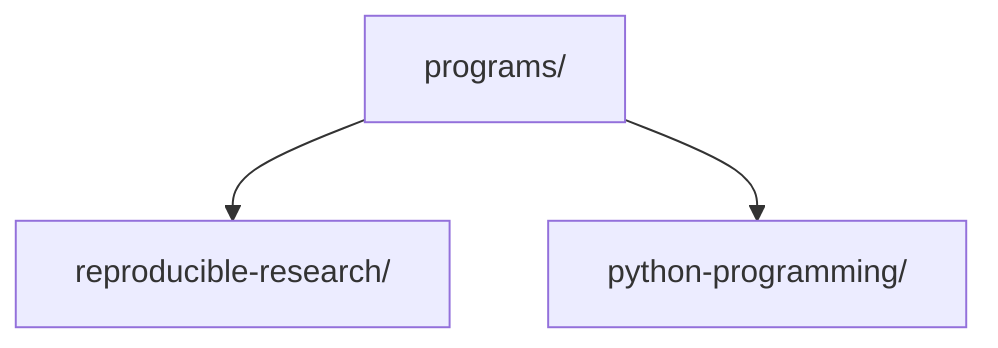

# Bijux Masterclass

The Bijux Masterclass is the umbrella catalog for a growing set of
correctness-first programs. The repository keeps all program histories in one
place and organizes them by long-lived subject area so new programs can be
added without inventing a new repository shape each time.

## Program Families

### Reproducible Research

Build systems, workflow engines, and other tooling used to create reliable,
traceable, repeatable research and data-processing systems.

- `deep-dive-make`
- `deep-dive-snakemake`
- `deep-dive-dvc`

### Python Programming

Language-centric courses focused on how to write Python systems with explicit
semantics, strong engineering contracts, and maintainable abstractions.

- `python-object-oriented-programming`
- `python-functional-programming`
- `python-meta-programming`

## Repository Layout



## Working Locally

Build the series site:

```bash
make series-docs-build
```

Serve the series site locally:

```bash
make series-docs-serve
```

Work with a specific program:

```bash
make PROGRAM=reproducible-research/deep-dive-make program-help
make PROGRAM=python-programming/python-functional-programming test
```
