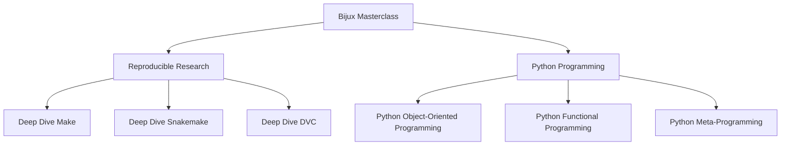
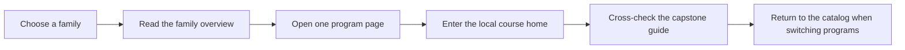

# Bijux Masterclass

Bijux Masterclass is the root catalog for the full program collection. The root docs site
is intentionally a learner-facing surface, not only a repository index: it mirrors the
checked-in course books and capstone guides so you can move between programs without
switching documentation systems.

## Catalog Maps





## How to Use This Site

- Start with the family page when you know the problem space but not the specific program.
- Start with the program page when you already know which course you want.
- Use the local course-home and capstone links on each program page instead of jumping to GitHub first.
- Use the root search when you want one result list across all six course books and capstone guides.

## Program Families

### [Reproducible Research](reproducible-research/index.md)

Courses about build graphs, workflow engines, data state, and long-lived reproducibility
contracts:

- [Deep Dive Make](reproducible-research/deep-dive-make.md)
- [Deep Dive Snakemake](reproducible-research/deep-dive-snakemake.md)
- [Deep Dive DVC](reproducible-research/deep-dive-dvc.md)

### [Python Programming](python-programming/index.md)

Courses about Python semantics, runtime boundaries, and maintainable design under real
change pressure:

- [Python Object-Oriented Programming](python-programming/python-object-oriented-programming.md)
- [Python Functional Programming](python-programming/python-functional-programming.md)
- [Python Meta-Programming](python-programming/python-meta-programming.md)

## Local Commands

```bash
make docs-serve
make docs-audit
make PROGRAM=python-programming/python-functional-programming docs-serve
make PROGRAM=reproducible-research/deep-dive-make test
```

## Honesty Boundary

The root catalog is a synchronized mirror of the checked-in course-book and capstone
Markdown. It is not a separate editorial fork. If a course page changes in `programs/`,
the root site picks up that same source during `make docs-build` or `make docs-serve`.
