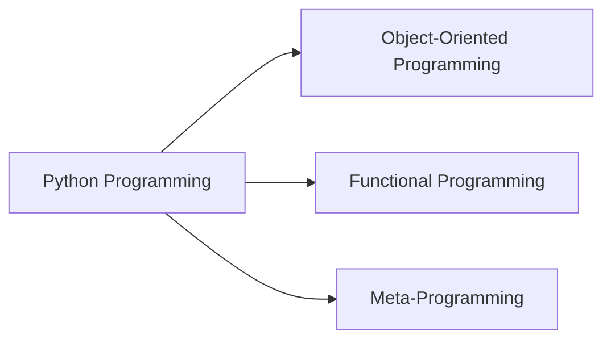
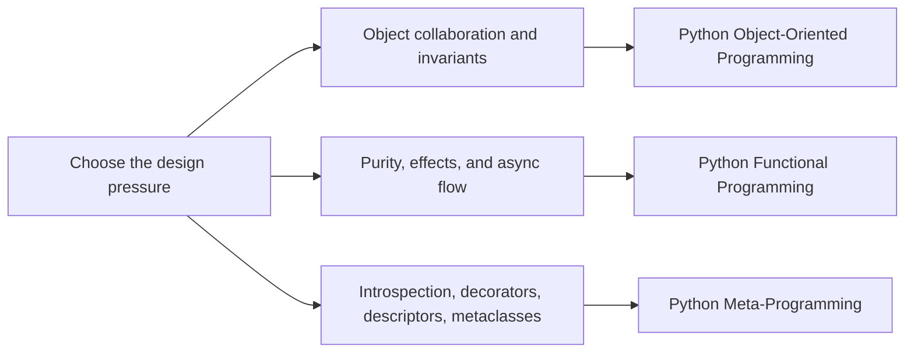

# Python Programming

This family collects long-form Python courses about semantics, runtime boundaries, and
how to keep a design understandable when a codebase grows more state, more abstraction,
or more runtime power.

<div class="bijux-callout">
  Use this page when you are choosing between the Python programs. The sidebar exposes
  the full ordered course and capstone tree for each program directly underneath it.
</div>

## Family Maps





## How to Read This Family

- Start with object-oriented programming when you need explicit roles, aggregates, and long-lived change boundaries.
- Start with functional programming when you need purity, pipeline discipline, effect isolation, and async coordination.
- Start with metaprogramming when you need runtime hooks but want to stay honest about invariants and debugging cost.
- Move back through this family page when you want to compare how the three programs answer similar design pressures differently.

## Program Routes

### [Python Object-Oriented Programming](python-object-oriented-programming/index.md)

- Learner entry: [Start Here](python-object-oriented-programming/guides/start-here.md)
- Promise review: [Module Promise Map](python-object-oriented-programming/guides/module-promise-map.md)
- Pressure route: [Pressure Routes](python-object-oriented-programming/guides/pressure-routes.md)
- Capstone guide: [Capstone docs](python-object-oriented-programming/capstone-docs/index.md)

### [Python Functional Programming](python-functional-programming/index.md)

- Learner entry: [Orientation](python-functional-programming/module-00-orientation/index.md)
- Capstone guide: [Capstone docs](python-functional-programming/capstone-docs/index.md)

### [Python Metaprogramming](python-meta-programming/index.md)

- Learner entry: [Orientation](python-meta-programming/module-00-orientation/index.md)
- Capstone guide: [Capstone docs](python-meta-programming/capstone-docs/index.md)

<div class="bijux-panel-grid">
  <div class="bijux-panel">
    <h3>Object Boundaries</h3>
    <p>Open the OOP program tree when you need aggregates, invariants, lifecycle design, and operational review routes.</p>
  </div>
  <div class="bijux-panel">
    <h3>Functional Discipline</h3>
    <p>Open the functional program tree when you need purity, effect isolation, and pipeline-oriented proof surfaces.</p>
  </div>
  <div class="bijux-panel">
    <h3>Runtime Power</h3>
    <p>Open the metaprogramming tree when you need descriptors, decorators, metaclasses, and explicit public-surface review.</p>
  </div>
</div>

## Local Commands

```bash
make docs-serve
make PROGRAM=python-programming/python-object-oriented-programming docs-serve
make PROGRAM=python-programming/python-functional-programming test
```

If port `8000` is already busy, the docs server automatically moves to the next open
local port. Set `DOCS_PORT=<port>` when you want a different starting port.

## Purpose

This page helps a reader choose the Python program that matches the current design
pressure before they enter the full course and capstone tree.

## Stability

This page is part of the canonical docs spine. Keep it aligned with the checked-in
program set and the learner entry routes exposed in the synced library.
