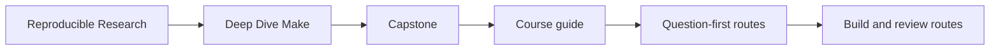
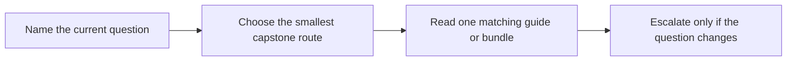
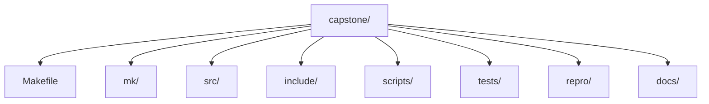

# Deep Dive Make Capstone

<!-- page-maps:start -->
## Guide Maps




<!-- page-maps:end -->

Read the first diagram as the capstone shape. Read the second diagram as the entry rule:
choose the smallest route that answers the current question, then escalate only when the
question changes.

This capstone is the executable reference build for Deep Dive Make. It is a compact C
project used to corroborate the course's main claims about truthful graphs, atomic
publication, parallel safety, determinism, and self-testing. It is not meant to be a
first-contact playground for Make syntax.

## Use this capstone when

- the module idea is already legible and you want executable corroboration
- you need one repository that keeps graph truth, publication, and proof visible together
- you are reviewing whether a small build behaves like a serious build under pressure

## Do not use this capstone when

- you still need first exposure to the concept itself
- you want to browse the whole repository before choosing a question
- the strongest proof route feels safer than naming the current claim

## Choose the entry route by question

| If the question is... | Start here | Escalate only if needed |
| --- | --- | --- |
| what does this repository promise | [Capstone Walkthrough](capstone-walkthrough.md) | [Capstone File Guide](capstone-file-guide.md) |
| which targets are public and what they mean | [Command Guide](command-guide.md) | [Capstone Proof Checklist](capstone-proof-checklist.md) |
| does the build prove convergence and parallel safety | [Capstone Proof Checklist](capstone-proof-checklist.md) | `make verify-report` |
| which failure class does this repro teach | [Repro Catalog](repro-catalog.md) | `make incident-audit` |
| should I trust this as a stewardship specimen | [Capstone Proof Checklist](capstone-proof-checklist.md) | `make confirm` |

From the repository root, the matching course-level commands are:

```sh
make PROGRAM=reproducible-research/deep-dive-make capstone-walkthrough
make PROGRAM=reproducible-research/deep-dive-make inspect
make PROGRAM=reproducible-research/deep-dive-make proof
```

Inside `capstone/`, use `gmake` on macOS because `/usr/bin/make` is BSD Make.

## First honest pass

1. Run `make PROGRAM=reproducible-research/deep-dive-make capstone-walkthrough`.
2. Read [Capstone Walkthrough](capstone-walkthrough.md).
3. Run `make PROGRAM=reproducible-research/deep-dive-make inspect`.
4. Read [Command Guide](command-guide.md).
5. Run `make PROGRAM=reproducible-research/deep-dive-make proof`.
6. Read [Capstone Proof Checklist](capstone-proof-checklist.md).

Stop there first. That is enough to see the public contract, the proof harness, and one
bounded review route without turning the capstone into a browsing exercise.

## What the main targets prove

| Target | What it proves | Why it matters |
| --- | --- | --- |
| `walkthrough` | the learner-facing reading order is bounded and explicit | first capstone contact stays humane |
| `inspect` | the public build contract is visible without the full proof route | review starts from stable surfaces |
| `selftest` | convergence, serial/parallel equivalence, and negative hidden-input detection | the build system is tested as a system |
| `verify-report` | the selftest evidence is saved as a review bundle | proof can be inspected later |
| `proof` | the sanctioned review bundle set exists and agrees with the contract | stewardship has a durable route |
| `confirm` | the strongest built-in confirmation path still passes | final review is stronger than first-pass learning |

## Repository shape



Use these areas deliberately:

- `Makefile` for public targets and entrypoints
- `mk/` for layered build responsibilities
- `scripts/` for generator and packaging boundaries
- `tests/` for build-system proof
- `repro/` for controlled failure teaching material
- `docs/` for bounded review routes

## Course guide set

- [Command Guide](command-guide.md)
- [Capstone Map](capstone-map.md)
- [Capstone File Guide](capstone-file-guide.md)
- [Capstone Walkthrough](capstone-walkthrough.md)
- [Capstone Proof Checklist](capstone-proof-checklist.md)
- [Repro Catalog](repro-catalog.md)

## Good stopping point

Stop when you can name:

- the current claim
- the smallest route that proves it
- the next stronger route only if the current one stops being enough

## Shelf vocabulary

Use this section when the capstone route pages start to blur together. The capstone shelf
is not a second course book. It is a small set of entry points into one executable
repository, and the terms here keep those entry points distinct.

### Route terms

| Term | Meaning here | Why it matters |
| --- | --- | --- |
| walkthrough | the bounded first pass through the repository | keeps first contact human-scale |
| inspect | the learner-facing public-contract review route | helps you review targets and boundaries before wider proof |
| proof | the sanctioned multi-bundle review route | meant for stewardship review, not first contact |
| confirm | the strongest built-in confirmation pass | for final confidence after narrower routes are already understood |
| repro | a deliberately broken miniature Makefile | isolates one failure class so the lesson is visible |
| capstone route | one bounded way into the executable repository | prevents directory tourism |
| public target | a target another learner or reviewer is allowed to rely on | separates the supported surface from implementation detail |
| proof surface | the command, file, or saved bundle that corroborates a claim | keeps review tied to evidence instead of prose |

### Page names in plain language

| Page | What it helps you do |
| --- | --- |
| [Capstone Map](capstone-map.md) | choose the right route by module or question |
| [Command Guide](command-guide.md) | pick the right command layer and first command |
| [Capstone File Guide](capstone-file-guide.md) | know which files to read first and why |
| [Capstone Walkthrough](capstone-walkthrough.md) | take a bounded first pass through the repository |
| [Capstone Proof Checklist](capstone-proof-checklist.md) | run one complete learner-facing proof pass |
| [Capstone Review Worksheet](capstone-review-worksheet.md) | review the repository as a steward, not just a reader |
| [Capstone Extension Guide](capstone-extension-guide.md) | change the capstone without weakening its teaching or proof value |
| [Repro Catalog](repro-catalog.md) | choose the right failure specimen for one lesson |
| [Repro Study Worksheet](repro-study-worksheet.md) | capture what a repro actually taught you |

## Reading rule

If two pages sound interchangeable, do not open both. Name the job first: entry, command
choice, file ownership, proof, stewardship, or failure study. Then open the one page that
owns that job.
