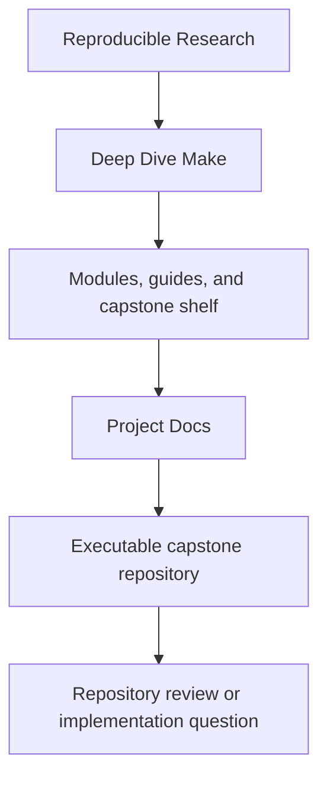
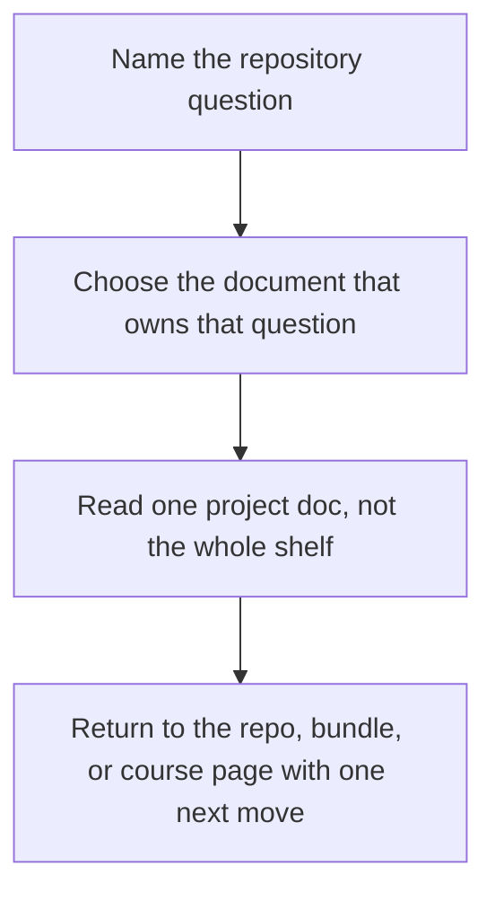

# Project Docs

<!-- page-maps:start -->
## Shelf Position

<!-- page-maps:end -->

Use this shelf when the question is about the executable capstone repository itself:
public targets, proof bundles, architecture, incidents, or review documents generated by
the build. These pages are not another first-contact route into the course. They are the
stable documentation set for the reference repository that the course keeps pointing to.

In this course shelf, the mirrored filenames are lowercase with dashes such as
`target-guide.md`. Inside the capstone repository and its generated bundles, the
corresponding documents appear as uppercase names such as `docs/TARGET_GUIDE.md`.

## Use this shelf when

- you are already inside the capstone repository or one of its generated bundles
- a course page sends you to a repository document by purpose rather than by module
- you need the repository-facing explanation of a target, bundle, or build layer

## Do not use this shelf when

- you still need the concept introduced for the first time
- you need help choosing which module or support page to read next
- you are browsing because the repository feels large instead of because the question is specific

## Choose the document by question

| If the question is... | Start here | Then use |
| --- | --- | --- |
| what does this repository promise and how should I enter it | [Walkthrough Guide](walkthrough-guide.md) | [Target Guide](target-guide.md) |
| which public command or review bundle should I choose first | [Target Guide](target-guide.md) | [Proof Guide](proof-guide.md) |
| what claim does a bundle or command actually prove | [Proof Guide](proof-guide.md) | [Contract Audit Guide](contract-audit-guide.md) or [Selftest Guide](selftest-guide.md) |
| which layer owns this behavior | [Architecture](architecture.md) | [Profile Audit Guide](profile-audit-guide.md) |
| how should I study one controlled failure route | [Repro Guide](repro-guide.md) | [Incident Review Guide](incident-review-guide.md) |
| how do I review the published contract instead of only the implementation | [Contract Audit Guide](contract-audit-guide.md) | [Proof Guide](proof-guide.md) |
| how do I review portability, policy, or precedence surfaces | [Profile Audit Guide](profile-audit-guide.md) | [Target Guide](target-guide.md) |
| how do I package the repository as clean tracked source | [Target Guide](target-guide.md) | [Walkthrough Guide](walkthrough-guide.md) |

## Project doc set

- [Architecture](architecture.md) for repository layers, ownership, and boundary placement
- [Walkthrough Guide](walkthrough-guide.md) for the bounded first pass through the repository
- [Target Guide](target-guide.md) for the stable command and bundle surface
- [Proof Guide](proof-guide.md) for claim-to-evidence routing
- [Contract Audit Guide](contract-audit-guide.md) for public-contract bundle review
- [Selftest Guide](selftest-guide.md) for the selftest evidence bundle
- [Profile Audit Guide](profile-audit-guide.md) for execution-policy and precedence review
- [Incident Review Guide](incident-review-guide.md) for one executed failure bundle
- [Repro Guide](repro-guide.md) for controlled failure specimens

## Naming crosswalk

| Course shelf page | Capstone repository document |
| --- | --- |
| [Architecture](architecture.md) | `docs/ARCHITECTURE.md` |
| [Walkthrough Guide](walkthrough-guide.md) | `docs/WALKTHROUGH_GUIDE.md` |
| [Target Guide](target-guide.md) | `docs/TARGET_GUIDE.md` |
| [Proof Guide](proof-guide.md) | `docs/PROOF_GUIDE.md` |
| [Contract Audit Guide](contract-audit-guide.md) | `docs/CONTRACT_AUDIT_GUIDE.md` |
| [Selftest Guide](selftest-guide.md) | `docs/SELFTEST_GUIDE.md` |
| [Profile Audit Guide](profile-audit-guide.md) | `docs/PROFILE_AUDIT_GUIDE.md` |
| [Incident Review Guide](incident-review-guide.md) | `docs/INCIDENT_REVIEW_GUIDE.md` |
| [Repro Guide](repro-guide.md) | `docs/REPRO_GUIDE.md` |

## How this shelf relates to the rest of the course

- use [Capstone](../capstone/index.md) when you need course-facing route choice into the repository
- use [Guides](../guides/index.md) when you need study, proof, or escalation help
- use [Reference](../reference/index.md) when you need durable terms, maps, or review standards
- use project docs when the question now belongs to the repository and its generated bundles

## Good stopping point

Stop when you can name the single repository document that owns the current question. If
you are still opening several documents at once, move back to the table above and choose
the one whose promise is narrowest.
