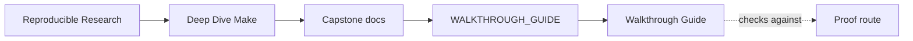
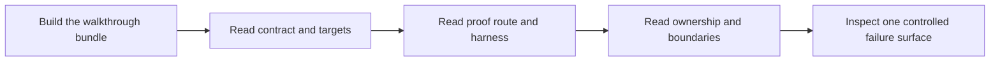

# Walkthrough Guide

<!-- page-maps:start -->
## Guide Maps

<!-- page-maps:end -->

Use this guide for first contact with the capstone. It exists to keep the first pass
bounded and human-readable, so a new reader does not have to choose between random
browsing and the strongest route in the repository.

---

## Recommended first pass

1. run `make walkthrough`
2. read `README.md` to understand what this repository is trying to prove
3. read [Target Guide](target-guide.md) to learn the public target surface
4. read [Proof Guide](proof-guide.md) to see how claims map to evidence
5. read `tests/run.sh` to understand what the proof harness actually checks
6. read [Architecture](architecture.md) and `mk/contract.mk` to place ownership and platform boundaries
7. inspect `repro/01-shared-log.mk` to see one failure class in miniature

That route keeps claim first, proof second, ownership third, and controlled failure last.

[Back to top](#top)

---

## If you have 15 minutes

Read:

- `README.md`
- [Target Guide](target-guide.md)
- [Proof Guide](proof-guide.md)

Outcome: you should be able to name the public surface and the next target you would run.

[Back to top](#top)

---

## If you have 45 minutes

Read:

- the 15-minute route
- `tests/run.sh`
- [Architecture](architecture.md)
- `mk/contract.mk`

Outcome: you should understand what the capstone proves and where boundary decisions live.

[Back to top](#top)

---

## If you have 90 minutes

Read:

- the 45-minute route
- `mk/objects.mk`
- `mk/stamps.mk`
- [Repro Guide](repro-guide.md)
- `repro/01-shared-log.mk`

Outcome: you should be able to explain graph truth, modeled hidden inputs, and one
failure class without hand-waving.

[Back to top](#top)

---

## Questions to keep asking

- what is this repository claiming right now
- which target is the smallest honest route for that claim
- which file owns the rule, and which file proves it
- where would a hidden input become visible if the graph stopped telling the truth
- which failure specimen would teach this concept faster than more prose

[Back to top](#top)

---

## Exit criteria

The walkthrough has done its job if you can answer these without guessing:

- why `selftest` is stronger than `all`
- when to choose `inspect` instead of `proof`
- which file declares the execution boundary
- which repro you would use to show a concurrency defect to another engineer

[Back to top](#top)
