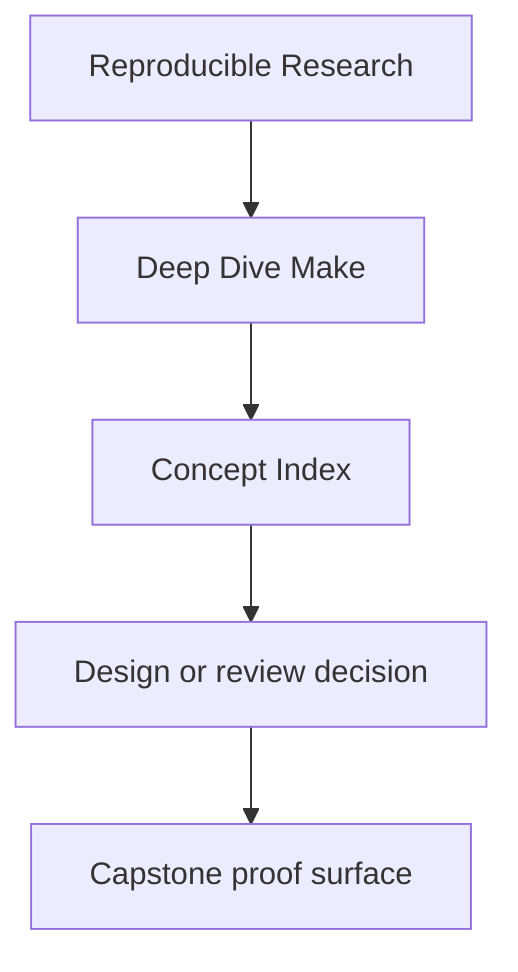
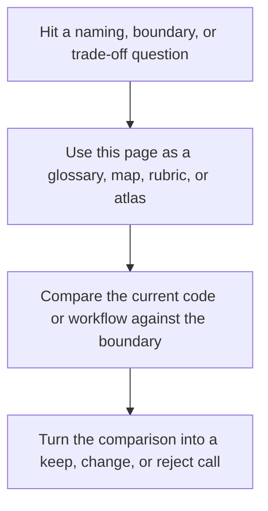
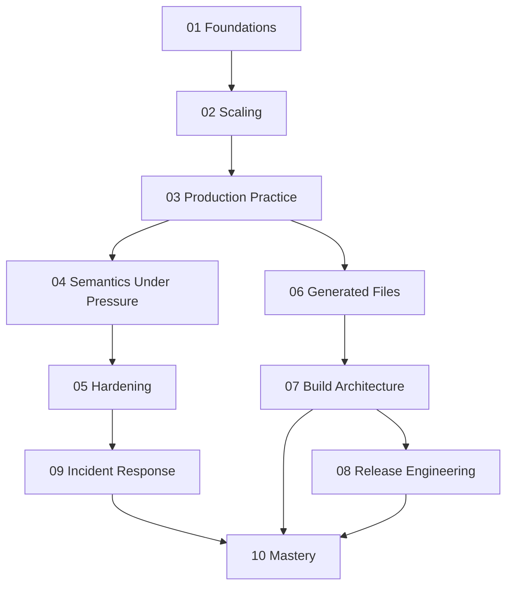

# Concept Index

<!-- page-maps:start -->
## Reference Position

<!-- page-maps:end -->

Read the first diagram as a lookup map: this page is part of the review shelf, not a first-read narrative. Read the second diagram as the reference rhythm: arrive with a concrete ambiguity, compare the current work against the boundary on the page, then turn that comparison into a decision.

This page answers one recurring learner question: "Where in the course do I actually
learn this idea?"

Use it when you remember the concept but not the module, or when you want to revisit one
theme across the whole course.

---

## Module order and safe reading sequence

Deep Dive Make is not ten independent essays. Later modules assume earlier mental models,
and the course becomes much easier when that dependency shape is explicit.

| Module | Depends most on | Reason |
| --- | --- | --- |
| 01 Foundations | none | it establishes the graph model and rebuild truth |
| 02 Scaling | 01 | parallel safety only makes sense after graph truth |
| 03 Production Practice | 01-02 | deterministic discovery and selftests assume basic correctness |
| 04 Semantics Under Pressure | 01-03 | debugging semantics matter most once the build already has structure |
| 05 Hardening | 03-04 | you need a build contract before you can harden it |
| 06 Generated Files | 03-05 | generators become safe only when truth and boundaries are already clear |
| 07 Build Architecture | 02-06 | reusable structure depends on both graph truth and boundary discipline |
| 08 Release Engineering | 03-07 | release contracts depend on a stable build API and trustworthy outputs |
| 09 Incident Response | 03-08 | good triage assumes the build already expresses its contracts clearly |
| 10 Mastery | all earlier modules | migration and governance require the whole mental model |

Fastest safe paths:

- new learner: read in order from Module 01 through Module 10
- working maintainer: start with Modules 04, 05, and 09, then backfill earlier modules when you find a gap in your mental model
- build steward: start with Modules 03, 07, 08, 09, and 10, then revisit earlier modules when a policy or graph-truth question points back to fundamentals

[Back to top](#top)

---

## Core Build Truth

| Concept | Primary modules | Typical proof |
| --- | --- | --- |
| DAG evaluation | 01, 02 | `make --trace all` |
| hidden inputs | 01, 05, 06 | non-convergence after changing an unmodeled input |
| convergence | 01, 03, 05 | `make all && make -q all` |
| depfiles | 01, 03, 06 | touch a header and inspect the rebuild |
| single writer per output | 01, 02, 06 | compare serial and parallel behavior |

[Back to top](#top)

---

## Parallel Safety And Structure

| Concept | Primary modules | Typical proof |
| --- | --- | --- |
| parallel safety | 02, 03 | `make -j2 all` plus artifact equivalence |
| order-only prerequisites | 02, 04 | controlled repro with directory creation or boundary drift |
| recursive make boundaries | 02, 05, 07 | inspect the top-level DAG and jobserver behavior |
| rooted discovery | 02, 03, 07 | sorted discovery audit and stable object mapping |

[Back to top](#top)

---

## Diagnostics And Semantics

| Concept | Primary modules | Typical proof |
| --- | --- | --- |
| `--trace` | 01, 03, 04, 09 | line-by-line causality output |
| `make -p` | 01, 03, 04, 09 | resolved rule and variable dump |
| variable precedence | 04 | `origin`, `flavor`, and controlled overrides |
| includes and restart semantics | 04, 07 | minimal include repro plus inspected database |
| incident ladder | 04, 05, 09 | stepwise diagnosis from preview to repro |

[Back to top](#top)

---

## Boundaries, Packaging, And Stewardship

| Concept | Primary modules | Typical proof |
| --- | --- | --- |
| modeled stamps and manifests | 05, 06, 08 | boundary file change triggers intended rebuild |
| generated files | 06 | trace the generator and its consumers |
| build APIs and public targets | 03, 07, 08 | inspect `help` and stable documented targets |
| release contracts | 08 | `dist`, `install`, and artifact inspection |
| migration and governance | 05, 09, 10 | written review or migration rubric |

[Back to top](#top)

---

## Best Companion Pages

When using this index, the most useful companion pages are:

* [`index.md`](index.md)
* [`incident-ladder.md`](incident-ladder.md)
* [`capstone-map.md`](../capstone/capstone-map.md)
* [`completion-rubric.md`](completion-rubric.md)

[Back to top](#top)
