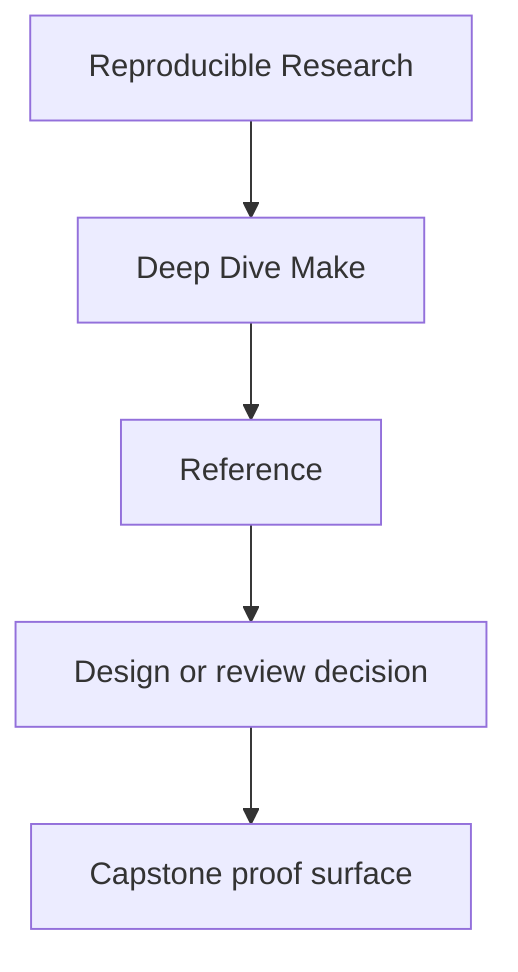
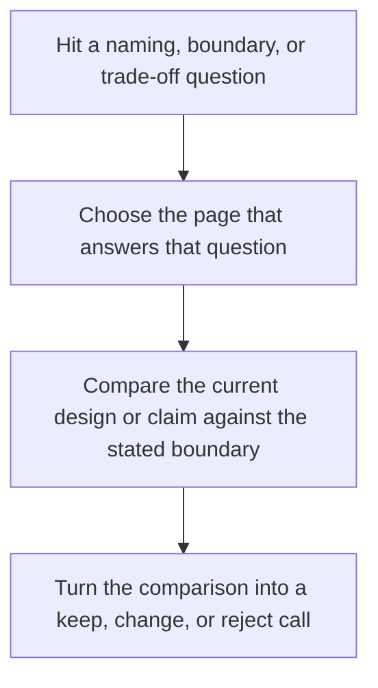

# Reference

<!-- page-maps:start -->
## Reference Position

<!-- page-maps:end -->

This shelf is for recurring questions, not first exposure. Use it when you already know
roughly what the course is teaching and need a durable answer about language, ownership,
debugging order, or proof routes.

## Start here by question

| If the question is... | Start here | Then read |
| --- | --- | --- |
| what does this term mean locally | the vocabulary section on this page | the page or module that used it |
| where does this idea belong in the program | [Concept Index](concept-index.md) | [Module Dependency Map](module-dependency-map.md) |
| which target is public and which is internal | [Public Targets](public-targets.md) | [Mk Layer Guide](mk-layer-guide.md) |
| why is this build incident happening | [Incident Ladder](incident-ladder.md) | [Anti-Pattern Atlas](anti-pattern-atlas.md) |
| where should this artifact or review output live | [Artifact Boundary Guide](artifact-boundary-guide.md) | [Completion Rubric](completion-rubric.md) |

## What these pages are for

- maps: reading order, concept placement, and proof routing
- boundaries: what belongs in the course, the capstone, and the public target surface
- review aids: standards for judging clarity, stability, and build truth
- failure aids: symptom-led routes into incidents and repair work

## What this shelf is not for

Do not use reference pages as a substitute for a module when the concept is still new.
These pages compress ideas so you can move faster later. They are strongest after at
least one full read of the relevant lesson or capstone guide.

## Reference pages

- [Module Dependency Map](module-dependency-map.md) for concept order and safe reading sequence
- [Topic Boundaries](topic-boundaries.md) for what the course treats as core, supporting, and boundary material
- [Concept Index](concept-index.md) for locating where an idea is taught
- [Anti-Pattern Atlas](anti-pattern-atlas.md) for routing common Make smells to the right repair path
- [Practice Map](practice-map.md) for module-to-proof routing
- [Public Targets](public-targets.md) for stable command surfaces
- [Incident Ladder](incident-ladder.md) for debugging order under pressure
- [Mk Layer Guide](mk-layer-guide.md) for the layered build architecture
- [Artifact Boundary Guide](artifact-boundary-guide.md) for separating outputs, proofs, and teaching surfaces
- [Selftest Map](selftest-map.md) for reading the build proof harness
- [Completion Rubric](completion-rubric.md) for course and repository review

## Shelf vocabulary

Use this section when a reference-page name is familiar enough to recognize but still too
fuzzy to choose confidently. The point is not to memorize the shelf. The point is to keep
the local meaning of each page stable while you move between modules, repository review,
and capstone evidence.

| Term | Meaning in Deep Dive Make |
| --- | --- |
| Anti-Pattern Atlas | A symptom-led catalog of recurring build mistakes, used when you recognize a smell before you recognize the module that explains it. |
| Artifact Boundary Guide | The reference page that separates build outputs, review bundles, and teaching materials so publication and proof do not blur together. |
| Completion Rubric | The review standard for deciding whether a module, capstone change, or teaching surface is clear enough to keep as-is. |
| Concept Index | A lookup page that tells you where a concept is taught, reinforced, and proven across the program. |
| Incident Ladder | The debugging order for build incidents: start with intent, then trace causality, then escalate into smaller repros only when needed. |
| Mk Layer Guide | The description of what belongs in the top-level `Makefile` versus `mk/*.mk` helper layers. |
| Module Dependency Map | The reading-order map that shows which modules support later ones and which lessons should come first. |
| Practice Map | The crosswalk from module work to the capstone routes that corroborate the same ideas. |
| Public Targets | The stable command surface a learner or reviewer should rely on without reading every recipe in the repository. |
| Selftest Map | The page that explains how the selftest harness demonstrates convergence, schedule equivalence, and hidden-input detection. |
| Topic Boundaries | The page that distinguishes core course material from supporting context and out-of-scope extensions. |
