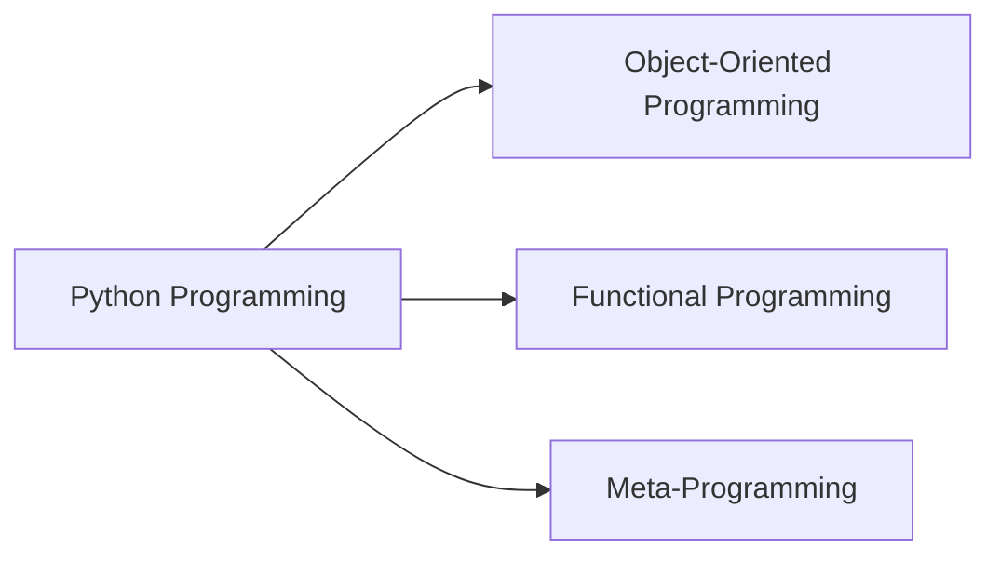
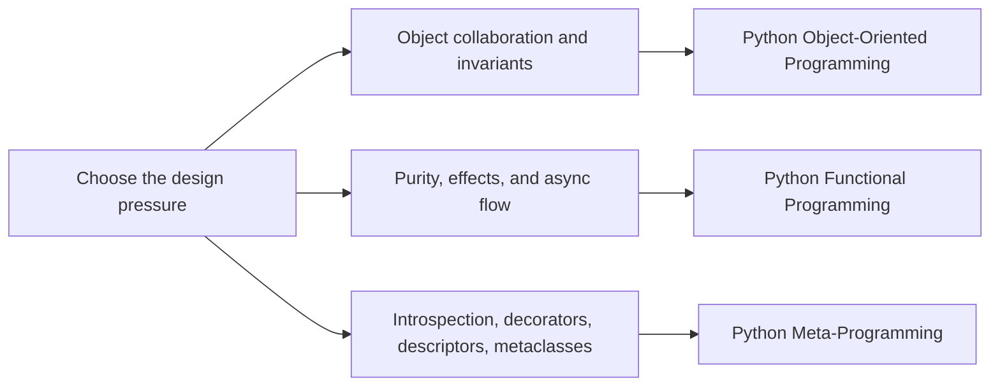

# Python Programming

This family collects long-form Python courses about semantics, runtime boundaries, and
how to keep a design understandable when a codebase grows more state, more abstraction,
or more runtime power.

<div class="bijux-callout">
  Expand a program in the sidebar to open its full course-book and capstone tree. The
  overview pages below are the short routing layer, not the whole library.
</div>

## Family Maps





## How to Read This Family

- Start with object-oriented programming when you need explicit roles, aggregates, and long-lived change boundaries.
- Start with functional programming when you need purity, pipeline discipline, effect isolation, and async coordination.
- Start with meta-programming when you need runtime hooks but want to stay honest about invariants and debugging cost.
- Move back through this family page when you want to compare how the three programs answer similar design pressures differently.

## Program Routes

### [Python Object-Oriented Programming](python-object-oriented-programming.md)

- Local course home: [Course home](../library/python-programming/python-object-oriented-programming/course-book/index.md)
- Learner entry: [Orientation](../library/python-programming/python-object-oriented-programming/course-book/module-00-orientation/index.md)
- Capstone guide: [Capstone README](../library/python-programming/python-object-oriented-programming/capstone/README.md)

### [Python Functional Programming](python-functional-programming.md)

- Local course home: [Course home](../library/python-programming/python-functional-programming/course-book/index.md)
- Learner entry: [Orientation](../library/python-programming/python-functional-programming/course-book/module-00-orientation/index.md)
- Capstone guide: [Capstone README](../library/python-programming/python-functional-programming/capstone/README.md)

### [Python Meta-Programming](python-meta-programming.md)

- Local course home: [Course home](../library/python-programming/python-meta-programming/course-book/index.md)
- Learner entry: [Orientation](../library/python-programming/python-meta-programming/course-book/module-00-orientation/index.md)
- Capstone guide: [Capstone README](../library/python-programming/python-meta-programming/capstone/README.md)

<div class="bijux-panel-grid">
  <div class="bijux-panel">
    <h3>Object Boundaries</h3>
    <p>Open the OOP program tree when you need aggregates, invariants, lifecycle design, and operational review routes.</p>
  </div>
  <div class="bijux-panel">
    <h3>Functional Discipline</h3>
    <p>Open the functional program tree when you need purity, effect isolation, and pipeline-oriented proof surfaces.</p>
  </div>
  <div class="bijux-panel">
    <h3>Runtime Power</h3>
    <p>Open the metaprogramming tree when you need descriptors, decorators, metaclasses, and explicit public-surface review.</p>
  </div>
</div>

## Local Commands

```bash
make docs-serve
make PROGRAM=python-programming/python-object-oriented-programming docs-serve
make PROGRAM=python-programming/python-functional-programming test
```
