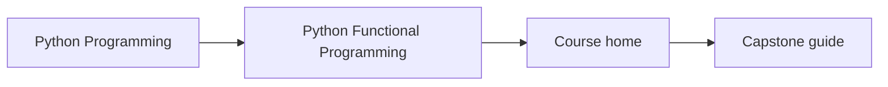
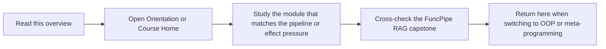

# Python Functional Programming

Python Functional Programming teaches data-first composition, explicit effects, typed
failure flow, and bounded async coordination for production Python systems.

## Page Maps





## What This Program Covers

- purity, substitution, and data-first API design
- streaming, resilience, algebraic modelling, and explicit context
- effect boundaries, async backpressure, interop, and long-lived refactoring
- a capstone that proves the abstractions survive real package and test structure

## Local Catalog Route

- Course home: [Course home](../library/python-programming/python-functional-programming/index.md)
- Learner entry: [Orientation](../library/python-programming/python-functional-programming/module-00-orientation/index.md)
- Capstone guide: [Project overview](../library/python-programming/python-functional-programming/project-docs/index.md)

## Local Commands

```bash
make PROGRAM=python-programming/python-functional-programming docs-serve
make PROGRAM=python-programming/python-functional-programming test
make PROGRAM=python-programming/python-functional-programming capstone-tour
```

## Honesty Boundary

This program is not trying to make Python pretend to be another language. It is for
readers who want stronger reasoning about state, effects, async work, and operational boundaries in ordinary Python.
