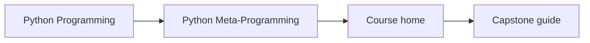
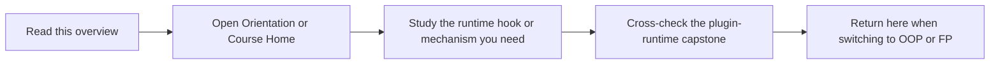

# Python Meta-Programming

Python Meta-Programming is the runtime-honesty program in the Python family. It teaches
introspection, decorators, descriptors, and metaclasses by making their semantics,
debuggability, and responsibility boundaries explicit.

## Page Maps





## What This Program Covers

- object introspection and `inspect` as diagnostic tools
- decorators, descriptors, and metaclasses with explicit trade-offs
- runtime registration, plugin patterns, and responsibility boundaries
- a capstone that shows how dynamic power behaves in a real executable system

## Local Catalog Route

- Course home: [Course home](../library/python-programming/python-meta-programming/index.md)
- Learner entry: [Orientation](../library/python-programming/python-meta-programming/module-00-orientation/index.md)
- Capstone guide: [Project overview](../library/python-programming/python-meta-programming/capstone/project-overview.md)

## Local Commands

```bash
make PROGRAM=python-programming/python-meta-programming docs-serve
make PROGRAM=python-programming/python-meta-programming test
make PROGRAM=python-programming/python-meta-programming capstone-tour
```

## Honesty Boundary

This program is not a celebration of magic for its own sake. It is for readers who want
to know when runtime power is justified, what it costs to debug, and where simpler alternatives should win.
