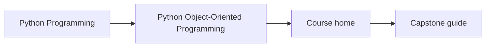
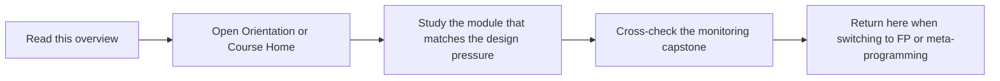

# Python Object-Oriented Programming

Python Object-Oriented Programming is the design-for-change program in the Python family.
It treats objects, repositories, lifecycles, public APIs, and operational pressure as
engineering contracts rather than style preferences.

## Page Maps





## What This Program Covers

- object semantics, role assignment, state design, and aggregates
- repositories, serialization, schema evolution, and concurrency boundaries
- verification strategy, public API governance, and operational hardening
- a ten-module route from object model fundamentals to production review

## Local Catalog Route

- Course home: [Course home](../library/python-programming/python-object-oriented-programming/index.md)
- Learner entry: [Start Here](../library/python-programming/python-object-oriented-programming/guides/start-here.md)
- Promise review: [Module Promise Map](../library/python-programming/python-object-oriented-programming/guides/module-promise-map.md)
- Pressure route: [Pressure Routes](../library/python-programming/python-object-oriented-programming/guides/pressure-routes.md)
- Topic boundaries: [Topic Boundaries](../library/python-programming/python-object-oriented-programming/reference/topic-boundaries.md)
- Capstone guide: [Capstone docs](../library/python-programming/python-object-oriented-programming/capstone-docs/index.md)

## Local Commands

```bash
make PROGRAM=python-programming/python-object-oriented-programming docs-serve
make PROGRAM=python-programming/python-object-oriented-programming test
make PROGRAM=python-programming/python-object-oriented-programming capstone-confirm
```

## Honesty Boundary

This program is not a beginner introduction to `class` syntax. It is for readers who
want explicit answers about invariants, ownership, evolution, and what object-oriented Python looks like under real change pressure.
