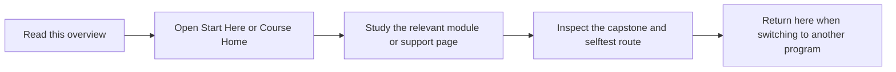

# Deep Dive Make

Deep Dive Make teaches GNU Make as a truthful build-graph engine rather than a bag of
recipes. It is the entry point when your problem is rebuild truth, publication safety,
parallel correctness, or build-system governance.

## Page Maps




## What This Program Covers

- truthful dependency graphs and rebuild semantics
- atomic publication and safe generated-file boundaries
- serial and parallel equivalence as a correctness rule
- reusable build architecture and operational runbooks

## Local Catalog Route

- Course home: [Program guide](../library/reproducible-research/deep-dive-make/course-book/index.md)
- Learner entry: [Start Here](../library/reproducible-research/deep-dive-make/course-book/guides/start-here.md)
- Pressure routes: [Pressure Routes](../library/reproducible-research/deep-dive-make/course-book/guides/pressure-routes.md)
- Promise review: [Module Promise Map](../library/reproducible-research/deep-dive-make/course-book/guides/module-promise-map.md)
- Capstone guide: [Capstone README](../library/reproducible-research/deep-dive-make/capstone/README.md)

## Local Commands

```bash
make PROGRAM=reproducible-research/deep-dive-make docs-serve
make PROGRAM=reproducible-research/deep-dive-make capstone-walkthrough
make PROGRAM=reproducible-research/deep-dive-make inspect
make PROGRAM=reproducible-research/deep-dive-make test
make PROGRAM=reproducible-research/deep-dive-make proof
```

## Honesty Boundary

This program is not a syntax quickstart. It is for readers who want evidence for why a
Makefile rebuilds, why a build is safe under `-j`, and where a public target boundary belongs.
