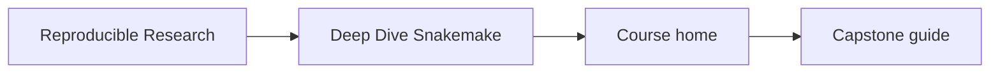
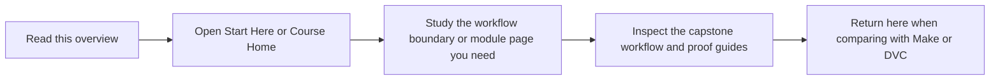

# Deep Dive Snakemake

Deep Dive Snakemake is the workflow-engine program in the reproducible-research family.
It is the right route when the core pressure is dynamic DAGs, publish contracts, executor
policy, and production workflow governance.

## Page Maps





## What This Program Covers

- file contracts, wildcard discipline, and dynamic DAG control
- profiles, executor semantics, and publish boundaries
- workflow modularity, CI gates, and operational proof
- recovery, scaling, and governance under production pressure

## Local Catalog Route

- Course home: [Program guide](../library/reproducible-research/deep-dive-snakemake/course-book/index.md)
- Learner entry: [Start Here](../library/reproducible-research/deep-dive-snakemake/course-book/guides/start-here.md)
- Capstone guide: [Capstone README](../library/reproducible-research/deep-dive-snakemake/capstone/README.md)

## Local Commands

```bash
make PROGRAM=reproducible-research/deep-dive-snakemake docs-serve
make PROGRAM=reproducible-research/deep-dive-snakemake test
make PROGRAM=reproducible-research/deep-dive-snakemake capstone-tour
```

## Honesty Boundary

This program is not only a Snakemake command catalog. It assumes you want to know which
workflow behaviors are contracts, which are operational policy, and which proof artifacts justify that claim.
