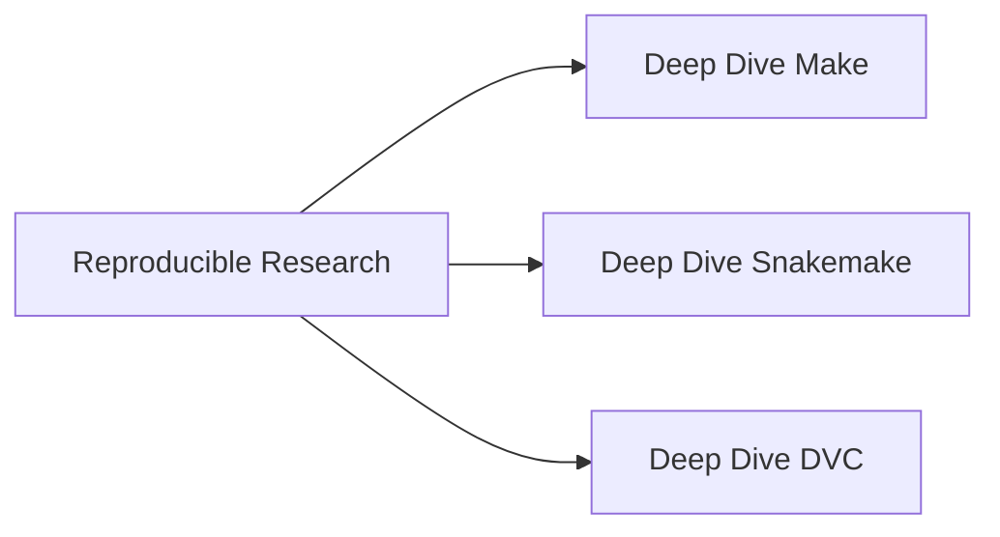
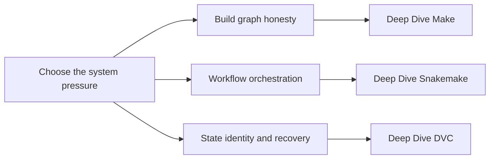

# Reproducible Research

This family collects programs about how systems declare state, build graphs, publish
artifacts, and recover trustworthy results after change or failure.

<div class="bijux-callout">
  Expand a program in the sidebar to browse its ordered course and capstone set. The
  overview routes here help you choose; the sidebar holds the full library.
</div>

## Family Maps





## How to Read This Family

- Start with Deep Dive Make if you need a mental model for truthful dependency graphs.
- Start with Deep Dive Snakemake if you need workflow-scale orchestration and publish boundaries.
- Start with Deep Dive DVC if you need data identity, experiment lineage, and recovery contracts.
- Move back through this family page when you want to compare how the three programs treat state and proof differently.

## Program Routes

### [Deep Dive Make](deep-dive-make.md)

- Local course home: [Deep Dive Make course home](../library/reproducible-research/deep-dive-make/index.md)
- Learner entry: [Start Here](../library/reproducible-research/deep-dive-make/guides/start-here.md)
- Pressure route: [Pressure Routes](../library/reproducible-research/deep-dive-make/guides/pressure-routes.md)
- Promise review: [Module Promise Map](../library/reproducible-research/deep-dive-make/guides/module-promise-map.md)
- Capstone guide: [Project overview](../library/reproducible-research/deep-dive-make/capstone/project-overview.md)

### [Deep Dive Snakemake](deep-dive-snakemake.md)

- Local course home: [Deep Dive Snakemake course home](../library/reproducible-research/deep-dive-snakemake/index.md)
- Learner entry: [Start Here](../library/reproducible-research/deep-dive-snakemake/guides/start-here.md)
- Pressure route: [Pressure Routes](../library/reproducible-research/deep-dive-snakemake/guides/pressure-routes.md)
- Promise review: [Module Promise Map](../library/reproducible-research/deep-dive-snakemake/guides/module-promise-map.md)
- Capstone guide: [Project overview](../library/reproducible-research/deep-dive-snakemake/capstone/project-overview.md)

### [Deep Dive DVC](deep-dive-dvc.md)

- Local course home: [Deep Dive DVC course home](../library/reproducible-research/deep-dive-dvc/index.md)
- Learner entry: [Start Here](../library/reproducible-research/deep-dive-dvc/guides/start-here.md)
- Pressure route: [Pressure Routes](../library/reproducible-research/deep-dive-dvc/guides/pressure-routes.md)
- Promise review: [Module Promise Map](../library/reproducible-research/deep-dive-dvc/guides/module-promise-map.md)
- Capstone guide: [Project overview](../library/reproducible-research/deep-dive-dvc/capstone/project-overview.md)

<div class="bijux-panel-grid">
  <div class="bijux-panel">
    <h3>Build Graph Honesty</h3>
    <p>Open the Make tree when you need explicit dependency semantics, reviewable targets, and release-safe operational practice.</p>
  </div>
  <div class="bijux-panel">
    <h3>Workflow Orchestration</h3>
    <p>Open the Snakemake tree when you need workflow-scale execution, publish review, and incident-aware pipeline design.</p>
  </div>
  <div class="bijux-panel">
    <h3>State and Recovery</h3>
    <p>Open the DVC tree when you need data identity, experiment comparison, release review, and recovery contracts.</p>
  </div>
</div>

## Local Commands

```bash
make docs-serve
make PROGRAM=reproducible-research/deep-dive-snakemake docs-serve
make PROGRAM=reproducible-research/deep-dive-dvc test
```

## Purpose

This page helps a reader choose the reproducible-research program that matches the current
system pressure before they drop into the full course tree.

## Stability

This page is part of the canonical docs spine. Keep it aligned with the checked-in
program set and the learner entry routes exposed in the synced library.
