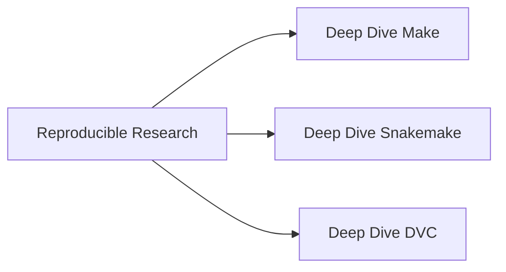
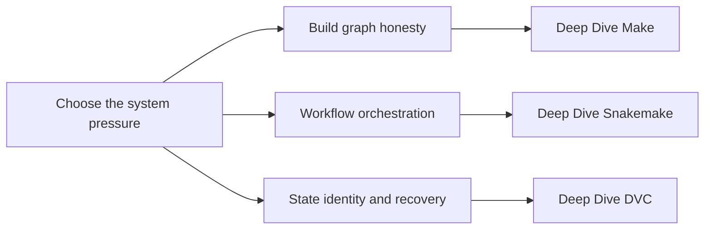

# Reproducible Research

This family collects programs about how systems declare state, build graphs, publish
artifacts, and recover trustworthy results after change or failure.

## Family Maps





## How to Read This Family

- Start with Deep Dive Make if you need a mental model for truthful dependency graphs.
- Start with Deep Dive Snakemake if you need workflow-scale orchestration and publish boundaries.
- Start with Deep Dive DVC if you need data identity, experiment lineage, and recovery contracts.
- Move back through this family page when you want to compare how the three programs treat state and proof differently.

## Program Routes

### [Deep Dive Make](deep-dive-make.md)

- Local course home: [Deep Dive Make course home](../library/reproducible-research/deep-dive-make/course-book/index.md)
- Learner entry: [Start Here](../library/reproducible-research/deep-dive-make/course-book/start-here.md)
- Capstone guide: [Capstone README](../library/reproducible-research/deep-dive-make/capstone/README.md)

### [Deep Dive Snakemake](deep-dive-snakemake.md)

- Local course home: [Deep Dive Snakemake course home](../library/reproducible-research/deep-dive-snakemake/course-book/index.md)
- Learner entry: [Start Here](../library/reproducible-research/deep-dive-snakemake/course-book/start-here.md)
- Capstone guide: [Capstone README](../library/reproducible-research/deep-dive-snakemake/capstone/README.md)

### [Deep Dive DVC](deep-dive-dvc.md)

- Local course home: [Deep Dive DVC course home](../library/reproducible-research/deep-dive-dvc/course-book/index.md)
- Learner entry: [Start Here](../library/reproducible-research/deep-dive-dvc/course-book/start-here.md)
- Capstone guide: [Capstone README](../library/reproducible-research/deep-dive-dvc/capstone/README.md)

## Local Commands

```bash
make docs-serve
make PROGRAM=reproducible-research/deep-dive-snakemake docs-serve
make PROGRAM=reproducible-research/deep-dive-dvc test
```
