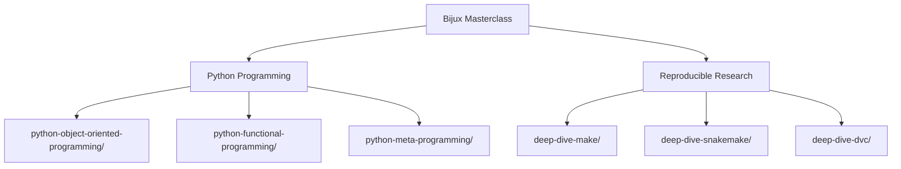
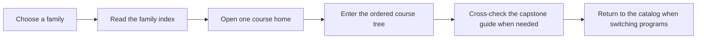

# Bijux Masterclass

Bijux Masterclass is the root catalog for the full program collection. Start here when
you need to choose a family first, then narrow down to the specific course that matches
the design or reproducibility pressure in front of you.

This README is the maintained source for the root catalog page, and the family README
files under `programs/` are the maintained source for the family landing pages.

## Catalog Maps





## How to Use This Catalog

| If you need to choose... | Open |
| --- | --- |
| the right program family | [Python Programming](python-programming/README.md) or [Reproducible Research](reproducible-research/README.md) |
| a specific course inside Python work | [Python Programming](python-programming/README.md) |
| a specific course inside reproducibility and workflow work | [Reproducible Research](reproducible-research/README.md) |

Use the family indexes when you know the problem space but not the exact course yet.
Use a course home when you already know which program you want. Return here when you
need to compare families before switching.

## Program Families

### [Python Programming](python-programming/README.md)

Use this family when the pressure is about Python design itself: object boundaries,
functional flow, runtime hooks, long-lived semantics, and reviewable code structure.

- [Python Object-Oriented Programming](python-programming/python-object-oriented-programming/course-book/index.md)
- [Python Functional Programming](python-programming/python-functional-programming/course-book/index.md)
- [Python Metaprogramming](python-programming/python-meta-programming/course-book/index.md)

### [Reproducible Research](reproducible-research/README.md)

Use this family when the pressure is about build graphs, workflow orchestration, data
state, reproducibility, publication, and recovery under change.

- [Deep Dive Make](reproducible-research/deep-dive-make/course-book/index.md)
- [Deep Dive Snakemake](reproducible-research/deep-dive-snakemake/course-book/index.md)
- [Deep Dive DVC](reproducible-research/deep-dive-dvc/course-book/index.md)

## Local Commands

```bash
make docs-serve
make docs-audit
make PROGRAM=python-programming/python-functional-programming docs-serve
make PROGRAM=reproducible-research/deep-dive-make test
```

If port `8000` is already busy, the docs server automatically moves to the next open
local port. Set `DOCS_PORT=<port>` when you want a different starting port.

## Honesty Boundary

The root catalog is a synchronized mirror of the checked-in course and capstone
Markdown. It is not a separate editorial fork. When a course or family route changes in
`programs/`, the root docs build should publish that same source rather than a second
hand-maintained version.

## Maintenance Contract

- Update this file when a family is added, removed, renamed, or rerouted.
- Update the owning family `README.md` when a program is added, removed, renamed, or rerouted.
- Keep links pointed at the real learner entry pages for each program.
- Treat these README files as catalog documents, not scratch notes: they should stay
  stable, direct, and clear enough for someone returning much later.
