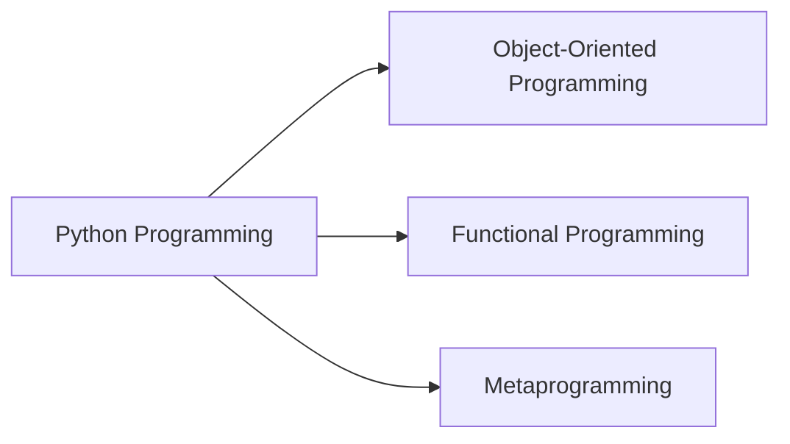
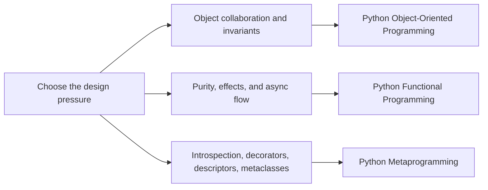

# Python Programming

This family collects long-form Python courses about semantics, architecture, and
runtime power. The goal is not to sort by syntax feature. The goal is to help a reader
choose the program that matches the design pressure they are actually under.

## Family Map

Read the first diagram as the family shape. Read the second diagram as the decision
route: start from the pressure, not from a favorite abstraction style.

## Choose a Program

| If your pressure is... | Start here | What this program sharpens |
| --- | --- | --- |
| ownership, invariants, lifecycle, and mutation rules | [Python Object-Oriented Programming](python-object-oriented-programming/course-book/index.md) | object semantics, aggregates, collaboration boundaries, API evolution |
| purity, typed pipelines, explicit effects, and async coordination | [Python Functional Programming](python-functional-programming/course-book/index.md) | dataflow discipline, effect isolation, compositional design, reviewable refactors |
| decorators, descriptors, metaclasses, and runtime hooks | [Python Metaprogramming](python-meta-programming/course-book/index.md) | runtime honesty, public-surface review, dynamic behavior with explicit contracts |

## Stable Entry Routes

### [Python Object-Oriented Programming](python-object-oriented-programming/course-book/index.md)

- Learner entry: [Start Here](python-object-oriented-programming/course-book/guides/start-here.md)
- Program guide: [Course Guide](python-object-oriented-programming/course-book/guides/course-guide.md)
- Pressure route: [Pressure Routes](python-object-oriented-programming/course-book/guides/pressure-routes.md)
- Capstone guide: [Capstone docs](python-object-oriented-programming/course-book/capstone-docs/index.md)

### [Python Functional Programming](python-functional-programming/course-book/index.md)

- Learner entry: [Orientation](python-functional-programming/course-book/module-00-orientation/index.md)
- Program guide: [Course Guide](python-functional-programming/course-book/guides/course-guide.md)
- Pressure route: [Pressure Routes](python-functional-programming/course-book/guides/pressure-routes.md)
- Capstone guide: [Capstone docs](python-functional-programming/course-book/capstone-docs/index.md)

### [Python Metaprogramming](python-meta-programming/course-book/index.md)

- Learner entry: [Start Here](python-meta-programming/course-book/guides/start-here.md)
- Program guide: [Course Guide](python-meta-programming/course-book/guides/course-guide.md)
- Pressure route: [Pressure Routes](python-meta-programming/course-book/guides/pressure-routes.md)
- Capstone guide: [Capstone docs](python-meta-programming/course-book/capstone-docs/index.md)

## How to Use This Family

- Start with the program whose pressure description sounds most like your real problem.
- Move back to this page when you need to compare two programs before committing to one.
- Use the capstone guide only after the core idea of the current course is clear.
- Keep this page aligned with the real learner entry routes whenever programs grow or move.
