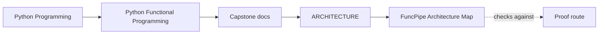
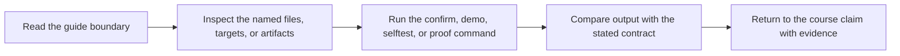

# FuncPipe Architecture Map

<!-- page-maps:start -->
## Guide Maps

<!-- page-maps:end -->

This map connects the course narrative to the real package layout of the capstone. Use it
when a module introduces a new idea and you want to find the concrete code that carries it.

## Core package groups

| Area | Packages | Why it exists | Closest course modules |
| --- | --- | --- | --- |
| Pure functional toolkit | `src/funcpipe_rag/fp/`, `src/funcpipe_rag/result/`, `src/funcpipe_rag/tree/`, `src/funcpipe_rag/streaming/` | Holds reusable functional building blocks, result containers, tree traversal, and stream composition. | Modules 01 to 06 |
| Domain and rules core | `src/funcpipe_rag/core/`, `src/funcpipe_rag/rag/`, `src/funcpipe_rag/rag/domain/` | Holds the main RAG value shapes, rule logic, chunking, stages, and pipeline-facing domain behavior. | Modules 01 to 06 |
| Policies and pipeline assembly | `src/funcpipe_rag/policies/`, `src/funcpipe_rag/pipelines/` | Encodes retries, breakers, reports, resource policies, configured pipelines, and CLI-facing assembly. | Modules 04, 07, 08, 10 |
| Effect boundaries | `src/funcpipe_rag/domain/`, `src/funcpipe_rag/boundaries/`, `src/funcpipe_rag/infra/` | Defines capabilities, facades, adapters, and runtime shells that keep the effectful edge explicit. | Modules 07 and 08 |
| Ecosystem interop | `src/funcpipe_rag/interop/` | Bridges the core model to stdlib helpers and external-library compatibility layers. | Module 09 |

## Evidence surfaces

| Evidence | Paths | What to inspect |
| --- | --- | --- |
| Algebra and laws | `tests/unit/fp/laws/`, `tests/unit/result/`, `tests/unit/tree/` | Proof that mapping, chaining, folds, and algebraic helpers behave as claimed. |
| Domain and pipeline behavior | `tests/unit/rag/`, `tests/unit/pipelines/`, `tests/unit/policies/` | Proof that the core RAG flow, assembly points, and policy decisions remain stable. |
| Boundaries and adapters | `tests/unit/boundaries/`, `tests/unit/infra/adapters/`, `tests/unit/domain/` | Proof that serialization, storage, capability isolation, and async coordination are working as designed. |
| Interop | `tests/unit/interop/` | Proof that external compatibility layers preserve the course's design contracts. |

## Suggested review route

1. Start with `tests/unit/fp/laws/` and `tests/unit/result/` for the algebraic floor.
2. Move to `src/funcpipe_rag/rag/` and `src/funcpipe_rag/core/` for the pipeline and value model.
3. Read `src/funcpipe_rag/policies/` and `src/funcpipe_rag/pipelines/` for runtime choices.
4. Read `src/funcpipe_rag/domain/`, `src/funcpipe_rag/boundaries/`, and `src/funcpipe_rag/infra/` for effects and adapters.
5. Finish with `src/funcpipe_rag/interop/` to see how the architecture survives contact with real libraries.

## What to keep asking

- Which code here is still pure?
- Which package owns retries, cleanup, and orchestration?
- Which interfaces are capabilities, and which modules are concrete adapters?
- Which claims in the course can I verify directly in the tests?
