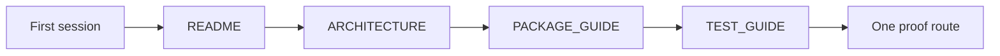
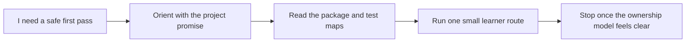

# FuncPipe First Session Guide

<!-- page-maps:start -->
## Guide Maps

<!-- page-maps:end -->

Use this guide when the capstone is new to you and you want one honest first session
instead of ten competing entrypoints.

## First-session route

1. Read `README.md`.
2. Read `ARCHITECTURE.md`.
3. Read `PACKAGE_GUIDE.md`.
4. Read `TEST_GUIDE.md`.
5. Run `make inspect`.
6. Read `artifacts/inspect/python-programming/python-functional-programming/summary.txt`.
7. Stop there unless your current question clearly needs executed proof.

## What each step should answer

| Step | Main answer |
| --- | --- |
| `README.md` | what the capstone proves for the course and which commands exist |
| `ARCHITECTURE.md` | which package groups own the major reasoning pressures |
| `PACKAGE_GUIDE.md` | what order to read the code in without mistaking adapters for the core |
| `TEST_GUIDE.md` | which test groups prove which kinds of claims |
| `make inspect` | what the learner-facing inspection bundle looks like |
| `summary.txt` | how the repository is grouped as a review surface |

## Good stopping point for the first session

Stop after the first session when you can answer:

- which packages are meant to stay pure or descriptive
- which packages are allowed to execute effects
- which test groups prove the semantic floor
- which proof route you would choose next for a concrete claim

## What not to do on the first session

- do not start with `make confirm` before you know the guide set
- do not read packages alphabetically
- do not start in adapters or interop code before the core and package map are clear
- do not treat one successful command as proof that you understand the architecture

## Best next routes after the first session

- Read `COMMAND_GUIDE.md` if the next question is command choice.
- Read `PROOF_GUIDE.md` if the next question is claim-to-evidence routing.
- Read `TOUR.md` if the next question is the human walkthrough route.
- Read `EXTENSION_GUIDE.md` if the next question is where a change should go.
