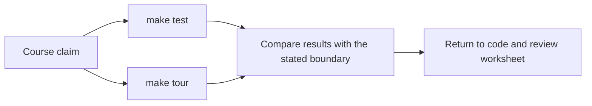
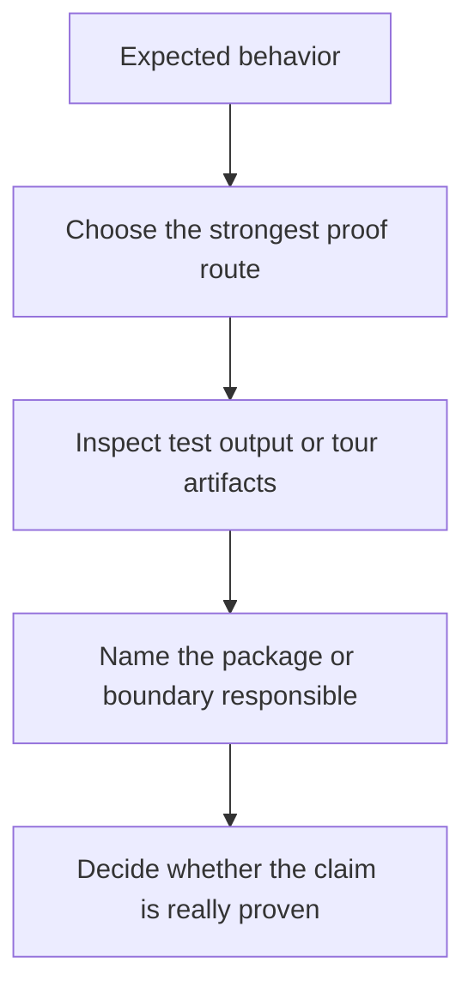

# FuncPipe Proof Guide

<!-- page-maps:start -->
## Guide Maps

<!-- page-maps:end -->

This capstone should not be trusted because the prose sounds tidy. It should be trusted
because the learner can inspect behavior and review artifacts directly.

## Current proof routes

- `make test` runs the executable test suite.
- `make tour` builds the learner-facing proof bundle.

## What each route proves

- `make test` proves behavioral claims about algebra, domain rules, policies, adapters, and interop.
- `make tour` proves that a human reviewer can see the package layout, focus areas, and current proof surface without reverse-engineering the repo.

## Honest limitation

These routes prove different things. Tests prove code behavior precisely. The tour proves
that the project remains inspectable as a human learning artifact. You need both.

## Best review pattern

1. State the claim you want to check.
2. Choose the route that produces the closest evidence.
3. Inspect the relevant package or guide.
4. Decide whether the evidence matches the claim or only hints at it.
