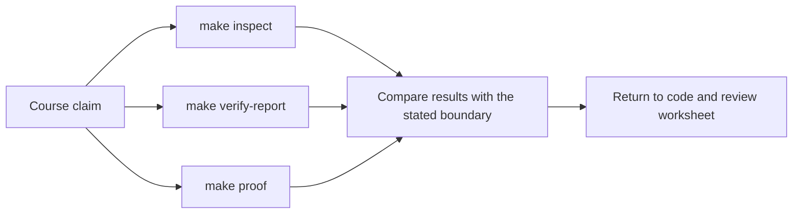
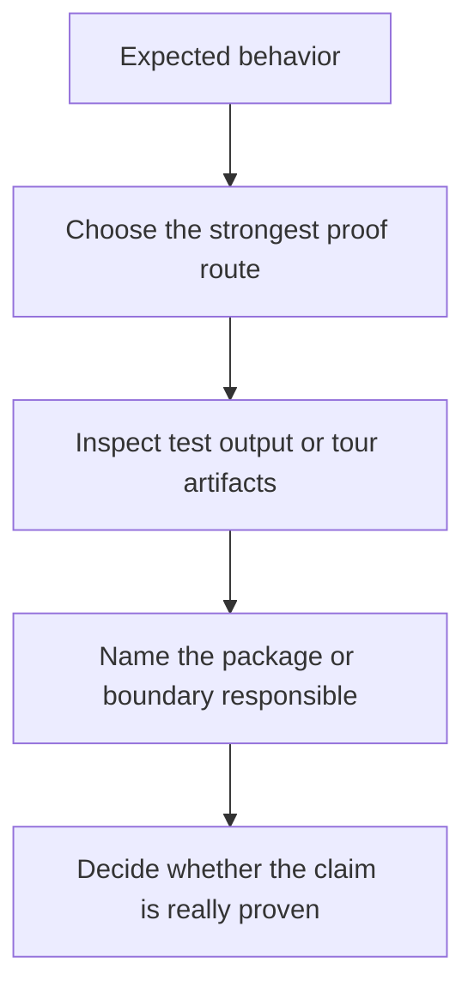

# FuncPipe Proof Guide

<!-- page-maps:start -->
## Guide Maps

<!-- page-maps:end -->

This capstone should not be trusted because the prose sounds tidy. It should be trusted
because the learner can inspect behavior and review artifacts directly.

## Current proof routes

- `make inspect` builds the fastest review bundle for package, test, and guide ownership.
- `make test` runs the executable test suite.
- `make verify-report` writes the executed test record plus a review summary bundle.
- `make tour` builds the learner-facing proof bundle.
- `make proof` runs the sanctioned end-to-end route.
- `make confirm` runs lint, build, verify-report, and proof as the strongest public confirmation route.

## What each route proves

- `make inspect` proves the repository stays navigable as a human learning surface before you dive into execution details.
- `make test` proves behavioral claims about algebra, domain rules, policies, adapters, and interop.
- `make verify-report` proves the current executable result was captured in a durable review bundle instead of disappearing in terminal scrollback.
- `make tour` proves that a human reviewer can see the package layout, focus areas, and current proof surface without reverse-engineering the repo.
- `make confirm` proves the project still satisfies the published lint, type, build, and proof route together.

## Honest limitation

These routes prove different things. Inspection proves navigability, tests prove behavior,
the verification report proves saved evidence, and the tour proves learner readability.
Use `make confirm` only when you need the strongest combined route.

## Best review pattern

1. State the claim you want to check.
2. Choose the route that produces the closest evidence, or use `make confirm` for the strongest published route.
3. Inspect the relevant package or guide.
4. Decide whether the evidence matches the claim or only hints at it.

## Best companion files

- `PUBLIC_SURFACE_MAP.md`
- `SOURCE_TO_PROOF_MAP.md`
- `TEST_READING_MAP.md`
- `REVIEW_ROUTE_MAP.md`
