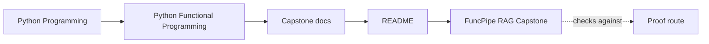
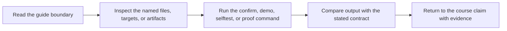

# FuncPipe RAG Capstone


<!-- page-maps:start -->
## Guide Maps




<!-- page-maps:end -->

This directory contains the runnable project that anchors the Python Functional
Programming course. It exists to prove that the course's design claims survive contact
with executable code, tests, and operational boundaries.

## Repository shape

- `src/funcpipe_rag/` contains the application packages and architecture seams
- `tests/` contains law checks, behavior checks, and integration proof
- `history/` preserves earlier snapshots used by the course narrative
- `scripts/` contains helper utilities used by the project workflow

## How to read this codebase

Start with evidence, then expand outward:

1. Read the test surface to see what the project promises.
2. Read the core packages to locate pure transforms and value modelling.
3. Read the adapter and runtime packages to see where effects enter.
4. Read the async and interop surfaces only after the core boundaries are clear.

## What to look for

- which functions stay pure and which modules are explicitly effectful
- where streaming remains lazy and where the code materializes by design
- how failures are represented as data instead of hidden control flow
- how protocols and adapters keep infrastructure from bleeding into the core
- how tests, laws, and fixtures justify the abstractions

## Working locally

From the repository root:

```bash
make PROGRAM=python-programming/python-functional-programming install
make PROGRAM=python-programming/python-functional-programming test
make PROGRAM=python-programming/python-functional-programming capstone-tour
```

From this directory:

```bash
make install
make test
make tour
```

Proof route:

- `PROOF_GUIDE.md`
- `ARCHITECTURE.md`
- `TOUR.md`

## Recommended review path

- `ARCHITECTURE.md` for the package map
- `tests/` for the proof surface
- `src/funcpipe_rag/` for package boundaries
- `TOUR.md` for the generated review bundle
- `pyproject.toml` for the executable project contract

Use `ARCHITECTURE.md` first whenever a course module asks you to review where purity,
effects, or orchestration should live.
Use `TOUR.md` when you want the shortest human-readable route through the proof bundle.

## Course connection

Use this repository as a running mirror of the course:

- Modules 01 to 03: purity, configuration, and lazy pipeline shape
- Modules 04 to 06: typed failures, modelling choices, and lawful composition
- Modules 07 to 08: effect boundaries, adapters, and async coordination
- Modules 09 to 10: interop, review standards, and sustainment
