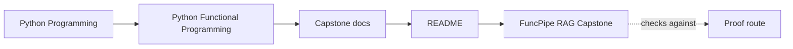
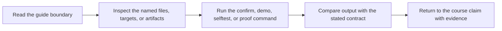

# FuncPipe RAG Capstone


<!-- page-maps:start -->
## Guide Maps




<!-- page-maps:end -->

This directory contains the runnable project that anchors the Python Functional
Programming course. It exists to prove that the course's design claims survive contact
with executable code, tests, and operational boundaries.

## Start with one question

| If your question is... | Start here | Then go to... |
| --- | --- | --- |
| What does this repository prove for the course? | [`GUIDE_INDEX.md`](docs/GUIDE_INDEX.md) | [`PROOF_GUIDE.md`](docs/PROOF_GUIDE.md) |
| Which files should I read first? | [`FIRST_SESSION_GUIDE.md`](docs/FIRST_SESSION_GUIDE.md) | [`PACKAGE_GUIDE.md`](docs/PACKAGE_GUIDE.md) |
| Which commands should I run? | [`COMMAND_GUIDE.md`](docs/COMMAND_GUIDE.md) | `make inspect`, `make verify-report`, or `make confirm` |
| Which tests or artifacts justify a claim? | [`TEST_GUIDE.md`](docs/TEST_GUIDE.md) | [`SOURCE_TO_PROOF_MAP.md`](docs/SOURCE_TO_PROOF_MAP.md) |
| Where do purity, effects, and adapters live? | [`ARCHITECTURE.md`](docs/ARCHITECTURE.md) | [`PUBLIC_SURFACE_MAP.md`](docs/PUBLIC_SURFACE_MAP.md) |
| How should I review the repository as a human? | [`WALKTHROUGH_GUIDE.md`](docs/WALKTHROUGH_GUIDE.md) | [`TOUR.md`](docs/TOUR.md) |

## Repository shape

| Area | What it owns |
| --- | --- |
| `src/funcpipe_rag/` | application packages and architecture seams |
| `tests/` | law checks, behavior checks, and integration proof |
| `module-reference-states/` | tracked end-of-module snapshot sources |
| `_history/` | generated module worktrees and comparison manifests |
| `scripts/` | project workflow helpers |

## First honest pass

1. Read [`FIRST_SESSION_GUIDE.md`](docs/FIRST_SESSION_GUIDE.md).
2. Open [`TEST_GUIDE.md`](docs/TEST_GUIDE.md) or [`PACKAGE_GUIDE.md`](docs/PACKAGE_GUIDE.md), depending on whether you want proof-first or code-first reading.
3. Run the smallest command that answers your question.
4. Stop when you can name one boundary, one proof surface, and one next page.

## What to look for

- which functions stay pure and which modules are explicitly effectful
- where streaming remains lazy and where the code materializes by design
- how failures are represented as data instead of hidden control flow
- how protocols and adapters keep infrastructure from bleeding into the core
- how tests, laws, and fixtures justify the abstractions

## Working locally

From the repository root:

```bash
make PROGRAM=python-programming/python-functional-programming install
make PROGRAM=python-programming/python-functional-programming inspect
make PROGRAM=python-programming/python-functional-programming test
make PROGRAM=python-programming/python-functional-programming capstone-test
make PROGRAM=python-programming/python-functional-programming capstone-tour
make PROGRAM=python-programming/python-functional-programming capstone-verify-report
make PROGRAM=python-programming/python-functional-programming capstone-confirm
```

From this directory:

```bash
make test
make inspect
make verify-report
make confirm
make proof
make history-refresh
make history-verify
```

From the repository root, `make PROGRAM=python-programming/python-functional-programming test`
is the strongest published course-level proof route and delegates here to `make confirm`.
Use `capstone-test` when you only want the pytest suite without the extra confirmation
bundles.

## Choose the smallest command that answers your question

| If you need... | Command |
| --- | --- |
| a fast inventory of packages, tests, and guides | `make inspect` |
| the pytest suite only | `make test` |
| a saved proof bundle with review artifacts | `make verify-report` |
| the human walkthrough bundle | `make tour` |
| the strongest built-in confirmation route | `make confirm` |

History route:

- `make history-refresh` rebuilds local module tags and `_history/worktrees/module-XX`
- `make history-verify` re-checks that every generated worktree still matches the snapshot source it claims to represent
- `_history/route.txt` records the generated module-to-tag map
- `_history/manifests/module-XX.json` records the exact file inventory, hash, source root, and snapshot kind for each module snapshot
- `module-reference-states/` is the tracked source of truth for Modules 01 to 09
- `_history/worktrees/` is the generated local comparison surface you read after `history-refresh`
- the live capstone is the Module 10 source of truth, with `_history/worktrees/module-10` generated from it for comparison

Proof route:

- [`FIRST_SESSION_GUIDE.md`](docs/FIRST_SESSION_GUIDE.md)
- [`GUIDE_INDEX.md`](docs/GUIDE_INDEX.md)
- [`CODE_ROUTE_MAP.md`](docs/CODE_ROUTE_MAP.md)
- [`COMMAND_GUIDE.md`](docs/COMMAND_GUIDE.md)
- [`PUBLIC_SURFACE_MAP.md`](docs/PUBLIC_SURFACE_MAP.md)
- [`SOURCE_TO_PROOF_MAP.md`](docs/SOURCE_TO_PROOF_MAP.md)
- [`TEST_READING_MAP.md`](docs/TEST_READING_MAP.md)
- [`REVIEW_ROUTE_MAP.md`](docs/REVIEW_ROUTE_MAP.md)
- [`PROOF_GUIDE.md`](docs/PROOF_GUIDE.md)
- [`ARCHITECTURE.md`](docs/ARCHITECTURE.md)
- [`TOUR.md`](docs/TOUR.md)
- [`WALKTHROUGH_GUIDE.md`](docs/WALKTHROUGH_GUIDE.md)
- [`EXTENSION_GUIDE.md`](docs/EXTENSION_GUIDE.md)

## Recommended review path

- `FIRST_SESSION_GUIDE.md` for the smallest honest first pass through the capstone
- `GUIDE_INDEX.md` for the smallest route into the capstone doc set
- `COMMAND_GUIDE.md` for choosing the smallest honest command and artifact route
- `TEST_GUIDE.md` and `TEST_READING_MAP.md` for proof-first reading
- `PACKAGE_GUIDE.md` and `CODE_ROUTE_MAP.md` for code-first reading
- `ARCHITECTURE.md` and `PUBLIC_SURFACE_MAP.md` for boundary ownership
- `PROOF_GUIDE.md`, `REVIEW_ROUTE_MAP.md`, and `TOUR.md` for saved review routes

Use `ARCHITECTURE.md` first whenever a course module asks you to review where purity,
effects, or orchestration should live.
Use `FIRST_SESSION_GUIDE.md` first whenever the capstone itself still feels too large.
Use `CODE_ROUTE_MAP.md` first whenever you know the concept but not the current file route.
Use `PUBLIC_SURFACE_MAP.md` when you ran a route and still need to know what it actually exposed.
Use `PROOF_GUIDE.md` when you need to choose between fast inspection, saved review output,
and the strongest confirmation route.
Use `TOUR.md` when you want the shortest human-readable route through the proof bundle.

## Documentation set

All capstone documentation lives under `docs/`. Use this index when you want
the full guide surface from one place:

- [`ARCHITECTURE.md`](docs/ARCHITECTURE.md)
- [`CODE_ROUTE_MAP.md`](docs/CODE_ROUTE_MAP.md)
- [`COMMAND_GUIDE.md`](docs/COMMAND_GUIDE.md)
- [`EXTENSION_GUIDE.md`](docs/EXTENSION_GUIDE.md)
- [`FIRST_SESSION_GUIDE.md`](docs/FIRST_SESSION_GUIDE.md)
- [`GUIDE_INDEX.md`](docs/GUIDE_INDEX.md)
- [`PACKAGE_GUIDE.md`](docs/PACKAGE_GUIDE.md)
- [`PROOF_GUIDE.md`](docs/PROOF_GUIDE.md)
- [`PUBLIC_SURFACE_MAP.md`](docs/PUBLIC_SURFACE_MAP.md)
- [`REVIEW_ROUTE_MAP.md`](docs/REVIEW_ROUTE_MAP.md)
- [`SOURCE_TO_PROOF_MAP.md`](docs/SOURCE_TO_PROOF_MAP.md)
- [`TEST_GUIDE.md`](docs/TEST_GUIDE.md)
- [`TEST_READING_MAP.md`](docs/TEST_READING_MAP.md)
- [`TOUR.md`](docs/TOUR.md)
- [`WALKTHROUGH_GUIDE.md`](docs/WALKTHROUGH_GUIDE.md)

## Course connection

Use this repository as a running mirror of the course:

- Modules 01 to 03: purity, configuration, and lazy pipeline shape
- Modules 04 to 06: typed failures, modelling choices, and lawful composition
- Modules 07 to 08: effect boundaries, adapters, and async coordination
- Modules 09 to 10: interop, review standards, and sustainment

## Course module to capstone evidence

| Course module | Primary source surface | Primary proof surface | Best route |
| --- | --- | --- | --- |
| Module 01: Purity and substitution | `src/funcpipe_rag/fp/core.py`, `src/funcpipe_rag/core/rag_types.py` | `tests/unit/fp/test_core_chunk_roundtrip.py`, `tests/unit/fp/test_core_state_machine.py` | `make inspect` |
| Module 02: Data-first APIs and expression style | `src/funcpipe_rag/pipelines/configured.py`, `src/funcpipe_rag/pipelines/specs.py` | `tests/unit/pipelines/test_configured_pipeline.py`, `tests/unit/pipelines/test_specs_roundtrip.py` | `make inspect` |
| Module 03: Iterators and lazy dataflow | `src/funcpipe_rag/streaming/`, `src/funcpipe_rag/tree/` | `tests/unit/fp/test_iter_helpers.py`, `tests/unit/streaming/test_streaming.py`, `tests/unit/tree/test_tree_folds.py` | `make inspect` |
| Module 04: Resilience and streaming failures | `src/funcpipe_rag/result/`, `src/funcpipe_rag/policies/retries.py`, `src/funcpipe_rag/policies/breakers.py` | `tests/unit/result/test_result_folds.py`, `tests/unit/policies/test_retries.py`, `tests/unit/policies/test_breakers.py` | `make verify-report` |
| Module 05: Algebraic data modelling | `src/funcpipe_rag/fp/validation.py`, `src/funcpipe_rag/rag/domain/` | `tests/unit/fp/test_pattern_matching.py`, `tests/unit/rag/test_stages.py` | `make inspect` |
| Module 06: Monadic flow and explicit context | `src/funcpipe_rag/fp/effects/`, `src/funcpipe_rag/result/types.py` | `tests/unit/fp/test_configurable.py`, `tests/unit/fp/test_layering.py`, `tests/unit/result/test_option_result.py` | `make verify-report` |
| Module 07: Effect boundaries and resource safety | `src/funcpipe_rag/boundaries/`, `src/funcpipe_rag/domain/effects/`, `src/funcpipe_rag/domain/capabilities.py` | `tests/unit/domain/test_io_plan_laws.py`, `tests/unit/domain/test_session.py`, `tests/unit/domain/test_idempotent.py` | `make tour` |
| Module 08: Async FuncPipe and backpressure | `src/funcpipe_rag/domain/effects/async_/`, `src/funcpipe_rag/infra/adapters/async_runtime.py` | `tests/unit/domain/test_async_backpressure.py`, `tests/unit/domain/test_async_law_properties.py`, `tests/unit/domain/test_async_resilience.py` | `make verify-report` |
| Module 09: Ecosystem interop | `src/funcpipe_rag/boundaries/shells/cli.py`, `src/funcpipe_rag/pipelines/cli.py`, `src/funcpipe_rag/pipelines/distributed.py`, `src/funcpipe_rag/interop/` | `tests/unit/pipelines/test_cli_overrides.py`, `tests/unit/interop/test_stdlib_fp.py`, `tests/unit/interop/test_toolz_compat.py` | `make tour` |
| Module 10: Refactoring and sustainment | `README.md`, `ARCHITECTURE.md`, `PROOF_GUIDE.md`, `pyproject.toml` | `make verify-report`, `make proof`, `make confirm` | `make confirm` |

Use this table when a course page tells you to "inspect the capstone" and you want the shortest stable path from concept to evidence.

## Definition of done

- `make inspect` produces the learner-facing inspection bundle with the expected review files.
- `make verify-report` writes executable proof and review artifacts into one saved bundle.
- `make tour` produces the walkthrough bundle for capstone-first reading.
- `make confirm` completes the strongest built-in confirmation route.
- `make proof` completes the published learner route end to end.

## Stop here when

- you know the first guide you need
- you know the smallest command that answers your current question
- you are no longer trying to read the whole repository in one sitting
