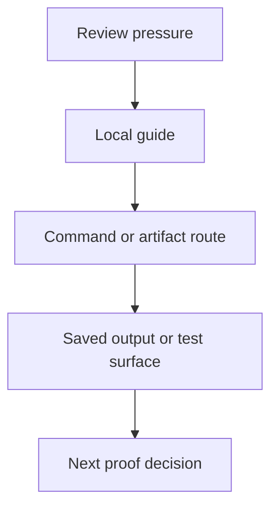
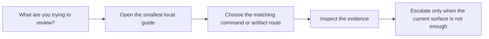

# FuncPipe Review Route Map

<!-- page-maps:start -->
## Guide Maps

<!-- page-maps:end -->

Use this guide when the capstone question is already concrete but you still need a clean
path through the guides, commands, and saved bundles.

## Pressure to route map

| If you need to review... | Start with | Then run or inspect | Escalate with |
| --- | --- | --- | --- |
| repository shape and learner routing | `FIRST_SESSION_GUIDE.md` or `GUIDE_INDEX.md` | `make inspect` and the inspection bundle | `PROOF_GUIDE.md` |
| what a published command or artifact actually exposed | `PUBLIC_SURFACE_MAP.md` | the matching command from `COMMAND_GUIDE.md` | `PROOF_GUIDE.md` |
| which package owns a behavior and how to read it | `ARCHITECTURE.md` or `PACKAGE_GUIDE.md` | the package route and matching test group | `SOURCE_TO_PROOF_MAP.md` |
| which proof should fail first for a claim | `TEST_READING_MAP.md` | the closest test group | `TEST_GUIDE.md` |
| where a package or boundary change should be proved | `SOURCE_TO_PROOF_MAP.md` | `make test`, `make inspect`, `make tour`, or `make verify-report` as mapped | `PROOF_GUIDE.md` |
| the human walkthrough route through the repo | `WALKTHROUGH_GUIDE.md` or `TOUR.md` | `make tour` | `PROOF_GUIDE.md` |
| the strongest published confirmation route | `PROOF_GUIDE.md` | `make confirm` | the saved bundles under `artifacts/` |

## Good use of this map

- Start from the question or pressure, not from the heaviest route.
- Choose the smallest guide that can still answer the question honestly.
- Use saved bundles when another human needs the artifact, not only because they exist.
- Use tests when the guide or artifact suggests a claim that still needs executable proof.

## Best companion files

- `GUIDE_INDEX.md`
- `COMMAND_GUIDE.md`
- `PROOF_GUIDE.md`
- `TOUR.md`
