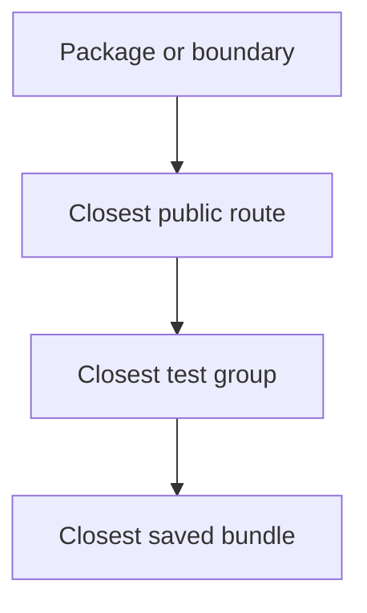
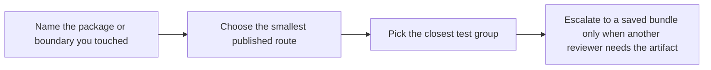

# FuncPipe Source To Proof Map

<!-- page-maps:start -->
## Guide Maps

<!-- page-maps:end -->

Use this guide when you already know which package or boundary owns the behavior and you
want the fastest honest route to prove it.

## Package to proof map

| Package or boundary | Best first route | Closest tests | Best saved bundle |
| --- | --- | --- | --- |
| `src/funcpipe_rag/fp/`, `result/`, `tree/`, `streaming/` | `make test` | `tests/unit/fp/`, `tests/unit/fp/laws/`, `tests/unit/result/`, `tests/unit/tree/`, `tests/unit/streaming/` | `make verify-report` |
| `src/funcpipe_rag/core/`, `rag/`, `rag/domain/` | `make test` or `make inspect` | `tests/unit/rag/`, `tests/unit/rag/domain/` | `make inspect` or `make verify-report` |
| `src/funcpipe_rag/pipelines/`, `policies/` | `make inspect` or `make verify-report` | `tests/unit/pipelines/`, `tests/unit/policies/` | `make verify-report` |
| `src/funcpipe_rag/domain/`, `domain/effects/`, `boundaries/`, `infra/` | `make tour` or `make verify-report` | `tests/unit/domain/`, `tests/unit/boundaries/`, `tests/unit/infra/adapters/` | `make tour` or `make verify-report` |
| `src/funcpipe_rag/interop/` | `make tour` or `make test` | `tests/unit/interop/` | `make tour` |
| guide or route changes under the capstone root | `make inspect` or `make proof` | the guide-backed proof route itself | `make inspect`, `make tour`, or `make verify-report` |

## Good proof habits

1. Start from the owning package, not from the heaviest command.
2. Choose the smallest published route that exposes the behavior under review.
3. Use the closest test group for executable confirmation.
4. Use a saved bundle when another reviewer needs a durable artifact, not by default.

## Common mistakes this prevents

- changing the functional core and only reading `TOUR.md`
- changing an effect boundary and proving only a pure helper
- changing a policy package and skipping the saved executable proof route
- treating one walkthrough artifact as proof of the whole repository

## Best companion files

- `ARCHITECTURE.md`
- `PACKAGE_GUIDE.md`
- `TEST_GUIDE.md`
- `PROOF_GUIDE.md`
