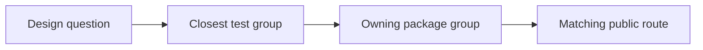
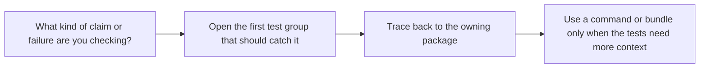

# FuncPipe Test Reading Map

<!-- page-maps:start -->
## Guide Maps

<!-- page-maps:end -->

Use this guide when you know the kind of claim you are reviewing but do not want to scan
the whole test tree to find the right proof surface.

## Question to test map

| If the question is about... | Read this test group first | Then open |
| --- | --- | --- |
| algebraic laws, mapping, chaining, folds, or reusable result behavior | `tests/unit/fp/laws/`, `tests/unit/result/`, `tests/unit/tree/` | `src/funcpipe_rag/fp/`, `result/`, `tree/` |
| pure helper behavior, iterator composition, or stream laziness | `tests/unit/fp/`, `tests/unit/streaming/` | `src/funcpipe_rag/fp/`, `streaming/` |
| domain values, stage composition, or RAG-specific rules | `tests/unit/rag/`, `tests/unit/rag/domain/` | `src/funcpipe_rag/core/`, `rag/`, `rag/domain/` |
| configured pipelines, retries, breakers, or runtime policy | `tests/unit/pipelines/`, `tests/unit/policies/` | `src/funcpipe_rag/pipelines/`, `policies/` |
| resource plans, async behavior, capabilities, or effect descriptions | `tests/unit/domain/` | `src/funcpipe_rag/domain/`, `domain/effects/`, `boundaries/` |
| adapters, serialization, storage, or infrastructure edges | `tests/unit/boundaries/`, `tests/unit/infra/adapters/` | `src/funcpipe_rag/boundaries/`, `infra/` |
| stdlib or external-library compatibility | `tests/unit/interop/` | `src/funcpipe_rag/interop/` |

## Failure-first reading order

1. State the behavior that should fail first.
2. Open the test group from the table above.
3. Name the owning package before you open implementation files.
4. Only then expand into inspect, verify-report, or tour routes.

## Best companion files

- `TEST_GUIDE.md`
- `SOURCE_TO_PROOF_MAP.md`
- `PROOF_GUIDE.md`
- `ARCHITECTURE.md`
