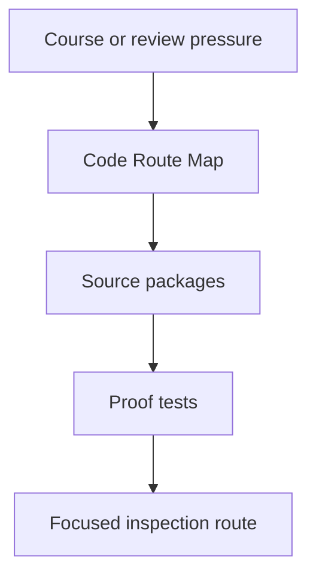
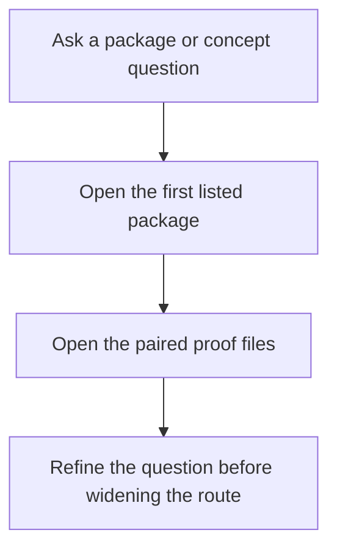

# FuncPipe Code Route Map

Use this guide when a course page tells you to "inspect the capstone" but you still need
one concrete route into the current source tree. The point is to keep learners out of
directory wandering and move them from concept to package to proof with one stable map.

## Start with the question you have

| If you are asking... | Open these source packages first | Then open these proofs |
| --- | --- | --- |
| Where do the pure helpers and composition primitives live? | `src/funcpipe_rag/fp/`, `src/funcpipe_rag/result/`, `src/funcpipe_rag/streaming/`, `src/funcpipe_rag/tree/` | `tests/unit/fp/`, `tests/unit/result/`, `tests/unit/streaming/`, `tests/unit/tree/` |
| Where does the RAG-specific domain model live? | `src/funcpipe_rag/core/`, `src/funcpipe_rag/rag/`, `src/funcpipe_rag/rag/domain/` | `tests/unit/rag/` |
| Where do configured pipelines and policy choices live? | `src/funcpipe_rag/pipelines/`, `src/funcpipe_rag/policies/` | `tests/unit/pipelines/`, `tests/unit/policies/` |
| Where do effect descriptions and execution boundaries begin? | `src/funcpipe_rag/domain/`, `src/funcpipe_rag/domain/effects/`, `src/funcpipe_rag/boundaries/`, `src/funcpipe_rag/infra/` | `tests/unit/domain/` |
| Where do library bridges and compatibility layers live? | `src/funcpipe_rag/interop/` | `tests/unit/interop/` |

## Short routes by course pressure

### Purity, substitution, and local reasoning

1. `src/funcpipe_rag/fp/core.py`
2. `src/funcpipe_rag/core/rag_types.py`
3. `tests/unit/fp/test_core_chunk_roundtrip.py`
4. `tests/unit/fp/test_core_state_machine.py`

### Data-first APIs and explicit configuration

1. `src/funcpipe_rag/rag/rag_api.py`
2. `src/funcpipe_rag/rag/config.py`
3. `src/funcpipe_rag/pipelines/configured.py`
4. `tests/unit/rag/test_api.py`
5. `tests/unit/pipelines/test_configured_pipeline.py`

### Iterators, laziness, and streaming pressure

1. `src/funcpipe_rag/rag/chunking.py`
2. `src/funcpipe_rag/rag/streaming_rag.py`
3. `src/funcpipe_rag/streaming/fanout.py`
4. `src/funcpipe_rag/streaming/time.py`
5. `tests/unit/streaming/test_streaming.py`

### Failure handling, validation, and explicit context

1. `src/funcpipe_rag/result/`
2. `src/funcpipe_rag/fp/validation.py`
3. `src/funcpipe_rag/fp/effects/`
4. `tests/unit/result/`
5. `tests/unit/fp/test_configurable.py`
6. `tests/unit/result/test_option_result.py`

### Ports, adapters, resource safety, and async work

1. `src/funcpipe_rag/domain/capabilities.py`
2. `src/funcpipe_rag/domain/effects/`
3. `src/funcpipe_rag/boundaries/`
4. `src/funcpipe_rag/infra/adapters/`
5. `tests/unit/domain/`

### Interop and long-lived project review

1. `src/funcpipe_rag/interop/`
2. `src/funcpipe_rag/pipelines/cli.py`
3. `src/funcpipe_rag/boundaries/shells/cli.py`
4. `tests/unit/interop/`
5. `tests/unit/pipelines/test_cli_overrides.py`

## When this guide is the wrong tool

- Use `INDEX.md` when the whole capstone still feels too large.
- Use `PACKAGE_GUIDE.md` when you want the package-reading order rather than the
  concept-to-code route.
- Use `SOURCE_TO_PROOF_MAP.md` when you already know the package and need the fastest
  proof surface.
