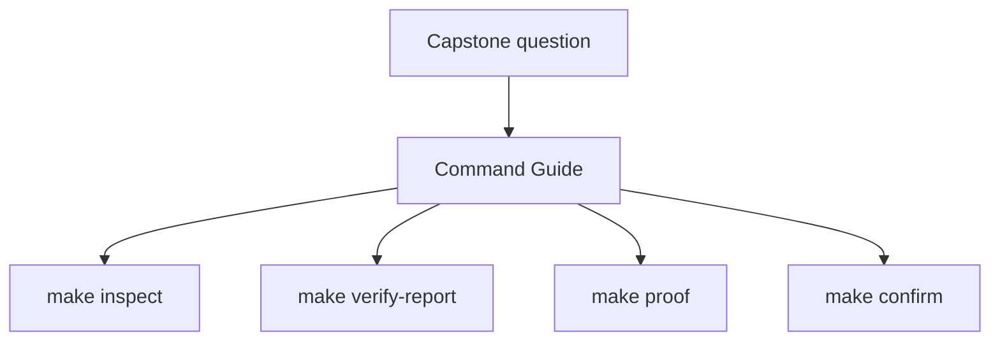
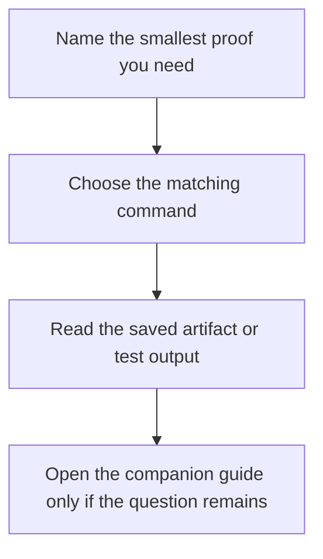

# FuncPipe Command Guide

Use this page when you already know your question is in the capstone, but you are not
sure which command gives the smallest honest proof surface. The goal is to keep command
choice tied to learner intent instead of rewarding the heaviest route by default.

## Smallest route by goal

| If you want to... | Run | What you get |
| --- | --- | --- |
| verify the executable behavior only | `make test` | the pytest result without the saved learner bundles |
| inspect the repository as a learning surface | `make inspect` | a saved inspection bundle with architecture, package, test, and proof guidance |
| capture executable proof with saved artifacts | `make verify-report` | pytest output plus the saved review summary bundle |
| read the capstone as a guided walkthrough | `make tour` | the learner-facing tour bundle with package trees and walkthrough files |
| follow the published learner route | `make proof` | the sanctioned sequence that runs test, inspect, and tour |
| run the strongest built-in confirmation route | `make confirm` | lint, type, build, verify-report, and proof together |

## Artifact locations

- `make inspect` writes to `artifacts/inspect/python-programming/python-functional-programming/`
- `make verify-report` writes to `artifacts/review/python-programming/python-functional-programming/`
- `make tour` writes to `artifacts/tour/python-programming/python-functional-programming/`

## Good command habits

- Start with `make inspect` when your question is about repository shape, package ownership, or guide routing.
- Start with `make test` when your question is only about behavior and you do not need saved bundles.
- Start with `make verify-report` when you need both executed proof and durable artifacts.
- Use `make proof` when you want the published learner route, not merely a local spot check.
- Use `make confirm` when you are checking whether the capstone still satisfies its strongest public contract.

## Common command mistakes

- using `make confirm` when `make inspect` would answer the question faster
- reading raw pytest output when the saved inspection or walkthrough bundle is the better teaching surface
- treating `make test` as equivalent to the published proof route
- forgetting that `make verify-report` and `make tour` produce artifacts meant for later human review

## Best companion files

- `INDEX.md`
- `PUBLIC_SURFACE_MAP.md`
- `PROOF_GUIDE.md`
- `ARCHITECTURE.md`
- `WALKTHROUGH_GUIDE.md`
