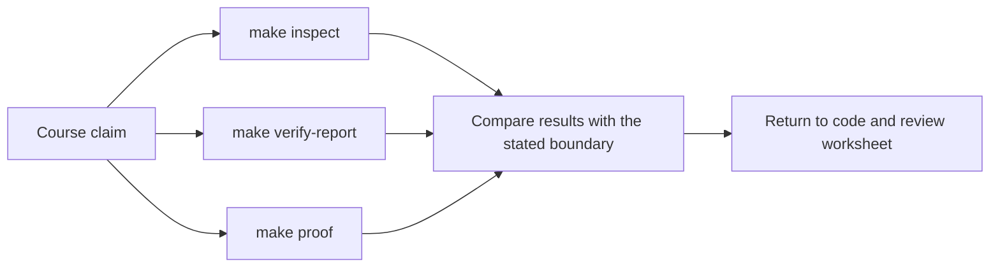
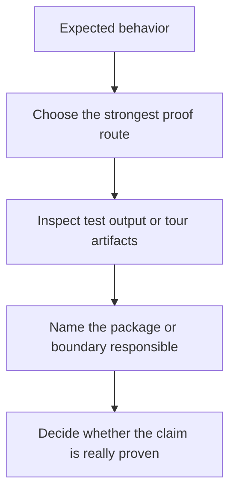

# FuncPipe Proof Guide

<!-- page-maps:start -->
## Guide Maps

<!-- page-maps:end -->

This capstone should not be trusted because the prose sounds tidy. It should be trusted
because the learner can inspect behavior and review artifacts directly.

## Current proof routes

- `make inspect` builds the fastest review bundle for package, test, and guide ownership.
- `make test` runs the executable test suite.
- `make verify-report` writes the executed test record plus a review summary bundle.
- `make tour` builds the learner-facing proof bundle.
- `make proof` runs the sanctioned end-to-end route.
- `make confirm` runs lint, build, verify-report, and proof as the strongest public confirmation route.

## What each route proves

- `make inspect` proves the repository stays navigable as a human learning surface before you dive into execution details.
- `make test` proves behavioral claims about algebra, domain rules, policies, adapters, and interop.
- `make verify-report` proves the current executable result was captured in a durable review bundle instead of disappearing in terminal scrollback.
- `make tour` proves that a human reviewer can see the package layout, focus areas, and current proof surface without reverse-engineering the repo.
- `make confirm` proves the project still satisfies the published lint, type, build, and proof route together.

## Honest limitation

These routes prove different things. Inspection proves navigability, tests prove behavior,
the verification report proves saved evidence, and the tour proves learner readability.
Use `make confirm` only when you need the strongest combined route.

## Best review pattern

1. State the claim you want to check.
2. Choose the route that produces the closest evidence, or use `make confirm` for the strongest published route.
3. Inspect the relevant package or guide.
4. Decide whether the evidence matches the claim or only hints at it.

## Package to proof map

| Package or boundary | Best first route | Closest tests | Best saved bundle |
| --- | --- | --- | --- |
| `src/funcpipe_rag/fp/`, `result/`, `tree/`, `streaming/` | `make test` | `tests/unit/fp/`, `tests/unit/fp/laws/`, `tests/unit/result/`, `tests/unit/tree/`, `tests/unit/streaming/` | `make verify-report` |
| `src/funcpipe_rag/core/`, `rag/`, `rag/domain/` | `make test` or `make inspect` | `tests/unit/rag/`, `tests/unit/rag/domain/` | `make inspect` or `make verify-report` |
| `src/funcpipe_rag/pipelines/`, `policies/` | `make inspect` or `make verify-report` | `tests/unit/pipelines/`, `tests/unit/policies/` | `make verify-report` |
| `src/funcpipe_rag/domain/`, `domain/effects/`, `boundaries/`, `infra/` | `make tour` or `make verify-report` | `tests/unit/domain/`, `tests/unit/boundaries/`, `tests/unit/infra/adapters/` | `make tour` or `make verify-report` |
| `src/funcpipe_rag/interop/` | `make tour` or `make test` | `tests/unit/interop/` | `make tour` |
| guide or route changes under the capstone root | `make inspect` or `make proof` | the guide-backed proof route itself | `make inspect`, `make tour`, or `make verify-report` |

## Review pressure to route map

| If you need to review... | Start with | Then run or inspect | Escalate with |
| --- | --- | --- | --- |
| repository shape and learner routing | `INDEX.md` | `make inspect` and the inspection bundle | `PROOF_GUIDE.md` |
| what a published command or artifact actually exposed | `PUBLIC_SURFACE_MAP.md` | the matching command from `COMMAND_GUIDE.md` | `PROOF_GUIDE.md` |
| which package owns a behavior and how to read it | `ARCHITECTURE.md` or `PACKAGE_GUIDE.md` | the package route and matching test group | `TEST_GUIDE.md` |
| which proof should fail first for a claim | `TEST_GUIDE.md` | the closest test group | `make test` or `make verify-report` |
| where a package or boundary change should be proved | `PACKAGE_GUIDE.md` or `TEST_GUIDE.md` | `make test`, `make inspect`, `make tour`, or `make verify-report` as mapped | `PROOF_GUIDE.md` |
| the human walkthrough route through the repo | `WALKTHROUGH_GUIDE.md` or `TOUR.md` | `make tour` | `PROOF_GUIDE.md` |
| the strongest published confirmation route | `PROOF_GUIDE.md` | `make confirm` | the saved bundles under `artifacts/` |

## Best companion files

- `PUBLIC_SURFACE_MAP.md`
- `PACKAGE_GUIDE.md`
- `TEST_GUIDE.md`
- `WALKTHROUGH_GUIDE.md`
