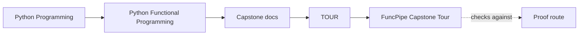
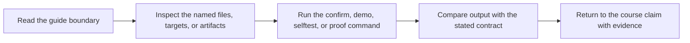

# FuncPipe Capstone Tour


<!-- page-maps:start -->
## Guide Maps




<!-- page-maps:end -->

This tour is the learner-facing entrypoint for the FuncPipe capstone. It builds a proof
bundle that captures the code and evidence surfaces the course keeps referring to:
package layout, test proof, and the main areas where purity, effects, and async
coordination live.

Use [`WALKTHROUGH_GUIDE.md`](../WALKTHROUGH_GUIDE.md) when you want a stable first-pass route
through the bundle instead of deciding the reading order yourself.

The tour is not just a convenience export. It is the shortest path from course prose to
inspectable evidence when you want a human-readable review route.
Use `make inspect` first when you need a smaller inventory bundle, and use
`make verify-report` when you need to preserve the executed test result alongside the tour.

## What the tour produces

- `pytest.txt`: the current test run for the capstone
- `ARCHITECTURE.md`: the package map for the capstone
- `package-tree.txt`: the package layout under `src/funcpipe_rag`
- `test-tree.txt`: the test layout under `tests`
- `focus-areas.txt`: the packages most relevant to course milestones
- `README.md`: the repository guide for the capstone
- `pyproject.toml`: the executable project contract
- `manifest.json`: the stable inventory of the generated bundle

## How to run it

From the capstone directory:

```bash
make tour
```

From the repository root:

```bash
make PROGRAM=python-programming/python-functional-programming capstone-tour
```

Neighbor routes:

- `make inspect` for the fastest inspection bundle
- `make verify-report` for the saved verification bundle
- `make confirm` for the strictest combined route

## What to inspect first

1. `ARCHITECTURE.md`
2. `pytest.txt`
3. `focus-areas.txt`
4. `package-tree.txt`
5. `test-tree.txt`
6. `README.md`

That order mirrors the course: map first, proof second, then architectural hotspots, and
finally the wider codebase shape.

## Questions to carry through the tour

- Which packages stay descriptive instead of effectful?
- Which focus areas correspond to the module you just studied?
- Which test surfaces prove the current abstraction instead of only exercising it?
