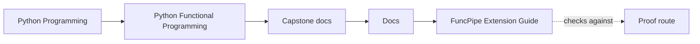
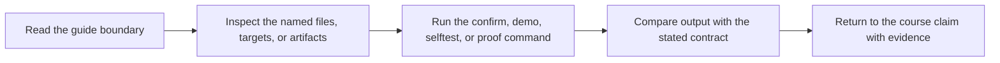

# FuncPipe Extension Guide

<!-- page-maps:start -->
## Guide Maps

<!-- page-maps:end -->

Use this guide before adding a feature or refactoring a boundary. The course is trying to
teach not only how the capstone is organized, but how to preserve that organization under
change.

## If the change is still pure

- prefer `fp/`, `result/`, `streaming/`, `core/`, or `rag/`
- keep I/O, logging, time, and retries outside the change
- add or strengthen tests first so the value of the abstraction stays explicit

## If the change is policy or pipeline assembly

- prefer `policies/` or `pipelines/`
- keep the pipeline descriptive instead of letting orchestration leak backward into the core
- update the proof surface that demonstrates why the policy exists

## If the change is an effect boundary

- prefer `domain/`, `boundaries/`, or `infra/`
- keep the capability or adapter seam visible
- do not hide retries, cleanup, or resource ownership inside pure helpers

## If the change is interop

- prefer `interop/`
- keep the compatibility layer thin enough that the core model remains semantically stable
- prove that the bridge preserves the same contract the course uses

## If the change adds a distributed backend

- prefer `pipelines/distributed.py` as the attachment point instead of spreading backend logic through the local pipeline
- keep Dask or Beam optional until the repository is ready to carry them as part of the default proof contract
- preserve the local proof route so the course still has one canonical implementation surface

## Final review question

If another engineer read this change six months later, would they be able to see why it
landed in that package instead of somewhere more convenient?
