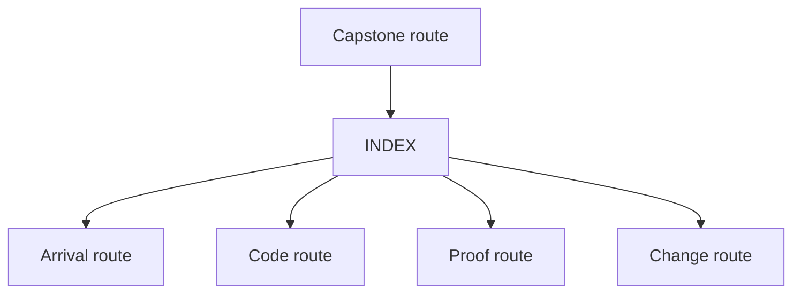
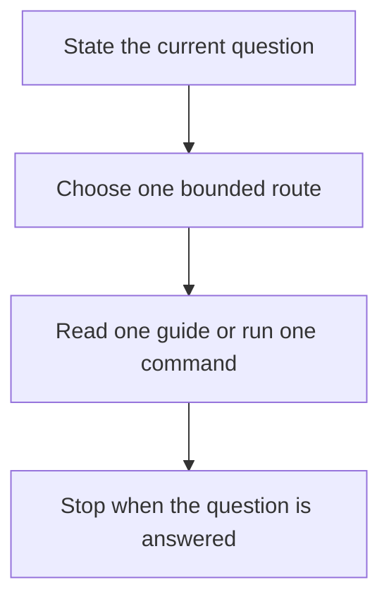

# FuncPipe Capstone Docs

Use this page when the capstone is the right place to look but the next local guide is
still unclear. It combines the first-session route with the guide index so the doc set
has one stable entry hub instead of two overlapping arrival pages.

## First honest pass

1. Read `README.md`.
2. Read `ARCHITECTURE.md`.
3. Read `PACKAGE_GUIDE.md`.
4. Read `TEST_GUIDE.md`.
5. Run `make inspect`.
6. Read `artifacts/inspect/python-programming/python-functional-programming/summary.txt`.
7. Stop there unless the next question clearly needs executed proof.

## What the first pass should settle

| Step | Main answer |
| --- | --- |
| `README.md` | what the capstone proves for the course and which commands exist |
| `ARCHITECTURE.md` | which package groups own the major reasoning pressures |
| `PACKAGE_GUIDE.md` | what order to read the code in without mistaking adapters for the core |
| `TEST_GUIDE.md` | which test groups prove which kinds of claims |
| `make inspect` | what the guided inspection bundle looks like |
| `summary.txt` | how the repository is grouped as a review surface |

## Start here by question

| If the current question is... | Open this next |
| --- | --- |
| what this capstone proves for the course | `README.md` |
| what to read on a first pass | `ARCHITECTURE.md` |
| which package owns this behavior | `PACKAGE_GUIDE.md` |
| which current files should I open first for this concept | `PACKAGE_GUIDE.md` |
| which tests prove this claim | `TEST_GUIDE.md` |
| which proof should fail first for this claim | `TEST_GUIDE.md` |
| which command should I run | `COMMAND_GUIDE.md` |
| what a command or artifact actually exposed | `PUBLIC_SURFACE_MAP.md` |
| what the shortest human reading route is | `WALKTHROUGH_GUIDE.md` |
| which route fits the current review pressure | `PROOF_GUIDE.md` |
| where a change should go | `EXTENSION_GUIDE.md` |
| how to prove a package or boundary change | `PROOF_GUIDE.md` |

## Route groups

- Arrival route: `README.md`, `ARCHITECTURE.md`, `PACKAGE_GUIDE.md`, `TEST_GUIDE.md`
- Code route: `ARCHITECTURE.md`, `PACKAGE_GUIDE.md`, `TEST_GUIDE.md`
- Proof route: `COMMAND_GUIDE.md`, `PUBLIC_SURFACE_MAP.md`, `PROOF_GUIDE.md`,
  `TOUR.md`, `WALKTHROUGH_GUIDE.md`
- Change route: `ARCHITECTURE.md`, `EXTENSION_GUIDE.md`, `TEST_GUIDE.md`,
  `PROOF_GUIDE.md`

## Guide map

- [FuncPipe Architecture Map](architecture.md)
- [FuncPipe Command Guide](command-guide.md)
- [FuncPipe Extension Guide](extension-guide.md)
- [FuncPipe Package Guide](package-guide.md)
- [FuncPipe Proof Guide](proof-guide.md)
- [FuncPipe Public Surface Map](public-surface-map.md)
- [FuncPipe Test Guide](test-guide.md)
- [FuncPipe Capstone Tour](tour.md)
- [FuncPipe Walkthrough Guide](walkthrough-guide.md)

## Good stopping point

Stop when you can answer:

- which package groups are meant to stay pure or descriptive
- which packages are allowed to execute effects
- which test groups prove the semantic floor
- which proof route you would choose next for a concrete claim

## What not to do

- do not start with `make confirm` before you know the guide set
- do not read packages alphabetically
- do not start in adapters or interop code before the core and package map are clear
- do not treat one successful command as proof that you understand the architecture

## Best next files when unsure

If you do not have a sharper question yet, open `README.md`, then `ARCHITECTURE.md`,
then `PACKAGE_GUIDE.md`.
