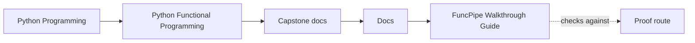
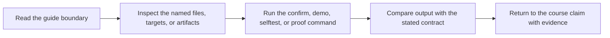

# FuncPipe Walkthrough Guide

<!-- page-maps:start -->
## Guide Maps

<!-- page-maps:end -->

Use this guide when you want the shortest first pass through the capstone without turning
the experience into random file browsing.

## Recommended first route

1. Run `make inspect` if you need the fastest inventory before running the heavier proof routes.
2. Run `make tour`.
3. Read `TOUR.md` for the bundle purpose and reading order.
4. Read `pytest.txt` for the proof surface that currently passes.
5. Read `focus-areas.txt` for the package groups that matter most to the course.
6. Read `package-tree.txt` and `test-tree.txt` to place those focus areas inside the full repository.
7. Run `make verify-report` when you need the executed test record preserved as a review bundle.
8. Move into `PACKAGE_GUIDE.md` and `TEST_GUIDE.md` when one part of the repository now matters more than the rest.

## What this walkthrough should teach

- the capstone is reviewable as a human artifact, not just runnable code
- tests are the first proof surface, not an afterthought
- package groups and test groups line up with the course's module arc
- the tour bundle is a way to decide where to read next, not a substitute for code review

## When to leave the walkthrough

- Leave for `PACKAGE_GUIDE.md` when the main question is package ownership.
- Leave for `TEST_GUIDE.md` when the main question is proof depth.
- Leave for `ARCHITECTURE.md` when the main question is purity and effect boundaries.
- Leave for `PROOF_GUIDE.md` when the main question is which command or artifact proves the claim.
