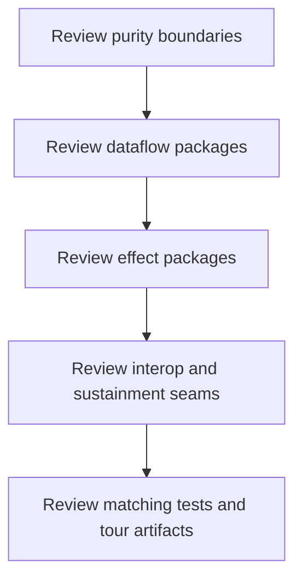

# Capstone Architecture Guide

<!-- page-maps:start -->
## Page Maps

<!-- page-maps:end -->

Use this page when a module asks you to review the capstone's architecture instead of
only its syntax.

## What to inspect

1. Read `capstone/ARCHITECTURE.md`.
2. Compare it with [FuncPipe Capstone Guide](capstone.md) and [Capstone File Guide](capstone-file-guide.md).
3. Inspect `tests/`, then `src/funcpipe_rag/fp/`, `rag/`, `pipelines/`, `domain/`, and `boundaries/` in that order.

## What the architecture should prove

- the pure functional core is still visibly separate from concrete effects
- failures and composition rules are carried by explicit packages instead of hidden branching
- policies and pipelines encode orchestration without swallowing the domain model
- adapters and interop surfaces remain visible edges instead of slowly owning the core

## Best use inside the course

- Use it after Module 03 to confirm that purity and dataflow still have a concrete home.
- Revisit it after Modules 06 to 08 to confirm that composition and async pressure did not blur the boundaries.
- Revisit it again in Module 10 when reviewing interop, evidence, and sustainment.
