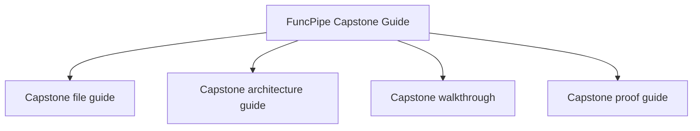
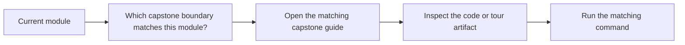

# Capstone Map

<!-- page-maps:start -->
## Page Maps

<!-- page-maps:end -->

This map turns the capstone into a deliberate study surface instead of a single guide
page. Use it whenever you want to decide where to go next for concrete evidence.

## Capstone route

- Start with [FuncPipe Capstone Guide](capstone.md) for the overall role and purpose.
- Read [Capstone File Guide](capstone-file-guide.md) when you need a code-reading route.
- Read the capstone's local [`PACKAGE_GUIDE.md`](https://github.com/bijux/bijux-masterclass/blob/master/programs/python-programming/python-functional-programming/capstone/PACKAGE_GUIDE.md) when you are already inside the repository and want the same route locally.
- Read [Capstone Test Guide](capstone-test-guide.md) when you want the test suite to function as a review map.
- Read [Capstone Review Worksheet](capstone-review-worksheet.md) when you want an explicit review lens.
- Read [Capstone Architecture Guide](capstone-architecture-guide.md) when you are reviewing package boundaries.
- Read [Capstone Walkthrough](capstone-walkthrough.md) when you want the learner-facing tour story.
- Read the capstone's local [`WALKTHROUGH_GUIDE.md`](https://github.com/bijux/bijux-masterclass/blob/master/programs/python-programming/python-functional-programming/capstone/WALKTHROUGH_GUIDE.md) when you want the repository itself to provide the first-pass reading order.
- Read [Capstone Proof Guide](capstone-proof-guide.md) when you want the verification route.
- Read [Capstone Extension Guide](capstone-extension-guide.md) when you want to decide where a new change belongs.

## Module-to-capstone bridge

- Modules 01 to 03 map most directly to `fp/`, `result/`, `streaming/`, and the pipeline core.
- Modules 04 to 06 map most directly to failure containers, algebraic modelling, and configured flows.
- Modules 07 to 08 map most directly to `domain/`, `boundaries/`, `infra/`, and async effect packages.
- Modules 09 to 10 map most directly to `interop/`, review guides, and proof surfaces.
