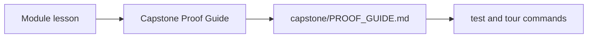
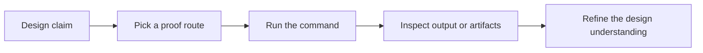

# Capstone Proof Guide

<!-- page-maps:start -->
## Page Maps

<!-- page-maps:end -->

Use this page when a lesson makes a design claim and you want the most direct evidence in
the capstone.

## Proof route

1. Read `capstone/PROOF_GUIDE.md`.
2. Run `make PROGRAM=python-programming/python-functional-programming test` for executable verification.
3. Run `make PROGRAM=python-programming/python-functional-programming capstone-tour` for the learner-facing proof bundle.
4. Run `make PROGRAM=python-programming/python-functional-programming proof` when you want the sanctioned end-to-end route.
5. Use [Capstone Review Worksheet](capstone-review-worksheet.md) to decide whether the evidence is strong enough.

## What you should be able to answer after proof review

- Which package owns the checked behavior?
- Which test or artifact confirmed it?
- Which future change would require stronger or different proof?
