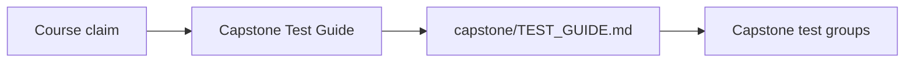
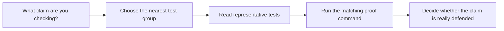

# Capstone Test Guide

<!-- page-maps:start -->
## Page Maps

<!-- page-maps:end -->

Use this page when a module tells you to inspect capstone proof and you want a stable
reading route through the test suite.

## Best route

1. Read the capstone's local [`TEST_GUIDE.md`](https://github.com/bijux/bijux-masterclass/blob/master/programs/python-programming/python-functional-programming/capstone/TEST_GUIDE.md).
2. Start with the test group that matches the current module.
3. Run `make PROGRAM=python-programming/python-functional-programming test`.
4. Compare the tests you read with [Proof Matrix](guides/proof-matrix.md) and [Capstone Review Worksheet](capstone-review-worksheet.md).

## Best module-to-test bridge

- Modules 01 to 03:
  start with `tests/unit/fp/`, `tests/unit/result/`, and `tests/unit/streaming/`
- Modules 04 to 06:
  start with `tests/unit/fp/laws/`, `tests/unit/policies/`, and `tests/unit/rag/`
- Modules 07 to 08:
  start with `tests/unit/domain/`, `tests/unit/boundaries/`, and `tests/unit/infra/adapters/`
- Modules 09 to 10:
  start with `tests/unit/interop/`, `tests/unit/pipelines/`, and the capstone proof bundle

## What this page should prevent

- treating every test folder as equally relevant to every module
- reading implementation code before you know what the proof surface promises
- using a large test suite as a vague reassurance instead of as a review map
